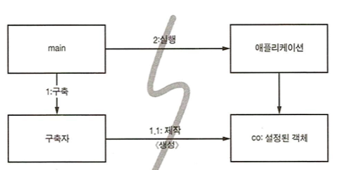
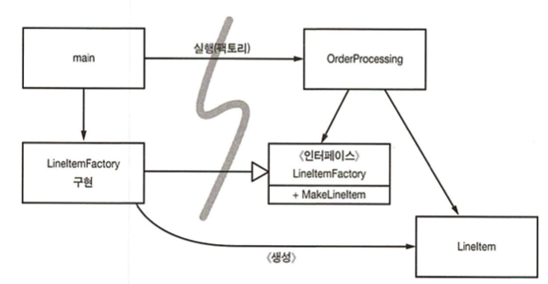

# 11장. 시스템

## 시스템 제작과 시스템 사용을 분리하라

객체를 생성하거나 의존성을 연결할 때도 마찬가지다. 설정 논리는 일반 실행 논리와 분리해야 모듈성이 높아진다.

또한 주요 의존성을 해소하기 위한 방식, 즉 전반적이며 일관적인 방식도 필요하다.

### Main 분리

생성과 관련한 코드는 모두 main이나 main이 호출하는 모듈로 옮기고, 나머지 시스템은 모든 객체가 생성되었고 모든 의존성이 연결되었다고 가정한다.

- 애플리케이션은 main이나 객체가 생성되는 과정을 전혀 모른다.

### 팩토리

객체가 생성되는 시점을 애플리케이션이 결정한다. 그러나 애플리케이션은 객체를 생성하는 코드는 모른다.

### 의존성 주입

IoC 기법을 의존성 관리에 적용한 메커니즘

→ 의존성 관리 맥락에서 객체는 의존성 자체를 인스턴스로 만드는 책임을 지지 않는다. 대신에 이런 책임을 다른 전담 메커니즘에 넘기므로써 제어를 역전한다.

- 초기 설정은 시스템 전체에서 필요하므로 대개 책임질 메커니즘으로 main 루틴이나 특수 컨테이너를 사용한다.
- **진정한 의존성 주입은 클래스가 의존성을 해결하려하지 않는다.** 대신에 의존성을 주입하는 방법으로 setter 나 생성자 인수를 제공한다. DI 컨테이너는 필요한 객체의 인스턴스를 만든 후 생성자 인수나 설정자 메서드를 사용해 의존성을 설정한다. 실제로 생성되는 객체 유형은 설정 파일에서 지정하거나 특수 생성 모듈에서 코드로 명시한다.

## 확장

‘처음부터 올바르게' 시스템을 만들 수 있다는 믿음은 미신이다. 대신에 우리는 오늘 주어진 사용자 스토리에 맞춰 시스템을 구현해야 한다. 내일은 새로운 스토리에 맞춰 시스템을 조정하고 확장하면 된다. **이것이 반복적이고 점진적인 애자일 방식의 핵심이다.**

소프트웨어 시스템은 물리적인 시스템과 다르다. 관심사를 적절히 분리해 관리한다면 소프트웨어 아키텍처는 점진적으로 발전할 수 있다.

### 횡단 관심사

트랜잭션, 보안, 영속성과 같은 관심사는 애플리케이션의 자연스러운 객체 경계를 넘나드는 경향이 있다.

따라서 모든 객체가 전반적으로 동일한 방식을 이용하게 만들어야 한다.

AOP는 횡단 관심사에 대처에 모듈성을 확보하는 일반적인 방법론이다.

- AOP에서 관점은 “특정 관심사를 지원하려면 시스템에서 특정 지점들이 동작하는 방식을 일관성 있게 바꿔야 한다" 라고 명시한다.

## 자바 프록시

자바 프록시는 개별 객체나 클래스에서 메서드 호출을 감싸는 상황같이 단순한 상황에 적합하다.

하지만 JDK에서 제공하는 동적 프록시는 인터페이스만 지원한다. 클래스 프록시를 사용하려면 CGLIB, ASM, Javassist 등과 같은 바이트 코드 처리 라이브러리가 필요하다.

그러나 프록시를 사용하면 코드가 길어지고 복잡해져 깨끗한 코드를 작성하기 어렵다. 또한 시스템 단위로 실행 지점을 명시하는 메커니즘도 제공하지 않는다.

## 순수 자바 AOP 프레임워크

순수 자바 관점을 구현하는 스프링 AOP 등과 같은 여러 자바 프레임워크는 내부적으로 프록시를 사용한다.

스프링은 비즈니스 논리는 POJO로 구현한다.

POJO는 엔터프라이즈 프레임워크에 의존하지 않고, 순수하게 도메인에 초점을 맞춘다.

따라서 테스트가 개념적으로 더 쉽고 간단하다.

설정 파일이나 API를 사용해 트랜잭션, 보안, 영속성, 캐시, 장애조치 등과 같은 횡단 관심사의 관점을 명시한다.

이때 프레임워크는 사용자가 모르게 프록시나 바이트코드 라이브러리를 사용해 이를 구현한다.

## AspectJ 관점

- AspectJ: 언어 차원에서 관점을 모듈화 구성으로 지원하는 자바 언어 확장

관점을 분리하는 강력하고 풍부한 도구지만, 새 언어 문법과 사용법을 익혀야 한다는 단점이 있다.

## 테스트 주도 시스템 아키텍처 구축

최선의 시스템 구조는 각지 POFO 객체로 구현되는 모듈화된 관심사 영역(도메인)으로 구성된다.

이렇게 서로 다른 영역은 해당 영역 코드에 최소한의 영향을 미치는 관점이나 유사한 도구를 사용해 통합된다.

이런 구조 역시 코드와 마찬가지로 테스트 주도 기법을 적용할 수 있다.

## 의사 결정을 최적화하라

관심사를 모듈로 분리한 POJO 시스템은 기민함을 제공한다.

이런 기민함 덕택에 최신 정보에 기반해 최선의 시점에 최적의 결정을 내리기가 쉬워진다.

또한 결정의 복잡성도 줄어든다.

## 명백한 가치가 있을 때 표준을 현명하게 사용하라

표준을 사용하면 아이디어와 컴포넌트를 재사용하기 쉽고, 적절한 경험을 가진 사람을 구하기 쉬우며, 좋은 아이디어를 캡슐화하기 쉽고, 컴포넌트를 엮기 쉽다.

하지만 때로는 표준을 만드는 시간이 너무 오래 걸려 업계가 기다리지 못한다.

어떤 표준을 원래 표준을 제정한 목적을 잊어버리기도 한다.

## 시스템은 도메인 특화 언어가 필요하다.

도메인 특화 언어(DSL)를 사용하면 고차원 정책에서 저차원 세부사항에 이르기까지 모든 추상화 수준과 모든 도메인을 POJO로 표현할 수 있다.

- DSL: 스크립트 언어나 표준 언어로 구현한 API

좋은 DSL은 도메인 개념과 그 개념을 구현한 코드 사이에 존재하는 ‘의사소통 간극'을 줄여준다.