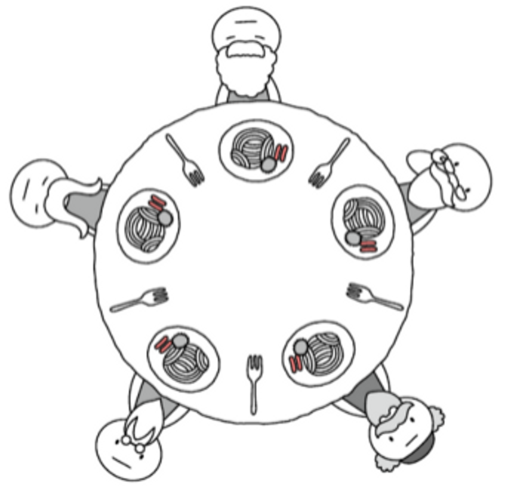

# 13장. 동시성

## 동시성이 필요한 이유?

동시성 = 결합을 없애는 전략. 무엇과 언제를 분리하는 전략

- 동시성이 필요한 이유
    1. 무엇과 언제를 분리하면 애플리케이션 구조와 효율이 극적으로 나아진다.
        - 구조적인 관점에서 프로그램은 거대한 루프 하나가 아니라 작은 협력 프로그램 여럿으로 보인다.
        - 따라서 시스템을 이해하기가 쉽고 문제를 분리하기도 쉽다.
    2. 어떤 시스템은 응답 시간과 작업 처리량 개선을 위해 직접적인 동시성 구현이 불가피한다.

### 미신과 오해

- 동시성은 ~~항상~~ 때로 성능을 높여준다.

  → 대기 시간이 아주 길어 여러 스레드가 프로세서를 공유할 수 있거나 여러 프로세서가 동시에 처리할 독립적인 계산이 충분히 많은 경우에만 해당

- 동시성을 구현해도 설계는 ~~변하지 않는다.~~ 판이하게 달라진다.
- 웹 또는 EJB 컨테이너를 사용하면 동시성을 이해할 필요가 ~~없다.~~ 있다.

  → 실제로는 컨테이너가 어떻게 동작하는지, 어떻게 동시 수정, 데드락 등과 같은 문제를 피할 수 있는지를 알아야만 한다.


### 타당한 의견

- 동시성은 다소 부하를 유발한다.

  → 성능 측면에서 부하가 걸리며, 코드도 더 짜야 한다.

- 동시성은 복잡하다.
- 일반적으로 동시성 버그는 재현하기 어렵다.

  → 진짜 결함으로 간주되지 않고 일회성 문제로 여겨 무시하기 쉽다.

- 동시성을 구현하려면 흔히 근본적인 설계 전략을 재고해야 한다.

## 동시성을 구현하기 어려운 이유

```java
public class X {
    private int lastIdUsed;

    public int getNextId() {
        return ++lastIdUsed;
    }
}
```

ex) lastIdUsed = 10 인 인스턴스를 두 스레드 A, B가 공유해서 사용한다고 했을 때, 다음과 같은 결과가 나올 수 있다.

```java
A: lastIdUsed = 11 -(getNextId)-> lastIdUsed = 12
B: lastIdUsed = 10 -(getNextId)-> lastIdUsed = 11

A: lastIdUsed = 10 -(getNextId)-> lastIdUsed = 11
B: lastIdUsed = 10 -(getNextId)-> lastIdUsed = 11
-> 두 스레드 모두 시작점이 10이 되어버린 상황
```

## 동시성 방어 원칙

### 단일 책임 원칙

동시성을 구현할 때는 다음 몇 가지를 염두해야 한다.

- 동시성 코드는 독자적인 개발, 변경, 조율 주기가 있다.
- 동시성 코드에는 독자적인 난관이 있다. 다른 코드에서 겪는 난관과 다르며 훨씬 어렵다.
- 잘못 구현한 동시성 코드는 정말 다양하게 실패한다.

→ **동시성 관련 코드는 다른 코드와 분리해야 한다.**

### 자료 범위를 제한하라

공유 객체를 사용하는 코드 내 임계영역을 synchronized 키워드로 보호하라고 권장한다.

그러나 이런 임계영역의 수 자체를 줄이는 것이 더 중요하다.

- 임계영역이 늘어날수록 보호할 임계영역을 빠뜨리기 쉬워지기 때문이다.
- 모든 임계영역이 올바로 보호했는지 확인하는 비용이 늘어나기 때문이다.
- 버그 찾기가 더 어려워지기 때문이다.

**→ 자료를 캡슐화하라. 공유 자료를 최대한 줄여라**

### 자료 사본을 사용하라

공유 자료를 줄이려면

- 처음부터 공유하지 않거나
- 객체를 복사해 읽기 전용으로 사용하거나
- 각 스레드가 객체를 복사해 사용한 후 한 스레드가 해당 사본에서 결과를 가져오거나

사본으로 동기화를 피할 수 있다면 내부 잠금을 없애 절약한 수행 시간이 객체 복사 비용과 GC에 드는 부하를 상쇄할 가능성이 크다.

### 스레드는 가능한 독립적으로 구현하라

즉, 다른 스레드와 자료를 공유하지 않는다.

각 스레드는 클라이언트 요청 하나를 처리하고, 모든 정보는 비공유 출처에서 가져오며 로컬 변수에 저장한다.

**→ 독자적인 스레드로, 가능하면 다른 프로세서에서, 돌려도 괜찮도록 자료를 독립적인 단위로 분할하라**

## 라이브러리를 이해하라

(자바 17 기준으로 다시 살펴보기)

- 스레드 환경에 안전한 컬렉션을 사용한다.
    - java.util.concurrent
        - `ConcurrentHashMap`
        - `CountDownLatch`: 개수가 있는 락
    - java.util.concurrent.atomic
    - java.util.concurrent.locks
        - `ReentrantLock`: 한 메서드에서 잠그고 다른 메서드에서 푸는 락
        - `Semaphore`: 지정한 수만큼 이벤트가 발생하고 나서야 대기 중인 스레드를 모두 해제하는 락
            - 모든 스레드에게 동시에 공평하게 시작할 기회를 준다.
- 서로 무관한 작업을 수행할 때는 executor 프레임워크를 사용한다.
- 가능하다면 스레드가 blocking 되지 않는 방법을 사용한다.
- 일부 클래스 라이브러리는 스레드에 안전하지 못하다.


## 실행 모델을 이해하라

### 생산자-소비자

1. 하나 이상 생산자 스레드가 정보를 생성해 버퍼나 대기열에 넣는다.
    - 생산자 스레드는 대기열에 빈 공간이 생길 때까지 기다린다.
2. 대기열에 정보를 채운 다음 소비자 스레드에게 시그널을 보낸다.
3. 하나 이상 소비자 스레드가 대기열에서 정보를 가져와 사용한다.
    - 소비자 스레드는 정보가 채워질 때까지 기다린다.
4. 소비자 스레드는 정보를 읽어들인 후 생산자 스레드에게 시그널을 보낸다.

이 때 생산자, 소비자 스레드가 둘 다 진행 가능함에도 불구하고 동시에 서로에게서 시그널을 기다릴 가능성이 존재한다.

### 읽기-쓰기

읽기 스레드를 위한 주된 정보원으로 공유 자원을 사용하지만, 쓰기 스레드가 공유 자원을 가끔 갱신하는 상황에서는 두 스레드 간 균형을 잡으면서 동시 갱신 문제를 해결해야 한다.

- 처리율(throughput)을 강조하면 기아 현상이 생기거나 오래된 정보가 쌓인다.

  → 읽기 스레드가 없을 때까지 쓰기 스레드가 버퍼를 기다리게 되면 쓰기 스레드는 기아 상태에 빠진다.

- 갱신을 허용하면 처리율에 영향을 미친다.

  → 쓰기 스레드가 버퍼를 오랫동안 점유하면 읽기 스레드가 버퍼를 기다리느라 처리율이 떨어진다.


### 식사하는 철학자들



```java
[상황]
- 밥을 먹으려면 양손에 포크를 들고 있어야 한다.
- 5명의 철학자가 순차적으로 사용하지 않은 포크를 1개씩 집는다.
- 다른 사람이 포크를 쓰고 있다면 포크를 내려놓을 때까지 기다린다.
- 밥을 먹었다면 포크를 내려놓고 다시 생각에 잠긴다.

[문제 발생]
- 5명의 사람 모두 포크를 1개씩 집은 상황이라면 젓가락 5개를 모두 사용했지만 5명 누구도 식사를 하지 못한다.
- 여기서 포크를 주지도 못하므로 5명이 포크 1개씩 들고 하루 종일 밥만 구경하는 교착(Deadlock)상태에 걸려 무한히 대기한다.
- 이렇게 한번 교착상태에 빠진 철학자들은 계속 고뇌만 하다가 기아현상(Starvation)으로 굶어 죽는다.

철학자 == 스레드 / 포크 == 자원
```

대개 기업 애플리케이션은 여러 프로세스가 자원을 얻으려 경쟁한다.

주의해서 설계하지 않으면 데드락, 라이브락, 처리율 저하, 효율성 저하 등을 겪는다.

## 동기화하는 메서드 사이에 존재하는 의존성을 이해하라

공유 클래스 하나에 동기화된 메서드가 여러 개라면 다시 설계를 고민해야한다.

**→ 공유 객체 하나에는 메서드 하나만 사용하라**

여러 메서드가 필요한 상황이라면 다음 세 가지 방법을 고려한다.

- 클라이언트에서 잠금
    - 클라이언트에서 첫 번째 메서드를 호출하기 전에 서버를 잠근다.
    - 마지막 메서드를 호출할 때까지 잠금을 유지한다.
- 서버에서 잠금
    - 서버를 잠그고 모든 메서드를 호출한 후 잠금을 해제하는 메서드를 서버에 구현한다.
    - 클라이언트는 이 메서드를 호출한다.
- 연결 서버
    - 잠금을 수행하는 중간 단계를 생성한다.
    - `서버에서 잠금 방법`과 유사하지만 원래 서버는 변경하지 않는다.


## 동기화하는 부분을 작게 만들어라

`synchronized` 키워드를 사용하면 락을 설정하는데 락은 스레드를 지연시키고 부하를 가중시킨다.

따라서, `synchronized` 를 남발하는 코드는 바람직하지 않다.

보호해야 할 임계 영역의 수를 최대한 줄이되, 임계 영역의 크기를 너무 키우지 않도록 한다.

(필요 이상으로 커져버리면 스레드 간 경쟁이 늘어나고 프로그램 성능이 떨어진다.)

**→ 동기화하는 부분을 최대한 작게 만들어라**

## 올바른 종료 코드는 구현하기 어렵다

가장 흔히 발생하는 문제 == 데드락

**→ 종료 코드를 개발 초기부터 고민하고 동작하게 초기부터 구현하라. 이는 생각보다 어려우므로 이미 나온 알고리즘을 검토하라**

## 스레드 코드 테스트하기

**→ 문제를 노출하는 테스트 케이스를 작성하라. 프로그램 설정과 시스템 설정과 부하를 바꿔가며 자주 돌려라. 테스트가 실패하면 원인을 추적하라.**

### 말이 안 되는 실패는 잠정적인 스레드 문제로 취급하라

스레드 버그는 실패를 재현하기가 아주 어려워 일회성 문제로 취급할 수 있으나 일회성 문제란 존재하지 않는다고 가정하는 편이 안전한다.

### 다중 스레드를 고려하지 않는 순차 코드부터 제대로 돌게 만들자

일반적인 방법으로 순차 코드를 POJO에 최대한 넣어두고 스레드는 이 POJO를 호출하게 만든다.

**→ 스레드 환경 밖에서 생기는 버그와 스레드 환경에서 생기는 버그를 동시에 디버깅하지 마라.**

### 다중 스레드를 쓰는 코드 부분을 다양한 환경에 쉽게 끼워 넣을 수 있게 스레드 코드를 구현하라

- 실행 중 스레드 수를 바꿔본다.
- 스레드 코드를 실제 환경이나 테스트 환경에서 돌려본다.
- 테스트 코드를 다양한 속도를 돌려본다.
- 반복 테스트가 가능하도록 테스트 케이스를 작성한다.

### 다중 스레드를 쓰는 코드 부분을 상황에 맞게 조율할 수 있게 작성하라

처음부터 다양한 설정으로 프로그램의 성능 측정 방법을 강구한다.

- 스레드 개수를 조율하기 쉽게 코드를 구현한다.
- 프로그램 실행 중에 스레드 개수를 변경하는 방법도 고려한다.
- 프로그램 처리율과 효율에 따라 스스로 스레드 개수를 조율하는 코드도 고민한다.

### 프로세서 수보다 많은 스레드를 돌려보라 → 스와핑

시스템이 스레드를 스와핑할 때도 문제가 발생한다.

스와핑이 잦을수록 임계영역을 빼먹은 코드나 데드락을 일으키는 코드를 찾기 쉬워진다.

### 다른 플랫폼에서 돌려보라

다중 스레드 코드는 플랫폼에 따라 다르게 돌아간다.

코드가 돌아갈 가능성이 있는 플랫폼 전부에서 테스트를 수행해야 마땅하다.

### 코드에 보조 코드를 넣어 돌려라. 강제로 실패를 일으키게 해보라

스레드 버그가 재현이 어렵기 때문에 보조 코드로 오류를 더 자주 일으켜본다.

(코드를 흔드는 이유는 스레드를 매번 다른 순서로 실행하기 위해서다.)

보조 코드를 추가해 코드가 실행되는 순서를 바꿔준다.

ex) `Object.wait()`, `Object.sleep()`, `Object.yield()`, `Object.priority()` 등

- 추가 방법1) 직접 구현하기
    - 보조 코드를 넣을 위치를 직접 찾아야 한다.
    - 어떤 함수를 어디서 호출해야 좋을지 알기 어렵다.
    - 배포 환경에 남겨두면 프로그램 성능이 떨어진다.
    - 보조 코드를 넣어도 오류가 무작위로 나온다.
- 추가 방법2) 자동화 → AOF, CGLIB, ASM 등 활용

## 결론

다중 스레드 코드를 작성한다면 각별히 깨끗하게 코드를 짜야한다.

무엇보다 먼저 SRP를 준수한다.

- 스레드를 아는 코드끼리 최대한 집약되어야 하고, 크기는 작아야 한다.
- 스레드 코드를 테스트할 때는 전적으로 스레드만 테스트한다.

동시성 오류를 일으키는 잠정적인 원인을 철저히 이해한다.

사용하는 라이브러리와 기본 알고리즘을 이해한다.

- 특정 라이브러리 기능이 기본 알고리즘과 유사한 어떤 문제를 어떻게 해결하는지 파악한다.

임계 영역을 찾아내는 방법과 그 영역을 잠그는 방법을 이해한다.

- 잠글 필요가 없는 코드는 잠그지 않는다.
- 잠긴 영역에서 다른 잠긴 영역을 호출하지 않는다.
- 공유하는 객체 수와 범위를 최대한 줄인다.
- 클라이언트에게 공유 상태를 관리하는 책임을 넘기지 않는다.

스레드 코드는 많은 플랫폼에서 많은 설정으로 반복해서 계속 테스트해야 한다.

시간을 들여 초반부터 보조 코드를 추가하면 오류가 드러날 가능성이 크게 높아진다.