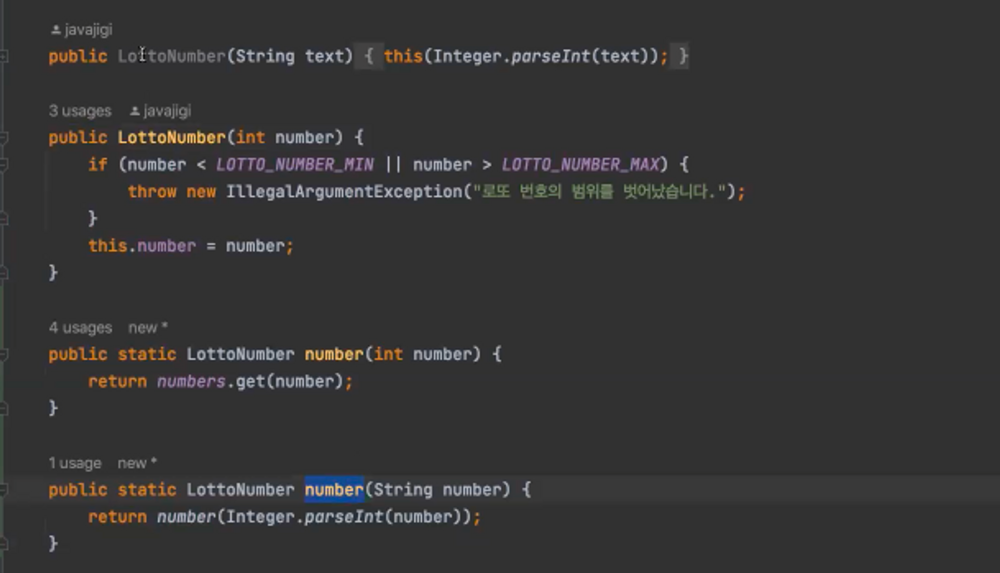

# 14장. 점진적인 개선
깨끗한 코드를 짜려면 먼저 지저분한 코드를 짠 뒤에 정리해야 한다.

프로그램을 망치는 가장 좋은 방법 중 하나는 개선이라는 이름 아래 구조를 크게 뒤집는 행위다.

- 어떤 프로그램은 그저 그런 ‘개선’에서 결코 회복하지 못한다.
- ‘개선’ 전과 똑같이 프로그램을 돌리기가 아주 어렵기 때문이다.

→ 처음부터 새로 구현하는 빅뱅 전략 / 차세대, 고도화 프로젝트

<br/>

### 빅뱅 전략

특별한 준비와 전략없이 아무 것도 없는 상태에서 새롭게 구현하는 기존 방식으로 구현 가능하다.

- 빅뱅 전략을 채택했을 때의 상황

```java
1. 레거시가 쌓이고 쌓여 결국 유지보수를 담당하던 팀이 GG
2. 기존 시스템에 대한 재설계 시작
3. 기존 유지보수 팀과 차세대 팀의 경주 시작
4. 새 시스템이 기존 시스템을 따라잡을 쯤에는 초창기 차세대 팀원들은 거의 퇴사함
5. 새로운 팀원들은 다시 새롭게 설게하자고 주장 <- 현재 시스템이 너무 엉망이라
6. 다시 반복
```

→ 결국 재설계를 통해 유지보수하기 좋은 상태의 소스 코드를 구현하고 싶어도 결과는 또 하나의 유지보수하기 어려운 시스템이 등장해버린다.

- 문제점
  1. 새로운 시스템으로 오픈하는 시점엔 기존과 비슷한 수준의 부채를 떠안고 시작하는 경우가 대부분
  2. 새로 만들기만 하는 개발자들은 기존 기능을 리팩터링 역량을 쌓지 못해 새로운 시스템 또한 시간이 지나면 부채가 금방 늘어나게 된다.
  3. 시장은 빠르게 바뀌지만 새로 서비스를 만드는 기간동안에는 기존 서비스에 새로운 기능을 붙이는데에 한계가 있으므로 회사는 비즈니스 요구사항을 제한적으로 수용할 수 밖에 없다.

     → 회사 자체가 망할 수도 있다.

<br/>

### 점진적으로 리팩토링하는 전략

초반에는 상당히 느리고 답답할 수 있다.

하지만 비즈니스의 새로운 요구를 수용하며 점진적으로 리팩토링 할 수 있다.

개발자들이 리팩토링 역량을 쌓을 수 있고, 이에 대한 필요성을 점차 느껴 나아가기 때문에 부채를 만들 가능성이 낮아진다.

<br/>

점진적인 개선을 위해 TDD 기법을 사용하는 것이 좋다.

- TDD는 언제 어느 때라도 시스템이 돌아가야 한다는 원칙을 따르기 때문이다.
- TDD는 시스템을 망가뜨리는 변경을 허용하지 않기 때문이다.

  → 변경을 가한 후에도 시스템이 변경 전과 똑같이 돌아가야 한다.

시스템 변경과 상관없이 똑같이 돌아간다는 사실을 확인하려면 언제든 실행 가능한 자동화된 테스트 코드가 필요하다.

<br/>

기존 코드를 최소로 건드리는, 가장 단순한 변경부터 시작해본다.

- 확장은 쉽게
- 변경은 적게
- 기존 시스템에 최대한 영향이 가지 않도록

<br/>

- 점진적인 리팩토링 시 가장 중요한 것

  → 기존의 코드(AS-IS)와 바꾸려는 코드(TO-BE)가 일정 기간 공존하는 지점이 있어야 한다.

  - ex) 위에 두 생성자가 AS-IS, 아래 정적 팩토리 메소드가 TO-BE

  

  - 한 번에 TO-BE가 되어 버리면 문제가 생길 가능성이 높아짐
  - 하다가 막힌다고 무조건 원복시키지 말고 그 상태에서 대안을 찾으려고 노력해야 한다.

<br/>

### 스트랭글러 패턴

→ AS-IS 코드와 TO-BE 코드를 공존시키고 점진적으로 TO-BE 코드를 사용하게 만들고 어디에서도 AS-IS 코드를 사용하지 않을 때 AS-IS 코드를 날려버리는 방법

프레임워크 변경, 언어 변경과 같은 큰 리팩토링에도 비즈니스 요구사항을 수용하고, 더 안전한 리팩토링이 가능하다.

<br/><br/>

## 결론

소프트웨어 설계는 분할만 잘해도 품질이 크게 높아진다.

관심사를 분리하면 코드를 이해하고 보수하기 훨씬 더 쉬워진다.

→ SRP

<br/>

나쁜 코드보다 더 오랫동안 더 심각하게 개발 프로젝트에 악영향을 미치는 요인도 없다.

나쁜 코드를 깨끗한 코드로 개선하는 것은 비용이 엄청나게 많이 든다.

반면 처음부터 코드를 깨끗하게 유지하기란 상대적으로 쉽다.

그러므로 코드는 언제나 최대한 깔끔하고 단순하게 정리하자.