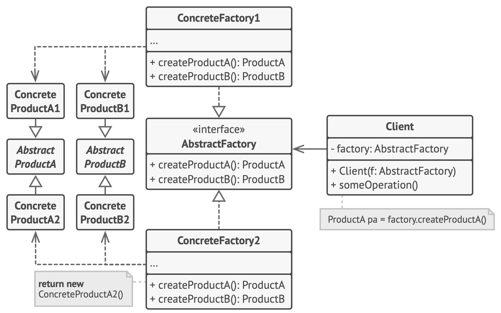

# 16장. SerialDate 리팩토링

## 첫째, 돌려보자

클래스를 철저히 이해하고 리팩토링하려면 훨씬 높은 테스트 커버리지가 필요하다.

 

### 경계 조건 오류

- 에러냐 아니냐의 경계가 되는 조건
    - ex) `a / b` → `b > 0` 이 경계 조건이 된다.
- 행복 경로 끝에 있는 것 → 이 조건까지 통과한다면 해당 기능은 제대로 작동한다고 볼 수 있다.
- **CORRECT**

  - 경계 조건을 생각할 때 고려해야 하는 7가지

    1. Conformance(준수)
    2. Ordering(순서)
    3. Range(범위)
    4. Reference(참조)
    5. Existence(존재)
    6. Cardinality(기수): 중복성이 없는 정도
    7. Time(절대적/상대적 시간)

  

## 둘째, 고쳐보자

추상 클래스에서는 구현을 암시할 필요가 전혀 없다. 구현을 숨기는 편이 좋다.

일반적으로 파생 클래스의 인스턴스로부터 구현 정보를 가져온다.

 

상수 클래스를 상속하면 Month.January 와 같은 표현을 사용할 필요가 없어진다.

그러나 이 방법은 옛날에 많이 쓰던 방법이지, 바람직한 방법이 아니다. enum class로 정의해야 한다.

 

Serializable 인터페이스를 상속하는 클래스에서 serialVersionUID 변수를 선언하지 않으면 컴파일러가 자동으로 클래스의 구조 정보를 이용해서 생성한다.

-  클래스에 변경이 있을 때마다 변수 값이 달라질 수 있다.

보통 직접 선언하라고 권하지만 (작가는) 자동 제어가 훨씬 더 안전하게 여겨진다.

깜빡하고 serialVersionUID를 변경하지 않아 생기는 오류를 디버깅하는 것보다 차라리 InvalidClassException을 디버깅하는 편이 낫기 때문이다.

- 직접 serialVersionUID를 선언 하는 이유

  → JVM 내부 알고리즘에 따라 serialVersionUID 작성되기 때문에 해당 어플리케이션을 구동하는 환경이 달라지면 같은 객체를 직렬화/역직렬화 해도 달라질 수 있다.

 

불필요한 주석은 거짓말과 잘못된 정보가 쌓이기 좋은 곳이다.

 

변수는 해당 변수를 실제로 사용하는 클래스에서 정의한다.

 

일반적으로 기반(부모) 클래스는 파생(자식) 클래스를 몰라야 바람직하다. → 추상 팩토리 패턴을 활용

- **추상 팩토리 패턴**

  : 각각의 구체 클래스를 지정하지 않고도 연관 객체들의 모음을 생성할 수 있는 패턴

  

 

메소드 명은 이름이 좀 더 서술적이어야 한다.

 

추상 메소드로 위임하는 정적 메소드는 싱글턴, 데코레이터, 추상 팩토리 패턴 조합을 사용한다.

- **싱글턴 패턴**

  - 인스턴스가 오직 하나만 생성되는 것을 보장하고 어디에서든 이 인스턴스에 접근할 수 있도록 하는 패턴

  

    - 하나의 인스턴스만을 생성하는 책임이 있다.
    - getInstance() 를 통해 모든 클라이언트에게 동일한 인스턴스를 반환하는 작업을 수행한다.

     
- **데코레이터 패턴**

  

  - 기본 기능에 추가할 수 있는 다양한 부가 기능에서 파생되는 다양한 조합을 동적으로 구현할 수 있는 패턴
    
  → OCP와 DIP가 적용된 설계 패턴

 

일반적으로 메서드 인수로 플래그는 바람직하지 못하다.

특히 출력 형식을 선택하는 플래그는 가급적 피하는 편이 좋다.

 

알고리즘이 복잡할 때는 임시 변수를 활용하여 좀 더 가독성을 높일 수 있다.

특히, 조건문에서 조건을 설명하는 변수로 사용하면 조건을 더 명확하게 나타낼 수 있다.