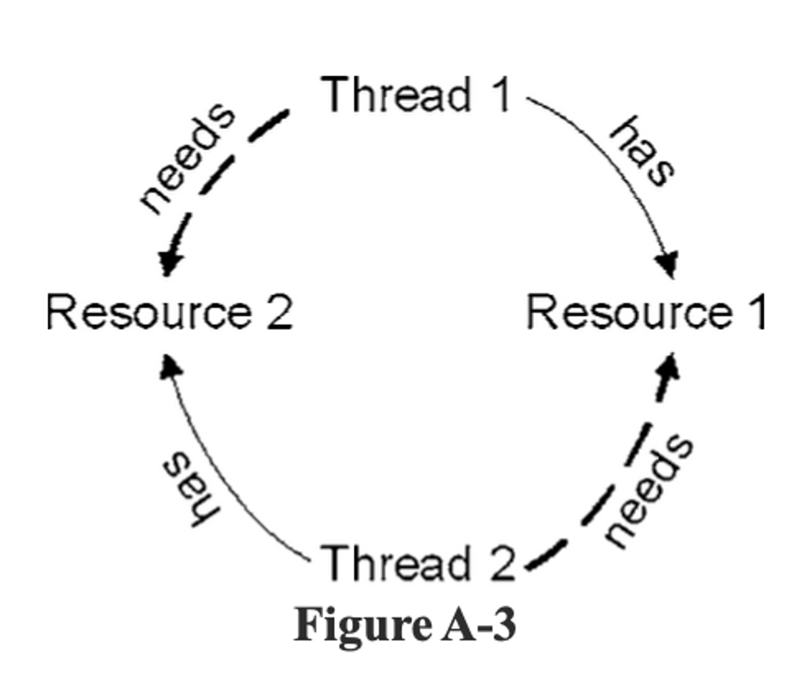

# 부록A. 동시성2

## 클라이언트/서버 예제

서버

- 연결을 기다리다 들어오는 메세지를 처리한 후, 다음 클라이언트 요청을 기다린다.

```java
ServerSocket serverSocket = new ServerSocket(8009)

while (keepProcessing) {
	try {
		Socket socket = server.Socket.accept();
		process(socket);
	} catch (Exception e) {
		handle(e);
	}
}
```

<br/>

클라이언트

```java
private void connectSendReceive(int i) {
	try {
		Socket socket = new Socket("localhost", PORT);
		MessageUtils.sendMessage(socket, Integer.toString(i));
		MessageUtils.getMessage(socket);
		socket.close();
	} catch (Exception e) {
		e.printStackTrace();
	}
}
```

<br/>

성능 테스트

- 시스템 작업 처리량을 검증하는 예시 케이스
- 시스템이 일련의 클라이언트 요청을 10초 내에 처리해야 함

```java
@Test(timeout=10000)
public void shouldRunInUnder10Seconds() throws Exception {
	Thread[] threads = createThreads();
	startAllThreads(threads);
	waitForAllThreadsToFinish(threads);
}
```

<br/>

테스트가 실패한다면 단일스레드 환경에서 속도를 끌어올릴 방법은 거의 없다.

다중 스레드를 사용하면 성능이 높아질까?

그럴지도 모르지만 먼저 애플리케이션이 어디서 시간을 보내는지 알아야 한다.

대개 시스템은 둘 다 하느라 시간을 보내지만, 특정 연산을 살펴보면 대개 하나가 지배적이다.

- I/O - 소켓 사용, DB 연결, 가상 메모리 스와핑 기다리기 등

  → 동시성이 성능을 높여주기도 한다.

       (시스템 한 쪽이 I/O를 기다리는 동안 다른 쪽이 뭔가를 처리해 놀고 있는 CPU를 효과적으로 활용 가능)

- 프로세서 - 수치 계산, 정규 표현식 처리, 가비지 컬렉션 등

  → 새로운 하드웨어를 추가해 성능을 높이는 방식이 적합

       (CPU 사이클은 한계가 있기 때문에 스레드를 늘인다고 빨라지지 않기 때문)

<br/>

### 스레드 추가하기

```java
void process(final Socket socket) {
	if (socket == null)
		return;

	Runnable clientHandler = new Runnable() {
		public void run() {
			try {
				String message = MessageUtils.getMessage(socket);
				MessageUtils.sendMessage(socekt, "Processed: " + message);
				closeIgnoringException(socket);
			} catch (Exception e) {
				e.printStackTrace();
			}
		}
	};

	// 스레드 추가
	Thread clientConnection = new Thread(clientHandler);
	clientConnection.start();
}
```

<br/>

### 서버 살펴보기

위의 코드는 성능 테스트는 완료하지만 코드에서 최대 스레드 수를 명시하지 않으므로 이론상 JVM이 허용하는 수까지 생성이 가능하다.

너무 많은 사용자가 한꺼번에 몰리는 시스템이라면 동작을 멈출지도 모른다.

<br/>

그리고 현재 서버 프로그램의 process 함수는 단일 책임 원칙을 위반하고 있다.

- 현재 지고 있는 책임
    1. 소켓 연결 관리
    2. 클라이언트 처리
    3. 스레드 정책
    4. 서버 종료 정책

<br/>

다중 스레드 프로그램을 깨끗하게 유지하려면 잘 통제된 몇 곳으로 스레드 관리를 모아야 한다.

스레드를 관리하는 코드는 스레드만 관리해야 한다.

비동시성 문제까지 뒤섞지 않더라도 동시성 문제는 그 자체만으로도 추적하기 어렵기 때문이다.

<br/>

스레드 관리 책임을 클래스로 분리한다면 스레드 관리 전략이 변할 때 전체 코드에 미치는 영향이 작아지며 다른 책임을 간섭하지 않는다.

더구나 스레드를 걱정하지 않고서 다른 책임을 테스트하기가 훨씬 더 쉬워진다.

<br/>

```java
// 스레드 관련 코드 분리
public void run() {
	while (keppProcessing) {
		try {
			ClientConnection clientConnection = connectionManager.awaitClient();
			ClientRequestProcessor requestProcessor = new ClientRequestProcessor(clientConnection);
			clientScheduler.schedule(requestProcessor);
		} catch (Exception e) {
			e.printStackTrace();
		}
	}

	connectionManager.shutdown();
}

// 동시성 정책 관련 코드 분리
public interface ClientScheduler {
	void schedule(ClientRequestProcessor requestProcessor);
}

public class ThreadPerRequestScheduler implements ClientScheduler {
	
	...
	
	public void schedule(final ClientRequestProcessor requestProcessor) {
		Runnable runnable = new Runnable() {
			public void run() {
				requestProcessor.process();
			}
		};

		Thread thread = new Thread(runnable);
		thread.start();
	}
}
```

<br/>

### 결론

동시성은 그 자체가 복잡한 문제이므로 다중 스레드 프로그램에서는 단일 책임 원칙이 특히 중요하다.

<br/><br/>

## 가능한 실행 경로

```java
public class IdGenerator {
	int lastIdUsed;

	public int incrementValue() {
		return ++lastIdUsed;
	}
}
```

스레드 하나가 IdGenerator 인스턴스 하나를 사용한다면 가능한 실행 경로도, 가능한 결과도 단 하나다.

그러나 스레드가 여러 개고 incrementValue 메소드를 한 번씩 호출한다면 가능한 실행 경로와 결과도 다양해진다.

- 스레드 1이 94를 얻고, 스레드2가 95를 얻고, lastIdUsed가 95가 된다.
- 스레드 1이 95를 얻고, 스레드2가 94를 얻고, lastIdUsed가 95가 된다.
- 스레드 1이 94를 얻고, 스레드2가 94를 얻고, lastIdUsed가 94가 된다.

<br/>

### 경로 수

`return ++lastIdUsed` 는 바이트 코드 명령 8개에 해당한다.

```java
단계가 N개 이고 스레드가 T개라면 총 단계는 = N*T
각 단계를 실행하기 전 스레드 T개 중 하나를 선택하는 컨텍스트 스위칭이 일어나는데 이로 인해 일련의 순열로 표현 = (NT)!
이때 중복된 순열 수 = N^T
따라서, 가능한 경우의 수 = (NT)! / N^T
```

<br/>

이때 `synchronized` 를 추가하면 가능한 경로의 수는 (스레드가 2개일 때) 2개로 줄어든다.

스레드가 N개라면 가능한 경로의 수는 N! 이다.

```java
public synchronized int incrementValue() {
    return ++lastIdUsed;
}
```

<br/>

### 심층 분석

원자적 연산: 중단이 불가능한 연산

- (int) `lastId = 0;` O
- (long) `lastId = 0;` X
- `++lastId;` X

<br/>

- 프레임: 호출 스택을 정의할 때 사용하는 표준 기법
    - 모든 메서드 호출에는 프레임이 필요하다.
    - 반환 주소, 메서드로 넘어온 매개변수, 메서드가 정의하는 지역 변수 포함
    - 현대 언어는 호출 스택으로 기본 함수/메서드 호출과 재귀적 호출을 지원
- 지역 변수: 메서드 범위 내에 정의되는 모든 변수
    - 정적 메서드를 제외한 모든 메서드는 this라는 지역 변수를 갖는다.
    - this는 현재 객체, 즉 현재 스레드에서 가장 최근에 메시지를 받아 메서드를 호출한 객체를 가리킨다.
- 피연산자 스택: 매개변수를 저장하는 장소
    - 피연산자 스택은 표준 LIFO 자료구조다.

<br/>

### 결론

어떤 연산이 안전하고 안전하지 못한지 파악할 만큼 메모리 모델을 이해하고 있어야 한다.

- 공유 객체/값이 있는 곳
- 동시 읽기/수정 문제를 일으킬 소지가 있는 코드
- 동시성 문제를 방지하는 방법
- …

<br/><br/>

## 라이브러리를 이해하라

### Executor 프레임워크

- 스레드 풀링으로 정교한 실행을 지원
    - 스레드 풀 관리
    - 풀 크기 자동 조정
    - 스레드 재사용
    - Future 지원
        - Future: 여러 개의 독립적인 연산을 실행한 후 모두 끝나기를 기다릴때 활용
    - Runnable/Callable 인터페이스 구현 클래스 지원

→ 스레드를 생성하나 스레드 풀을 사용하지 않거나 직접 생성한 스레드 풀을 사용하는 경우 고려

<br/>

### 스레드를 차단하지 않는 방법

최신 프로세서는 non-blocking 방식으로도 안정적으로 값을 갱신한다.

```java
// Before
public class ObjectWithValue {
	private int value;
	public void synchronized incrementValue() { ++value; }
	public int getValue() { return value;}
}

// After: AtomicXXX 클래스 사용 -> 이전보다 성능 향상
public class ObjectWithValue {
	private AtomicInteger value = new AtomicInteger(0);

	public void incrementValue() { 
		value.incrementAndGet();
	}

	public int getValue() { 
		return value.get();
	}
}
```

<br/>

`After` 가 성능이 더 좋은 이유

→ 현대 프로세서는 보통 CAS 연산을 지원하기 때문

<br/>

- CAS ≒ DB의 낙관적 잠금
    - 여러 스레드가 같은 값을 수정해 문제를 일으키는 상황이 그리 잦지 않다는 가정에서 출발
    - 그래서 그런 상황이 발생했는지 효율적으로 감지해 갱신이 성공할 때까지 재차 시도
- 동기화 ≒ DB의 비관적 잠금
    - synchronized 는 언제나 락을 건다.
    - 자바 버전이 올라갈 수록 내장 락의 성능이 좋아지기는 했지만 그래도 락의 비용은 비싸다.

→ 많은 스레드가 경쟁하는 상황이라도 락을 거는 쪽보다 문제를 감지하는 쪽이 거의 항상 더 효율적

<br/>

CAS 연산은 어떤 메서드가 공유 변수를 갱신하려 든다면, 현재 변수 값이 최종으로 알려진 값인지 확인한다.

그렇다면 변수 값을 갱신하고 아니라면 다른 스레드가 끼어들었다는 뜻이므로 변수 값을 갱신하지 않는다.

값을 변경하려던 메서드는 값이 변경되지 않았다는 사실을 확인하고 다시 시도한다.

<br/>

### 다중 스레드 환경에서 안전하지 않은 스레드

- ex)
    - SimpleDateFormat
    - DB 연결
    - java.util 컨테이너 클래스
    - 서블릿
    - …

<br/>

```java
// containsKey() 와 put() 사이에 다른 스레드가 끼어들어 hashTable에 값을 추가할 수 있는 문제점 존재
if (!hashTable.containsKey(key)) {
	hashTable.put(key, value);
}

// 해결방안 1. HashTable을 잠근다.
synchronized(hashTable) {
	if(!hashTable.containsKey(key))
		hashTable.put(key, value);
}

// 해결방안 2. HashTable을 객체로 감싼 후 다른 API를 사용한다. -> 어댑터 패턴 사용
public class WrappedHashTable(K, V> {
	private Map<K, V> map = new HashTable<K, V>():

	public synchronized void putIfAbsend(K key, V value) {
		if(!hashTable.containsKey(key))
			hashTable.put(key, value);
	}
}

// 해결방안 3. 스레드에 안전한 집합 클래스 사용
ConcurrentHashMap<Integer, String> map = new ConcurrentHashMap<>();
map.putIfAbsent(key, value);
```

<br/>

### 메서드 사이에 존재하는 의존성을 조심하라

```java
public class IntegerIterator implements Iterator<Integer> {
	private Integer nextValue = 0;

	public synchronized boolean hasNext() {
		return nextValue < 100000;
	}

	public synchronized Integer next() {
		if (nextValue == 100000)
			throw new IteratorPastEndException();
		return nextValue++;
	}

	public synchronized Integer getNextValue() {
		return nextValue;
	}
}

// IntegerIterator 클래스를 사용하는 예시 코드
IntegerIterator iterator = new IntegerIterator();
while (iterator.hasNext()) {
	int nextValue = iterator.next();
	...
}
```

스레드 하나가 위의 코드를 실행한다면 아무 문제도 없다.

하지만 스레드 두 개가 IntegerIterator 인스턴스 하나를 공유한다면, 맨 끝에 두 스레드가 서로를 간섭해 한 스레드가 최대 허용 값을 지나치는 바람에 예외가 발생할 가능성이 존재한다.

→ 개별 메서드는 동기화 되었지만 클라이언트는 메서드 두 개를 함께 사용하기 때문

<br/>

다중 스레드 환경에서 발생하는 문제 중 위의 예제가 까다로운 이유는 정수 범위 끝에서 스레드가 서로 간섭할 때만 문제가 발생하기 때문이다.

- 해결 방안
  1. 실패를 용인한다.
    - 다소 조잡한 방법

<br/>

  2. 클라이언트를 바꿔 문제를 해결한다. → 클라이언트-기반 잠금

      ```java
      IntegerIterator iterator = new IntegerIterator();
      
      while (true) {
          int nextValue;
      
          // synchronized 키워드로 IntegerIterator 객체에 락을 건다.
          synchronized (iterator) {
              if (!iterator.hasNext())
                  break;
              nextValue = iterator.next();
          }
      
          ...
      }
      ```

     - 👍🏻: DRY 원칙을 위반하지만 다중 스레드 환경에 안전하지 못한 외부 도구를 사용한다면 필요할 수도 있다.
     - 👎🏻: 서버를 사용하는 모든 프로그래머가 락을 기억해 객체에 걸었다 풀어야 하므로 다소 위험하다.

<br/>

  3. 서버를 바꿔 문제를 해결한다. 서버에 맞춰 클라이언트도 바꾼다. → 서버-기반 잠금 / 가장 바람직

      ```java
      // 서버
      public class IntegerIteratorServerLocked {
          private Integer nextValue = 0;
      
          public synchronized Integer getNextOrNull() {
              if (nextValue < 100000)
                  return nextValue++;
              else
                  return null;
          }
      }
      
      // 클라이언트
      while (true) {
          Integer nextValue = iterator.getNextOrNull();
          
          if (nextValue == null)
              break;
          
          ...
      }
      ```

     - 👍🏻: 클라이언트가 중복해서 락을 걸 필요가 없어진다.
       - 클라이언트는 자유롭게 객체를 사용할 뿐더러 클라이언트에 잠금 코드를 추가할 필요도 없어진다.
     - 👍🏻: 성능이 좋아진다.
       - 단일스레드 환경으로 시스템을 배치할 경우 다중 스레드 서버를 단일 스레드 서버로 서버만 교체하면 오버헤드가 줄어든다.
     - 👍🏻: 오류가 발생할 가능성이 줄어든다.
     - 👍🏻: 스레드 정책이 하나다.
       - 클라이언트-기반 잠금은 각 클라이언트가 정책을 구현하는 반면, 서버-기반 잠금은 서버 한 곳에서 정책을 구현한다.
     - 👍🏻: 공유 변수 범위가 줄어든다.
       - 공유 변수나 공유 변수가 잠긴 방식 모두 서버에 숨겨지기 때문에 클라이언트는 아예 모른다.
       - 따라서, 문제가 생기면 살펴볼 곳이 적다.

<br/>

  만약 서버 코드에 손대지 못한다면

  - 어댑터 패턴을 사용하여 잠금을 추가하거나

      ```java
      public class ThreadSafeIntegerIterator {
          private IntegerIterator iterator = new IntegerIterator();
        
          public synchronized Integer getNextOrNull() {
              if (iterator.hasNext())
                  return iterator.next();
              return null;
          }
      }
      ```

  - 스레드에 안전하며 인터페이스가 확장된 집합 클래스를 사용한다.

<br/><br/>

## 데드락

```java
상황) 개수가 한정된 자원 풀 두 개를 공유하는 웹 어플리케이션
- 사용 자원
	- 로컬 임시 DB 연결 풀
	- 중앙 저장소 MQ 연결 풀
- 수행 연산
	- 생성: 중앙 저장소와 통신한 후 임시 DB에 작업 저장(중앙 저장소 연결 확보 -> 임시 DB 연결 확보)
	- 갱신: 임시 DB에서 작업을 읽어 중앙 저장소로 전송(임시 DB 연결 확보 -> 중앙 저장소 연결 확보)
```

이때 풀 크기(10)보다 사용자 수가 많다면

1. 사용자 10명이 생성을 시도해 중앙 저장소 연결 10개를 모두 확보한다. 모든 스레드가 중앙 저장소 연결을 확보한 이후 DB 연결을 확보하기 전에 중단된다.
2. 사용자 10명이 갱신을 시도해 DB 연결 10개를 모두 확보한다. 모든 스레드가 DB 연결을 확보한 이후 중앙 저장소 연결을 확보하기 전에 중단된다.
3. 생성 스레드 10개는 DB 연결을 기다린다. 갱신 스레드 10개는 중앙 저장소 연결을 기다린다.
4. 데드락 발생. 시스템은 결코 복구되지 못한다.

<br/>

데드락은 다음 네 가지 조건을 모두 만족하면 발생한다. 네 조건 중 하나라도 깨버리면 발생하지 않는다.

- 상호 배제
- 잠금 & 대기
- 선점 불가
- 순환 대기

<br/>

### 상호 배제

→ 여러 스레드가 한 자원을 공유하지만 그 자원은 여러 스레드가 동시에 사용하지 못하며 개수가 제한적인 상황

ex) DB 연결, 쓰기용 파일 열기, 레코드 락, 세마포어 등

<br/>

- 조건 깨기
  - 동시에 사용해도 괜찮은 자원을 사용한다. ex) AtomicInteger
  - 스레드 수 이상으로 자원 수를 늘인다.
  - 자원을 점유하기 전에 필요한 자원이 모두 있는지 확인한다.

→ 달성하기 어려움

<br/>

### 잠금 & 대기

→ 일단 스레드가 자원을 점유하면 나머지 필요 자원까지 모두 점유해 작업을 마칠 때까지 이미 점유한 자원을 내놓지 않는다.

<br/>

- 조건 깨기
  - 대기하지 않는다.

    → 각 자원을 점유하기 전에 확인해서 어느 하나라도 점유하지 못한다면 지금까지 점유한 자원을 모두 내놓고 처음부터 다시 시작한다.

  - 문제점
    1. 기아: 한 스레드가 계속해서 필요한 자원을 점유하지 못한다.
    2. 라이브락: 여러 스레드가 한꺼번에 잠금 단계로 진입하는 바람에 계속해서 자원을 점유했다 내놨다를 반복한다.

    → 두 경우 모두 작업 처리량을 크게 떨어뜨린다.

      (기아는 CPU 효율을 저하시키는 반면 라이브락은 쓸데 없이 CPU만 많이 사용한다.)

<br/>

### 선점 불가

→ 한 스레드가 다른 스레드로부터 자원을 빼앗지 못한다.

자원을 점유한 스레드가 스스로 내놓지 않는 이상 다른 스레드는 그 자원을 점유하지 못한다.

<br/>

- 조건 깨기
  - 다른 스레드로부터 자원을 뺏어온다.

    → 필요한 자원이 잠겼다면 자원을 소유한 스레드에게 풀어달라 요청한다.

    → 소유 스레드가 다른 자원을 기다리던 중이었다면 자신이 소유한 자원을 모두 풀어주고 처음부터 다시 시작한다.

  - 장점
    - 스레드가 자원을 기다려도 괜찮다.
    - 처음부터 다시 시작하는 횟수가 줄어든다.
  - 문제점
    - 모든 요청을 관리하기가 어렵다.

<br/>

### 순환 대기



- 조건 깨기
  - 데드락을 방지하는 가장 흔한 전략
  - 모든 스레드가 일정 순서에 동의하고 그 순서로만 자원을 할당한다.
  - 문제점
    1. 자원을 할당하는 순서와 자원을 사용하는 순서가 다를지도 모른다.

       → 제일 처음 할당한 자원을 나중에 쓰는 상황이 있을 수 있다.

       → 자원을 필요 이상으로 점유한다.

    2. 순서에 따라 자원을 할당하기 어렵다.

<br/><br/>

## 다중 스레드 코드 테스트

다중 스레드 코드 이슈는 드물게 발생하기 때문에 대게 테스트로 발견하지 못한다.

테스트를 조율해 한 장비에서 이슈를 발견했다 하더라도 다른 장비, 다른 OS, 다른 JVM으로 옮기면 테스트 값을 다시 조율해서 진행해야 한다.

실패를 증명할 테스트 코드를 어떻게 작성할까? 어디를 살펴볼지 모른다면 코드에 버그가 있는지 없는지 어떻게 찾아낼까?

<br/>

1. 몬테 카를로 테스트
  - 조율이 가능하게 유연한 테스트를 만들고 임의로 값을 조율하면서 계속 돌린다.
  - 테스트가 실패한 조건은 신중하게 기록한다.
2. 시스템을 배치할 플랫폼 전부에서 테스트를 반복해서 돌린다.
  - 테스트가 실패 없이 오래 돌아갈수록 두 가지 중 하나일 확률이 높아진다.
    - 실제 코드가 올바르다.
    - 테스트가 부족해 문제를 드러내지 못한다.
3. 부하가 변하는 장비에서 테스트를 돌린다.

<br/>

하지만 위와 같은 조치를 모두 취하더라도 코드에서 스레드 문제를 찾아낼 가능성은 매우 낮다.