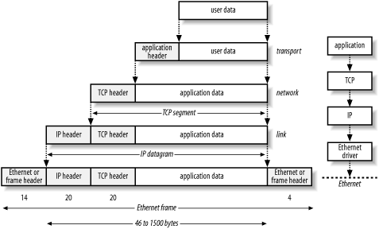
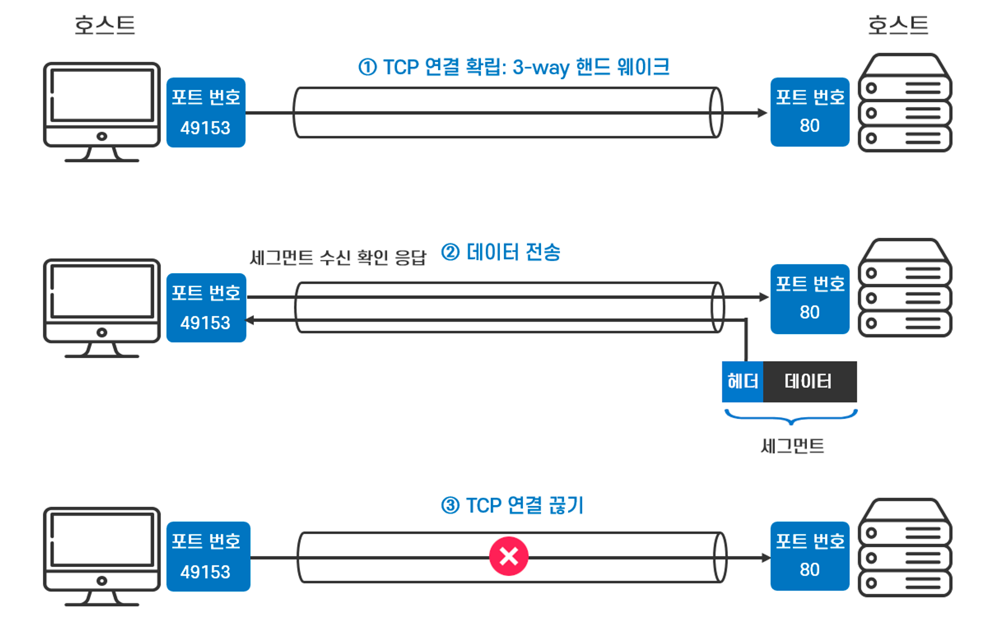
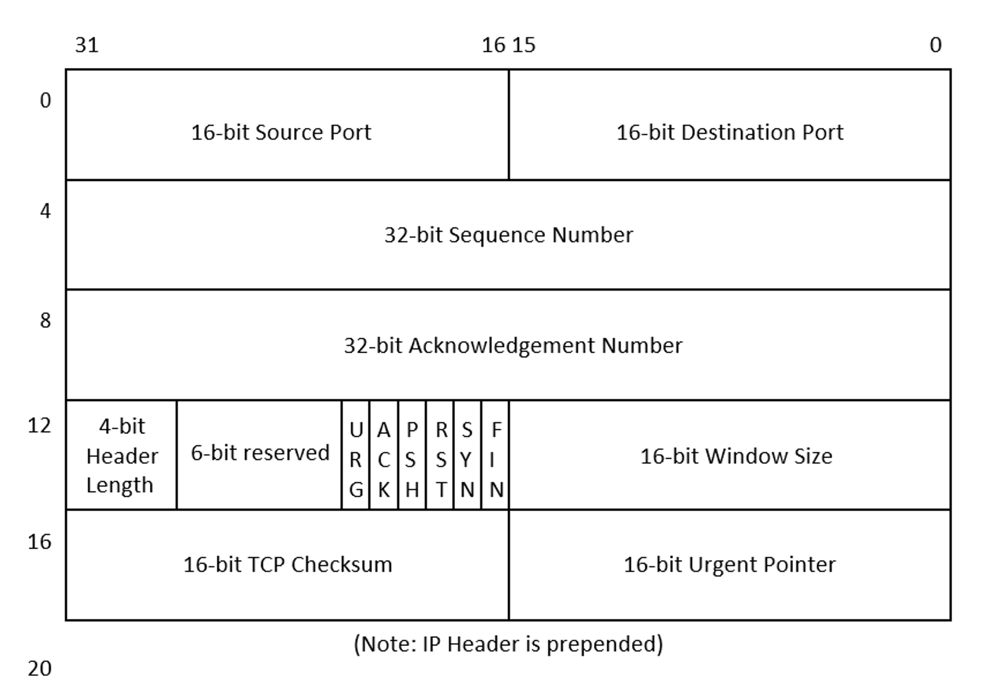
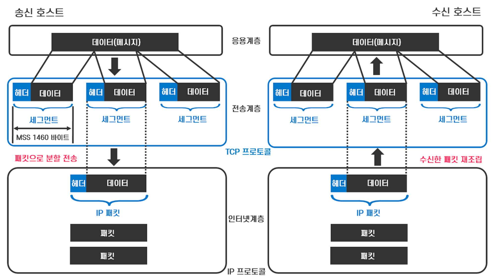
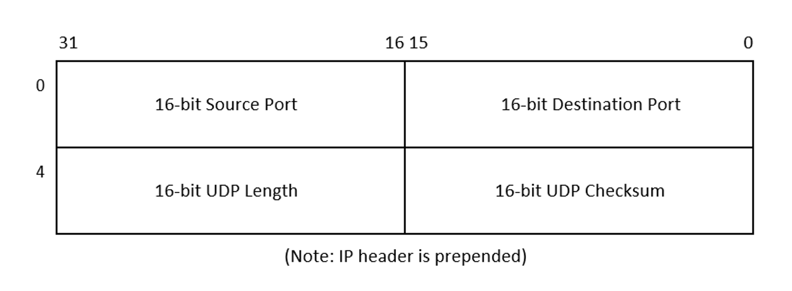

# Chapter03. 네트워크의 공통 언어 TCP/IP
## 3-1 TCP/IP: 네트워크의 공통 언어

### TCP/IP의 계층구조

TCP/IP에서는 네트워크를 통해 통신하기 위한 기능을 계층화하고 복수의 프로토콜을 조합하여 실현했다.

TCP/IP는 4계층으로 구성된다.

- 애플리케이션층
    - 애플리케이션에서 다룰 데이터 형식과 절차를 결정한다.
    - ex) HTTP, SMTP, POP3, DNS 등
- 트랜스포트층
    - 애플리케이션에 데이터를 할당한다.
    - ex) TCP/UDP
- 인터넷층
    - 엔드투엔드 통신을 한다.
    - ex) IP, ICMP, ARP 등
- 네트워크 인터페이스층
    - 프로토콜은 자유롭게 선택할 수 있다.
    - 통신 상대와 같은 것을 사용할 필요는 없다.
    - ex) 이더넷, 무선 LAN(와이파이) 등

 

각 계층에 포함된 프로토콜을 조합해 애플리케이션이 통신한다.

4계층의 프로토콜이 모두 정상적으로 제기능을 해야 통신이 이루어진다.

어떤 계층이 기능을 발휘하려면, 그 하위 계층이 정상적으로 동작한다는 것을 전제로 한다.

  

## 3-2 네트워크 인터페이스층과 인터넷층: 데이터를 전송하는 역할을 하는 계층

### 네트워크 인터페이스층

네트워크 인터페이스층의 역할은 같은 네트워크 내 인터페이스 간 데이터를 전송하는 것이다.

- ex)
    - 기술적인 관점에서 하나의 네트워크는 라우터와 레이어3 스위치로 구획되는 범위, 또는 레이어2 스위치로 구성하는 범위다.
    - 레이어2 스위치에 연결된 PC의 인터페이스에서 같은 레이어2 스위치에 연결된 다른 PC의 인터페이스까지 데이터를 전송할 수 있다.
    - 이때 0, 1의 디지털 데이터를 전기 신호 등의 물리적 신호로 변환해 전달한다.

네트워크 인터페이스층의 프로토콜이 통신 상대와 같아야 할 필요는 없다.

 

### 인터넷층

인터넷층의 역할은 원격지 네트워크 간 데이터를 전송하는 것이다.

→ 엔드투엔드 통신

- 원격지 네트워크에서 최종적인 출발지와 목적지 사이의 데이터 전송

 

- 라우터: 네트워크끼리 연결하고 데이터를 전송하는 기기
- 라우팅: 라우터에 의한 네트워크 간 전송

  

## 3-3 트랜스포트층과 애플리케이션층: 애플리케이션의 동작을 준비하는 계층

### 트랜스포트층

트랜스포트층의 역할은 다양한 곳에서 들어온 데이터를 적절한 애플리케이션으로 배분하는 것이다.

최하층부터 트랜스포트층까지 바르게 동작하면, 출발지와 목적지 애플리케이션 간에 데이터를 송수신할 수 있게 된다.

TCP/IP 트랜스포트층에 포함되는 프로토콜은 TCP와 UDP이다.

TCP를 이용하면, 어떤 이유로 데이터가 유실되더라도 그 사실을 검출해 데이터를 다시 보내준다.

TCP는 엔드투엔드의 신뢰성을 확보해주고 데이터를 분할/조립 등의 역할도 한다.

 

### 애플리케이션층

애플리케이션층의 역할은 애플리케이션에서 다루는 데이터 형식과 처리 순서 등을 결정하는 것이다.

단순한 0과 1이 아니라 문자와 이미지 등 인간이 인식할 수 있도록 데이터를 표현한다.

  

## 3-4 캡슐화: 데이터 송수신 규칙

### 프로토콜의 제어정보 헤더를 만든다.

각 프로토콜에는 각각의 기능을 실현하기 위한 헤더가 필요하다.

- 헤더
    - 각 프로토콜의 처리를 하기 위한 제어 정보

 

각 프로토콜은 데이터를 전송할 때 헤더를 추가한다. → 캡슐화

프로토콜이 데이터를 받으면 각 프로토콜 헤더를 바탕으로 적절하게 처리하여 헤더를 벗겨내고 다시 다른 프로토콜로 처리를 넘긴다. → 역캡슐화 / 비캡슐화

 

### 물리적인 신호로 변환된다.

- 웹브라우저의 데이터에 계층의 상위 프로토콜의 차례대로 헤더를 추가해 간다.
- 마지막으로 이더넷 헤더와 FCS가 추가되면 네트워크로 내보낼 전체 데이터가 완성된다.
    - FCS(Frame Check Sequence): 에러 체크를 위한 정보
- 이용하는 이더넷의 규격에 대응하는 물리적인 신호로 데이터 전체를 변환해 전송 매체로 내보낸다.

  

## 3-5 TCP/IP를 이용한 통신: 데이터 수신, 전송할 때의 규칙

### 0과 1의 데이터로 되돌려서 전송한다.

네트워크 기기는 수신한 물리적인 신호를 0과 1의 데이터로 되돌린다.

그리고 각각의 네트워크 기기의 동작에 대응하는 헤더를 참조하여 데이터를 전송해 간다.

 

### 헤더로 목적지를 확인하고 수신한다.

1. 웹서버 애플리케이션이 동작하는 웹서버까지 물리적인 신호가 도착하면 0과 1의 데이터로 변환한다.
2. 각 계층의 프로토콜은 각각의 헤더를 참조해 자기 앞으로 온 데이터인지 확인한다.
    1. 네트워크 인터페이스 계층에서는 FCS로 데이터에 오류가 없는지 확인한다.
3. 자기 앞으로 온 데이터가 맞다면 각 계층의 헤더를 제거해서 상위 프로토콜로 데이터 처리를 넘겨준다.

  

## 3-6 메시지, 세그먼트, 패킷, 프레임: 데이터를 부르는 방법은 다양하다

### 계층별로 데이터를 부르는 방법

- 애플리케이션: 메시지
- 트랜스포트층: 세그먼트, 데이터그램
  - TCP를 이용할 때는 세그먼트, UDP를 이용할 때는 데이터그램이라고 부른다.
- 인터넷층: (IP) 패킷, (IP) 데이터그램
- 네트워크 인터페이스층: 프레임

 

### 데이터를 부르는 방법의 예

- HTTP 메시지 = HTTP 헤더 + 웹프라우저의 데이터
- TCP 세그먼트 = TCP 헤더 + HTTP 메시지
- IP 패킷 = IP 헤더 + TPC 세그먼트
- 이너텟 프레임 = 이더넷 헤더 + IP 패킷 + FCS

 

부르는 방법에 차이가 있으므로, 네트워크 통신을 생각할 때 어느 계층을 주목하는지 명확해진다.

그러나 데이터를 부르는 방법이 엄밀하게 구분된 것은 아니다.

`계층에 주목해서 데이터를 부르는 방법이 구분하는 경우도 있다` 라는 기준 정도로만 생각해야 한다.

- 예시
  - 라우터
    - 인터넷층 레벨의 네트워크 기기
    - IP 패킷을 적절히 전송하는 기능을 하는 네트워크 기기

    → 라우터의 기능을 생각하려면 인터넷층에 주목하게 됨

  - 레이어2 스위치
    - 네트워크 인터페이스층의 네트워크 기기
    - 이더넷 프레임을 전송하는 역할

    → 레이어2 스위치를 이해하려면 네트워크 인퍼테이스층에 주목하게 됨

  

## 3-7 IP, IP 패킷, 라우팅: 데이터를 목적지까지 전송한다.

### IP란?

- 역할
  - 엔드투엔드 통신을 하는 것

    → 네트워크 상의 어떤 PC에서 다른 PC 등으로 데이터를 전송하는 것

  - 출발지와 목적지는 같은 네트워크에 있든 다른 네트워크에 있든 어느쪽이라도 상관없다.

 

### 보내고 싶은 데이터를 IP 패킷으로 만든다.

IP로 데이터를 전송하기 위해서는 데이터에 IP 헤더를 추가해 IP 패킷으로 만들어야 한다.

IP 헤더 중 가장 중요한 것은 IP 주소다.

IP 주소로 데이터의 출발지와 목적지를 나타내기 때문이다.

 

목적지가 다른 네트워크에 접속된 경우는 중간에 라우터가 존재한다.

출발지 호스트에서 내보낸 IP 패킷은 경로 중간에 있는 라우터가 IP 헤더를 참조해 전송해서 목적지 호스트까지 도달한다.

  

## 3-8 IP 주소: 통신 상대는 누구?

### IP 주소의 개요

- IP 주소
  - TCP/IP에서 통신 상대가 되는 호스트를 식별하기 위한 식별 정보

TCP/IP 통신에서는 반드시 IP 주소를 지정해야만 한다.

 

### 인터페이스에 IP 주소를 설정한다.

IP 주소는 이더넷 등의 인터페이스와 연관 지어 설정한다.

호스트 내부에서 인터페이스와 IP 프로토콜 부분을 연관 지어 IP 주소를 설정한다.

복수의 인터페이스가 탑재된 경우라면 인터페이스마다 IP 주소를 설정할 수 있다.

→ IP 주소는 호스트 자체가 아니라 정확하게는 호스트의 인터페이스를 식별한다.

 

### IP 주소 표기하기

- 도트형 10진 표기
  - 8비트씩 4개로 0~255 사이의 10진수로 변환하고 `.` 으로 구분

    → 256 이상의 숫자가 포함된 주소는 잘못된 주소

  

## 3-9 유니캐스트, 브로드캐스트, 멀티캐스트: 목적지는 하나? 아니면 여러 개?

### 데이터를 전송하는 주소의 차이

IP로 데이터를 전송할 때 목적지 개수에 따라 데이터 전송 방식을 분류할 수 있다.

- 유니캐스트
  - 단 한 곳으로 데이터를 전송하는 것
  - 유니캐스트 IP 주소 사용
  - 같은 데이터를 여러 곳으로 전송하고 싶을 때는 출발지 ↔ 목적지 수 만큼 유니캐스트 데이터 전송을 반복하면 되지만 비효율적

    → 브로드캐스트와 멀티캐스트를 사용

 

- 브로드캐스트
  - 같은 네트워크 상의 모든 호스트에 같은 데이터를 전송하는 것
  - 목적지 IP주소에 브로드캐스트 IP 주소를 지정하면, 같은 네트워크 상의 모든 호스트에 데이터 전송 가능

 

- 멀티캐스트
  - 같은 애플리케이션이 동작하는 등 특정 그룹에 포함되는 호스트에 같은 데이터를 전송하는 것

    (멀티캐스트 그룹에 포함되는 호스트가 반드시 같은 네트워크라고는 할 수 없다.)

  

## 3-10 유니캐스트 IP 주소: IP 주소의 구성은 크게 나눠 두 가지

### 유니캐스트 IP 주소의 구성

대부분의 TCP/IP 통신은 유니캐스트다.

유니캐스트 IP 주소는 전반의 네트워크부와 후반의 호스트부로 구성된다.

IP 주소 전반의 네트워크부로 각 네트워크를 식별하고, 후반의 호스트부로 네트워크 내 호스트(의 인터페이스)를 식별한다.

 

### 브로드캐스트 IP 주소

→ 255.255.255.255

 

### 멀티캐스트 IP 주소

→ 224.0.0.0 ~ 239.255.255.255

이 범위 중 미리 정해져 있는 멀티캐스트 IP 주소가 있다.

ex) `224.0.0.2` : 같은 네트워크 상의 모든 라우터

  

## 3-11 서브넷 마스크: IP 주소의 범위 구분

### 서브넷 마스크란?

- 32비트 IP주소에서 네트워크부와 호스트부를 구분한 것
  - 네트워크부와 호스트부의 구분은 가변적이기 때문에 필요
- 32비트로 비트 1이 네트워크 부, 0이 호스트부를 나타낸다.
- 반드시 연속한 1과 연속한 0이며, 1과 0이 교대로 나타나는 것은 없다.
- 표기 방식
  - IP 주소처럼 88비트씩 10진수로 변환하고 `.` 으로 구분해 표시
    - (IP 주소) 1100 0000   1010 1000   0000 0001   0000 0001 → 192.168.1.1
    - (서브넷 마스크) 1111 1111   1111 1111   1111 1111   0000 0000 → 255.255.255.0
  - 프리픽스 표기: `/` 뒤에 연속한 비트 1의 개수로 표기하는 방식
    - /24

 

### 네트워크 주소와 브로드캐스트 주소

같은 네트워크 상의 호스트 IP 주소는 네트워크가 모두 공통이다.

IP 주소 후반 호스트부를 모두 0으로 채우면 네트워크 자체를 식별하기 위해 이용하는 네트워크 주소가 된다.

반대로 모두 1로 채우면 브로드캐스트 주소가 된다.

  

## 3-12 IP 주소 설정: 네트워크에 접속하는 두 단계

### 물리적인 접속과 논리적인 접속

네트워크에 접속하기 위해서는 두 단계가 필요하다.

- 물리적인 접속
  - 물리적인 신호를 주고받을 수 있게 하는 것

    → 네트워크 인터페이스층

  - ex) 인터페이스에 케이블을 연결, 무선 LAN 액세스 포인트에 접속, 휴대전화 기지국의 전파를 포착하는 등
- 논리적인 접속
  - 인터페이스에 IP 주소를 설정하는 것

    → 인터넷층

  - IP 주소 설정은 보통 DHCP 등의 기술로 자동으로 설정하고, 사용자에게는 의식하지 않게 하는 경우가 많다.

  

## 3-13 공인 주소, 사설 주소: 인터넷에서 사용하는 주소와 사설 네트워크에서 사용하는 주소

### IP 주소의 이용 범위

이용 범위에 따라 두 가지로 나눠진다.

- 공인 IP 주소(퍼블릭 IP 주소)
  - 인터넷에서 이용하는 IP 주소
  - 인터넷에서 통신하기 위해서는 반드시 공인 IP 주소가 필요하다.
  - 인터넷 전체에서 중복되지 않도록 관리된다.
- 사설 IP 주소
  - 사내 네트워크 등의 사설 네트워크에서 이용하는 IP 주소
  - 다른 네트워크의 사설 주소가 겹치더라도 사설 네트워크 안의 통신에는 전혀 문제없다.
  - 사설 주소의 범위
    - 10.0.0.0 ~ 10.255.255.255
    - 172.16.0.0 ~ 172.31.255.255
    - 192.168.0.0 ~ 192.168.255.255

 

### 사설 네트워크에서 인터넷으로의 통신

사설 주소를 이용하는 사설 네트워크에서 인터넷으로 통신할 때는 사설 주소 그대로는 통신할 수 없다.

사설 네트워크에서 인터넷으로 통신하려면 NAT(Network Address Translation)가 필요하다.

  

## 3-14: NAT: 사설 네트워크에서 인터넷으로의 통신

### 사설 주소 그대로는 응답이 돌아오지 않는다

목적지가 사설 주소로 된 IP 패킷은 반드시 폐기되어 버린다.

 

### 주소를 변환한다

사설 네트워크에서 인터넷으로 통신하기 위해서는 NAT로 주소를 변환한다.

1. 사설 네트워크에서 인터넷으로 요청을 전송할 때 출발지 IP 주소를 변환
2. 라우터는 나중에 원래대로 돌리기 위해 원래 주소와 변환 주소의 매핑 정보를 NAT 테이블에 보존한다.
3. 요청에 대한 응답이 라우터로 돌아오면 NAT 테이블에서 매핑 정보를 찾아 목적지 IP 주소를 변환한다.

 

사설 주소와 공인 주소를 1대 1로 매핑하려면 공인 주소가 많이 필요해지기 때문에 NAPT를 사용한다.

- NAPT(Network Address Port Translation)
  - 복수의 사설 주소를 하나의 글로벌 주소에 대응시키는 주소 변환

  

## 3-15 ICMP: 데이터가 목적지에 잘 도착했을까?

### IP는 확인하지 않는다

IP를 이용하는 데이터 전송의 특징 = 최선형

- IP로 데이터를 다른 호스트에 전송하지만, 제대로 도착했는지 확인할 방법은 없다.
- 목적지까지 도달하면 응답이 돌아오지만 그마저도 아니라면 응답도, 도달하지 못한 이유도 알 수 없다.

→ ICMP의 등장

 

- ICMP
  - IP에 의한 엔드투엔드 통신이 정상적으로 이루어졌는지 확인하는 기능을 갖춘 프로토콜
  - 주요 기능
    - 에러 리포트
      - 어떤 이유로 IP 패킷을 폐기했다면, 폐기한 기기가 ICMP를 통해 출발지에 에러 리포트를 전송
    - 진단 기능
      - ping 명령어 등으로 지정한 IP 주소로 엔드투엔드 통신이 가능한지 확인

  

## 3-16 ARP: IP 주소와 MAC 주소를 대응시킨다

### ARP란?

→ IP 주소와 인터페이스를 식별하기 위한 MAC 주소를 대응시키는 것(= 주소 해석)

이더넷 헤더에는 목적지 MAC 주소를 지정해야 하는데, 이때 목적지 IP 주소에 대응하는 MAC 주소를 구하기 위해 ARP를 이용한다.

ARP 주소 해석 범위는 같은 네트워크 내의 IP 주소이다.

 

### ARP 동작의 흐름

1. ARP 요청으로 IP 주소에 대응하는 MAC 주소를 질의한다.
  - 같은 네트워크 상으로 데이터를 보낼 때는 자동으로 ARP를 실행한다.
2. 질의받은 IP 주소를 가진 호스트가 ARP 응답으로 MAC 주소를 알려준다.
3. 주소 해석한 IP 주소와 MAC 주소의 대응을 각 호스트 기기의 ARP 캐시에 보존한다.

  

## 3-17 포트 번호, 웰노운 포트 번호: 포트 번호로 애플리케이션에 할당한다

### 포트 번호

→ TCP/IP의 애플리케이션을 식별하는 번호

- 애플리케이션을 식별하고, 데이터를 적절한 애플리케이션으로 보내준다.
- TCP 또는 UDP 헤더에 지정
- 16비트 수치 → 0 ~ 65535 범위에서만 지정 가능
  - 웰노운 포트(0 ~ 1023): 서버 애플리케이션용으로 예약된 포트 번호
    - 서버 애플리케이션을 실행하면 웰노운 포트 번호로 클라이언트 애플리케이션의 요청을 기다린다.
    - ex) HTTP(80), HTTPS(443), SMTP(25), POP3(110), …
  - 등록된 포트(1024 ~ 49151): 자주 이용되는 애플리케이션의 서버 쪽 포트 번호
  - 동적/사설 포트(49152 ~ 65535): 클라이언트 애플리케이션용 포트 번호
    - 클라이언트 애플리케이션이 통신할 때 동적으로 할당된다.

  

## 3-18 TCP: 확실하게 애플리케이션의 데이터를 전송한다

### TCP란?

→ 신뢰성이 있는 애플리케이션 간의 데이터 전송을 하기 위한 프로토콜

TCP를 이용하면 애플리케이션 프로토콜에서 신뢰성 확보를 위한 별도의 구조를 마련할 필요가 없다.

 

### TCP에 의한 데이터 전송 절차

1. TCP 커넥션 맺기
  - 데이터를 송수신하는 애플리케이션 간 통신이 정상으로 이루어질 수 있는지 확인

    → 3way handshake

2. 애플리케이션 간 데이터 송수신
  - TCP로 데이터를 송신하기 위해 애플리케이션 데이터에 애플리케이션 프로토콜 헤더와 TCP 헤더를 추가

    → TCP 세그먼트

  - 애플리케이션의 데이터 크기가 크면 분할해서 여러 개의 TCP 세그먼트로 전송
    - 분할 방식은 TCP 헤더에 명시
    - 목적지에서 차례대로 원본 데이터로 조립
  - 데이터를 수신했음을 반드시 확인(= ACK)
  - 일부 데이터가 도착하지 않았다면 재전송
  - 네트워크가 혼잡하면 데이터 전송 속도 제한 → 플로우 제어
3. TCP 커넥션 끊기

  

## 3.19 시퀀스 번호, ACK 번호: TCP로 데이터를 분할한다.

### TCP 헤더 형식

- 포트 번호를 통해 적절한 애플리케이션 프로토콜에 데이터를 배분할 수 있음
- 신뢰성 있는 데이터 전송을 위해 시퀀스 번호와 ACK 번호가 존재한다.
  - 시퀀스 번호
    - TCP로 전송하는 데이터 순서를 나타냄
    - 데이터가 분할되어 있을 때 시퀀스 번호로 어떻게 데이터를 분할했는지 알 수 있음
  - ACK 번호
    - 데이터를 바르게 수신했음을 확인하기 위해 이용

 

### 데이터 분할 구조

필요하면 TCP로 데이터를 분할한다.

TCP에서 애플리케이션의 데이터를 분할하는 단위는 MSS(Maximum Segment Size)라고 부른다.

MSS를 넘는 크기의 데이터는 MSS 단위로 나누어 송신한다.

- TCP 세그먼트를 네트워크(이더넷)로 내보내기 위해 다시 IP 헤더, 이더넷 헤더로 캡슐화

  

## 3-20 UDP: 애플리케이션에 데이터를 배분하기만 한다

### UDP

- PC나 서버 등에 도달한 데이터를 적절한 애플리케이션에 배분하는 기능만 있는 프로토콜

TCP와 같은 데이터 수신 확인은 하지 않는다.

UDP로 애플리케이션의 데이터를 송수신하기 위해서는 UDP 헤더를 추가한다.

 

### UDP 이용 사례

UDP는 상대방의 애플리케이션이 동작하는지 등을 확인하지 않은 채 무조건 UDP 데이터그램으로 애플리케이션의 데이터를 송신한다.

TCP만큼 별도의 처리를 하지 않으므로 데이터 전송 효율이 좋지만 신뢰성이 높지 않다.

 

UDP는 보내고 싶은 UDP 데이터그램이 상대방 애플리케이션까지 제대로 도달했는지 알 수가 없다.

또한, UDP는 크기가 큰 데이터를 분할하는 기능도 없다.

따라서, 해당 기능들을 원한다면 애플리케이션 쪽에서 구현해야 한다.

 

IP 전화의 음성 데이터와 같은 실시간 데이터 전송을 할 때 UDP를 이용한다.

  

## 3-21 이름해석, 호스트 이름, DNS: 네트워크의 전화번호부

### 이름 해석

IP 주소만으로는 사용자가 이해하기 어려우므로 호스트명을 이용해서 통신 상대를 지정하는 경우가 많다.

사용자가 URL 등으로 애플리케이션의 주소를 지정하면, 호스트 이름에 대응하는 IP 주소를 자동으로 구하는 것이 DNS의 역할이다.

이처럼 호스트명에서 IP 주소를 구하는 방법을 이름 해석이라고 부르며, DNS는 가장 대표적인 이름 해석 방법이다.

 

### 네트워크의 전화번호부

1. 클라이언트는 웹 서버와 통신하기 위해 DNS에 IP 주소를 문의
2. DNS는 호스트명에 대응되는 IP 주소를 알려줌
3. 클라이언트는 DNS에서 알려준 IP 주소를 이용해 웹 서버에 접속

  

## 3-22 리소스 레코드, DNS 리졸버, 재귀질의
- DNS로 IP 주소를 자동으로 구한다

### DNS 서버

DNS 서버에 미리 호스트명과 IP 주소의 대응 관계를 비롯하여 여러 가지 정보를 등록해 둔다.

DNS 서버에 등록하는 정보를 리소스 레코드라고 부른다.

- 주요 리소스 레코드
  - A: 호스트명에 대응하는 IP 주소
  - AAAA: 호스트명에 대응하는 IPv6 주소
  - CNAME: 호스트명에 대응하는 별명
  - MX: 도메인명에 대응하는 메일 서버
  - NS: 도메인명을 관리하는 DNS 서버
  - PTR: IP 주소에 대응하는 호스트명

 

### DNS의 이름해석

1. DNS 서버에 필요한 리소스 레코드를 바르게 등록한다.
2. 애플리케이션이 동작하는 호스트에는 DNS 서버의 IP 주소를 설정해 둔다.
3. 애플리케이션을 이용하는 사용자가 호스트 이름을 지정하는 자동으로 DNS 서버에 대응하는 IP 주소를 요청한다.

   → DNS 리졸버: DNS 서버에 질의하는 기능

4. 요청한 호스트명에 관한 정보가 가까운 DNS 서버에 있지 않다면 루트 서버부터 거슬러 올라가서 여러 번 질의를 반복해야 한다.

   → 재귀질의: DNS가 이름해석을 반복해서 묻는 것

  - 매번 루트 서버부터 재귀질의를 하는 것은 비효율적이므로, 요청된 정보를 캐시에 보존한다.

  

## 3-23 DHCP: 필요한 설정을 자동화한다

### 설정을 자동화하는 DHCP

TCP/IP를 이용해 통신하기 위해서는 각종 네트워크 기기에 TCP/IP 설정이 바르게 되어 있어야 한다.

수동으로 직접 설정을 한다면 문제가 생길 수 있으므로 설정을 자동화하는 DHCP 프로토콜을 사용하는 것이 좋다.

- TCP/IP 설정 항목
  - IP 주소 / 서브넷 마스크
  - 기본 게이트웨이의 IP 주소
  - DNS의 IP 주소

 

### DHCP의 동작

1. DHCP 서버에 TCP/IP 설정을 등록한다.
2. PC 등에서 DHCP 클라이언트가 되도록 설정한다.
3. DHCP 클라이언트의 호스트가 네트워크에 접속하면, DHCP 서버와 다음 메시지를 주고 받으면서 자동으로 TCP/IP 설정을 한다.
  - DHCP DISCOVER
  - DHCP OFFER
  - DHCP REQUEST
  - DHCP ACK

DHCP 클라이언트는 자신의 IP 주소는 물론이고, DHCP 서버의 IP 주소조차 알 수 없다.

따라서, DHCP 통신은 브로드캐스트를 이용한다.

   

---

## Reference

[https://better-together.tistory.com/140](https://better-together.tistory.com/140)