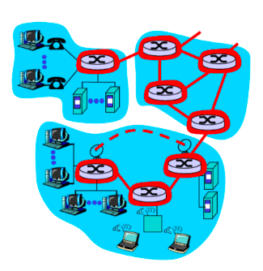

# Chapter05. 이더넷과 무선 LAN
## 5-1 이더넷, 무선 LAN(WI-FI): 같은 네트워크 내에서의 전송을 반복한다

기술적인 관점에서, ‘네트워크’는 라우터 또는 레이어3 스위치로 구획되는 범위다.

네트워크의 기본적인 구성은 레이어2 스위치로 하나의 네트워크를 구성하고, 라우터 또는 레이어3 스위치로 각 네트워크를 서로 연결하는 것이다.

 

### 같은 네트워크 내의 전송을 반복해 간다

다른 네트워크에 접속된 서버까지의 데이터 전송은 같은 네트워크 내의 전송을 반복해감으로써 실현한다.

PC에서 서버로 가는 데이터는 우선 PC와 같은 네트워크 상에 있는 라우터로 전송한다.

라우터는 다시 같은 네트워크 상의 다음 라우터로 전송한다.

이 과정을 반복하여 데이터가 목적지 네트워크 상의 라우터까지 도달하면 그 라우터가 서버로 데이터를 전송한다.

 

이때 같은 네트워크 내에서 전송하는 프로토콜로 자주 이용하는 것이 네트워크 인터페이스층에 속한 이더넷과 무선 LAN(WI-FI)이다.

  

## 5-2 이더넷의 개요: 데이터를 전송하는 이더넷

### 이더넷

- TCP/IP의 네트워크 인터페이스층에 있다.
- 같은 네트워크 내의 이더넷 인터페이스 사이에서 데이터를 전송한다.
    - 같은 네트워크 → 같은 레이어2 스위치에 연결

  (레이어2 스위치는 이더넷으로 전송하는 데이터에 변경을 가하지 않는다.)

 

이더넷 인터페이스가 있는 기기끼리 연결해서 이더넷 링크를 만들면 유선 네트워크가 된다.

  

## 5-3 IEEE802 위원회: 이더넷의 규격

이더넷의 규격은 IEEE802 위원회에서 결정된다.

이더넷의 규격은 주로 최대 전송 속도와 이용하는 매체(케이블)에 따라 나뉜다.

 

### 이더넷 규격의 명칭

- 종류
    1. IEEE802.3 으로 시작되는 이름
    2. 전송 속도와 전송 매체의 특징을 조합한 이름
        - ex) 1000BASE-T
            - `1000` : 전송 속도(기본적으로 Mbps 단위)
            - `BASE` : 베이스 밴드 방식
            - `- 뒤` : 전송 매체나 물리 신호 변환의 특징

  

## 5-4 MAC 주소: 인터페이스는 어느 것?

### MAC 주소

> 이더넷 인터페이스를 특정하기 위한 48비트 주소

- 전반 24비트의 OUI와 후반 24비트의 시리얼 넘버로 구성
    - OUI: 이더넷 인터페이스를 제조하는 벤더 식별 코드
- 16진수로 표기

  ex) 00-00-01-02-03-04, 00:00:01:02:03:04, 0000.0102.0304, …

- 이더넷 인터페이스 간 데이터를 전송하기 위해 필요
- 이더넷 인터페이스에 미리 할당 되어 있어 변경할 수 없다.

  

## 5-5 RJ-45 인터페이스와 UTP 케이블: 일반적으로 사용되는 인터페이스와 케이블은?

### 자주 사용하는 이더넷 규격

- UTP 케이블
    - 흔히 말하는 LAN 케이블
    - 케이블의 품질에 따라 카테고리가 나뉜다.
    - 카테고리에 따라 지원할 수 있는 주파수가 달라지고, 각각 용도나 전송 속도가 정해진다.
- RJ-45 이더넷 인터페이스

  

## 5-6 이더넷의 프레임 형식: 데이터 형식

### 이더넷 프레임

> 전송할 데이터 + 이더넷 헤더 + FCS

**이더넷 헤더:**

→ 어느 인터페이스에서 어느 인터페이스로 전송하는 데이터인지 MAC 주소로 지정

- 목적지 MAC 주소
- 출발지 MAC 주소
- 타입 코드: 이더넷으로 운반할 대상의 데이터
    - ex) 0x0800 - Ipv4, 0x86DD - IPv6

 

**FCS:**

- 에러 체크 담당

 

이더넷으로 전송할 데이터는 64바이트 ~ 1500바이트 사이로 정해져 있다.

MTU를 넘는 크기의 데이터는 분할해서 전송한다.

- MTU(Maximum Transmission Unit): 데이터 크기의 최댓값

  

## 5-7 토폴로지: 어떻게 접속하는가?

### 토폴로지

> 네트워크의 연결 형태

- 주요 형태
    - 버스형
        - 하나의 전송 매체(동축 케이블)를 복수의 기기가 공유
        - 이더넷은 전송 메체를 어떻게 공유할 것인지를 제어하기 위해 CSMA/CD 방식을 이용
    - 스타형
        - 레이어2 스위치가 중심
    - 링형

  

## 5-8 CSMA/CD: 데이터 전송 타이밍 제어

초기의 버스형 토폴로지로 된 이더넷에서는 복수의 기기가 동시에 데이터를 전송할 수 없다.

단 한 대의 기기만 특정 시점에 데이터를 전송할 수 있다.

전기 신호로서 데이터를 보낼 수 있는 회로는 하나이기 때문이다.

 

### CSMA/CD

> 빠른 쪽이 이기는 제어 방식의 이더넷 전송 매체 공유 메커니즘

**흐름:**

1. CS를 통해 케이블이 현재 사용 중인지 확인
    - 케이블이 사용중이면 대기
2. 케이블이 비어 있으면 데이터 전송
3. 동시에 여러 호스트가 케이블이 비었다고 판단해서 여러 곳에서 데이터가 전송된 경우 충돌 발생

   → 데이터는 파괴되어 버림

4. 충돌이 발생하면 랜덤한 시간동안 대기한 후 데이터를 다시 전송

   → 같은 타이밍에 데이터를 보내면 다시 충돌할 가능성이 높기 때문

그러나 현재 이더넷은 전송 매체를 공유하지 않으므로 CSMA/CD가 필요없다.

  

## 5-9 레이어2 스위치: 이더넷 네트워크를 만든다

### 레이어2 스위치

> 이더넷을 이용한 네트워크 하나를 구성하는 네트워크 기기

→ 레이어2 스위치를 여러 대 연결해도 하나의 네트워크

- 레이어2 스위치로 구성된 한 이더넷 네트워크 안에서 MAC 주소에 기반해 데이터(이더넷 프레임)를 전송
- 수신한 이더넷 프레임에 변경 작업 없이 그대로 전송

  (이더넷 헤더의 MAC 주소만 확인)

- 하나의 네트워크에 접속하려면 레이어2 스위치에 접속해야 하기 때문에 네트워크의 입구 역할도 한다고 볼 수 있다.

  

## 5-10~13 레이어2 스위치의 데이터 전송: 레이어2 스위치의 동작1~4

레이어2 스위치가 데이터를 전송하기 위해 필요한 설정은 따로 없다.

**레이어2 스위치의 데이터 전송 동작 흐름:**

1. 수신한 이더넷 프레임의 출발지 MAC 주소를 MAC 주소 테이블에 등록한다.
2. 목적지 MAC 주소와 MAC 주소 테이블에서 전송할 포트를 결정
3. 이더넷 프레임 전송

 

- 플러딩

  : MAC 주소가 MAC 주소 테이블에 존재하지 않으면 수신 포트를 제외한 모든 포트로 전송하는 것

    - 레이어2 스위치의 전송 범위는 같은 네트워크 한정이므로 큰 영향은 없다.
    - 수신한 이더넷 프레임은 하나기 때문에 플러딩을 하려면 포트 수만큼 데이터를 복제해야 한다.
    - 수신한 이더넷 프레임의 목적지 MAC 주소와 데이터를 받은 호스트의 MAC 주소가 다르면 해당 호스트는 전송된 이더넷 프레임을 파기
    - 한 번의 요청을 플러딩으로 하게 되면 응답을 보낼 때에는 이미 각 MAC 주소 테이블에 요청 출발지 MAC 주소가 등록되어 있으므로 플러딩을 할 필요가 없어진다.
- Unknown 유니캐스트 프레임

  : MAC 주소 테이블에 등록되지 않은 MAC 주소가 목적지인 이더넷 프레임

 

레이어2 스위치는 MAC 주소를 MAC 주소 테이블에 계속 등록하면서 같은 네트워크 내의 이더넷 인터페이스로 이더넷 프레임을 전송해 간다.

복수의 레이어2 스위치가 있어도, 각각의 레이어2 스위치는 같은 방식으로 동작한다.

  

## 5-14 MAC 주소 테이블: MAC 주소 테이블 관리

여러 대의 스위치를 연결한 경우에는 하나의 포트에 여러 개의 MAC 주소가 등록될 수 있다.

- ex) SW1, SW2이 서로 3번 포트로 연결되어 있고, SW1은 호스트 A와 호스트 B, SW2는 호스트 C와 호스트 D가 각각 연결되어 있다고 할 때
    - SW1 입장에서는 호스트 C와 호스트 D가 똑같이 3번 포트로 연결되었다고 본다.
    - SW2도 마찬가지로 호스트 A와 호스트 B가 3번 포트로 연결되었다고 본다.

 

MAC 주소 테이블에 등록하는 MAC 주소 정보에는 제한 시간이 설정되어 있다.

제한 시간은 스위치 기기에 따라 다르지만 보통 5분 정도이다.

등록된 MAC 주소가 출발지로 되어 있는 데이터를 수신하면 제한 시간이 다시 리셋된다.