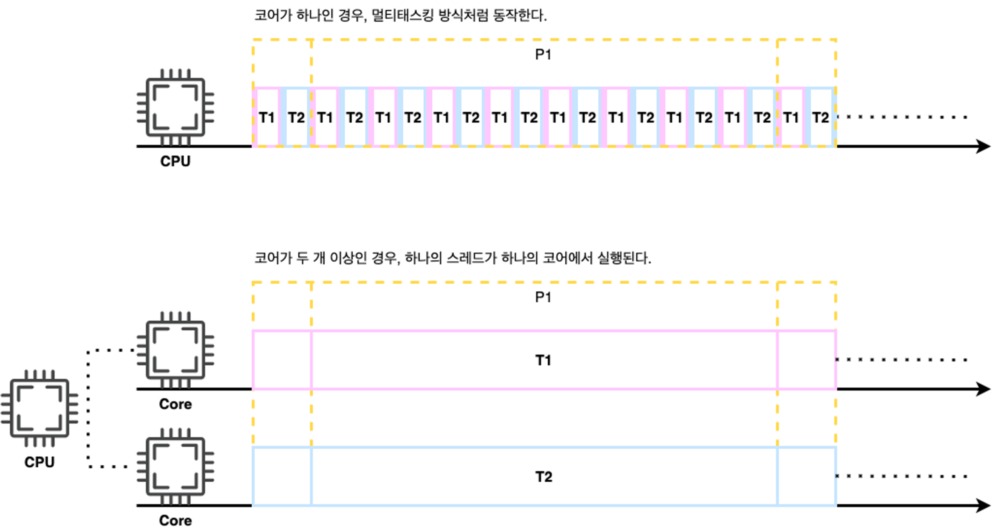

(강의 자료 링크: https://youtu.be/QmtYKZC0lMU)

## 용어 정리

### 프로그램

 컴퓨터가 실행할 수 있는 명령어들의 집합

 

### 프로세스

 컴퓨터에서 실행 중인 프로그램

- 각각의 프로세스는 **독립된 메모리 공간**을 할당 받음
- 할당 받은 메모리 공간에 명령어들과 데이터를 가짐

 

### CPU

명령어를 실행하는 연산 장치

 

### 메인 메모리

프로세스가 CPU에서 실행되기 위해 대기하는 곳

 

### IO(Input/Output)

파일을 읽고 쓰거나, 네트워크의 어딘가와 데이터를 주고 받는 것

→ 입출력 장치와 데이터를 주거나 받는 것

  

## 단일 프로세스 시스템

한 번에 하나의 프로그램만 실행하는 시스템

→ 다른 프로그램을 실행시키려면 현재 실행되고 있는 프로그램을 종료시켜야 한다.

- 단점
    - CPU 사용률이 좋지 않다.

      

  

## 멀티프로그래밍

### 등장

단일 프로세스 시스템의 단점을 해결하기 위해서 등장

→ 여러 개의 프로그램을 메모리에 올려놓고 동시에 실행시킨다.

ex) IO 작업이 발생하면 다른 프로세스가 CPU에서 실행된다.

 

### 특징

- CPU 사용률을 극대화 시키는데 목적

 

### 단점

  

## 멀티태스킹

### 등장

멀티프로그래밍의 단점을 해결하기 위해서 등장

 

### 특징

- 여러 프로그램을 실행시킨다는 점에서 멀티 프로그래밍과 유사하다.
- 하나의 프로세스가 CPU를 독점하는 상황 없이 아주 잘게 쪼갠 CPU 타임 안에서 프로세스들이 서로 번갈아 가면서 실행될 수 있다.

  → 일반 사용자들에게는 실제로 여러 프로그램이 동시에 실행되는 것처럼 느껴지게 만든다.

- 프로세스의 응답 시간을 최소화 시키는데 목적

 

### 단점

- 하나의 프로세스가 동시에 여러 작업을 수행하지는 못한다.
- 여러 프로세스를 띄워 동작 시키기에는 프로세스 간 컨텍스트 스위칭이 굉장히 무거운 작업이다.
- 프로세스끼리 데이터 공유가 까다롭다.
    - 프로세스는 각각 독립된 메모리 공간을 할당받기 때문
- 듀얼 코어가 등장했지만 잘 활용하지 못함

  

## 스레드

### 등장

한 프로세스 안에서 여러 개의 작업들을 동시에 실행하기 위해서 등장

 

### 특징

- 프로세스는 한 개 이상의 스레드를 가질 수 있다.
- CPU에서 실행되는 단위(unit of execution)
- 같은 프로세스의 스레드들 간 컨텍스트 스위칭은 가볍다.
- 스레드들은 자신들이 속한 프로세스의 메모리 영역을 공유한다.

  → 같은 프로세스의 스레드들 간 컨텍스트 스위칭은 가볍다.

  → 같은 프로세스의 스레드들 간 데이터 공유가 쉬워진다.

    - **공유하는 영역**: 힙 영역
    - **공유하지 않는 영역**: 스택 영역
        - 스택을 가리키는 포인터들과 프로그램 카운터들이 스레드마다 따로 존재한다.
            - 프로그램 카운터(PC): 다음 실행돼야 할 명령어가 있는 메모리 주소를 가르킨다.

  <figure>
    
    <figcaption>싱글 스레드 메모리 구조</figcaption>
  </figure>
  <figure>
    
    <figcaption>싱글 스레드 메모리 구조</figcaption>
  </figure>

  

## 멀티스레딩

하나의 프로세스가 동시에 병렬적으로 여러 작업을 실행하는데 목적

 

### 확장된 멀티태스킹의 개념

기존에는 여러 프로세스끼리만 CPU 타임을 나눠가졌다면 스레드가 등장하면서 여러 프로세스와 여러 스레드가 아주 짧게 쪼개진 CPU time을 나눠 갖는 것으로 그 의미가 확장됨

  

## 멀티프로세싱

두 개 이상의 프로세서나 코어를 활용하는 시스템

  

## 예제

1. 싱글-코어 CPU에 싱글-스레드 프로세스 두 개

    | 멀티태스킹 | O |
    | 멀티스레딩 | X → 싱글 스레드이기 때문 |
    | 멀티프로세싱 | X → 싱글 코어기 때문 |
2. 싱글-코어 CPU에 듀얼-스레드 프로세스 한 개

    | 멀티태스킹 | O → CPU 하나를 두 개의 스레드가 경합해야 되기 때문 |
    | 멀티스레딩 | O |
    | 멀티프로세싱 | X |
3. 듀얼-코어 CPU에 싱글-스레드 프로세스 두 개

    | 멀티태스킹 | X → 코어 경합 없이 각 프로세스가 하나의 코어에서 실행되기 때문 |
    | 멀티스레딩 | X |
    | 멀티프로세싱 | O |
4. 듀얼-코어 CPU에 듀얼-스레드 프로세스 한 개

    | 멀티태스킹 | X → 코어 경합 없이 각 스레드가 하나의 코어에서 실행되기 때문 |
    | 멀티스레딩 | O |
    | 멀티프로세싱 | O |
5. 듀얼-코어 CPU에 듀얼-스레드 프로세스 두 개

    | 멀티태스킹 | O → 어떤 경우든 하나의 코어에서는 여러 스레드들이 경합하기 때문 |
    | 멀티스레딩 | O |
    | 멀티프로세싱 | O |