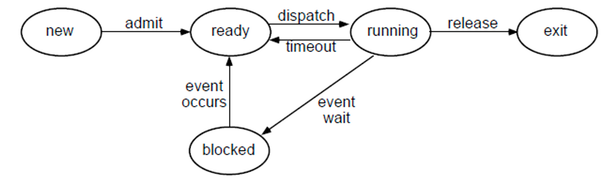

## 1. 프로세스 간 컨텍스트 스위칭은 어떻게 일어나는가?

인터럽트 이벤트가 발생하면 컨텍스트 스위칭이 일어나게 된다.

- 인터럽트 이벤트 예시
    - 자식 프로세스 생성
    - CPU 시간이 경과하는 것
        - 프로세스가 어떤 프로그램을 수행 중이더라도 타임 슬라이스를 모두 소비하면 발생한다.
    - 키보드나 마우스 같은 사용자 입력
    - HDD나 SSD 같은 저장 장치의 읽고 쓰기의 종료
    - 네트워크 데이터 송수신의 종료

 

컨텍스트 스위칭을 하려면 현재 실행 중인 프로세스의 정보를 저장해야 하는데 이때 사용하는 자료구조가 PCB다.

- PCB
    - 특정 프로세스에 대한 정보를 담고 있는 자료구조
    - 프로세스가 생성될 때마다 고유의 PCB가 생성되고 프로세스가 완료되면 제거된다.

 

- 컨텍스트 스위칭 시나리오
    1. 인터럽트 이벤트가 발생하여 PCB0에 P0 프로세스의 상태 정보를 저장
    2. PCB1에서 다음 수행할 P1 프로세스의 상태 정보가 CPU에 재로딩
    3. P1 프로세스를 CPU 시간만큼 수행
    4. 인터럽트 이벤트가 발생하여 PCB1에 P1 프로세스의 상태 정보를 저장
    5. 반복

 

컨텍스트 스위칭은 프로세스 상태에 기인한다.

그 중 준비 상태, 실행 상태, 대기 상태에 해당하는 프로세스들을 번갈아가면서 지속적으로 실행한다.

- Ready: CPU 시간이 할당되기를 기다리고 있는 상태
- Running: 현재 CPU를 사용하고 있는 상태
- Blocked: 인터럽트 이벤트가 발생하기를 기다리고 있으며 이벤트 발생까지는 CPU 시간을 사용하지 않는다.

 

### 1.1 프로세스는 언제 생성되는가?

리눅스에서는 두 가지 목적으로 프로세스를 생성한다.

1. 같은 프로그램의 처리를 여러 개의 프로세스가 나눠서 처리할 때 → fork() 함수 사용
    - 실행한 프로세스와 함께 새로운 프로세스가 1개 생성된다.

      → 자식 프로세스용 메모리 영역을 작성하고 해당 영역에 부모 프로세스의 메모리를 복사

2. 전혀 다른 프로그램을 생성할 때 → execve() 함수 사용
    - 프로세스의 수가 증가하는 것이 아니라 기존의 프로세스를 별도의 프로세스로 변경

      → 현재 프로세스의 메모리를 새로운 프로세스의 데이터로 덮어씀

 

### 1.2 프로세스 간 데이터 공유는 어떻게 일어나는가?

원칙적으로 프로세스는 독립적인 주소 공간을 갖기 때문에, 다른 프로세스의 주소 공간을 참조할 수 없다.

하지만 경우에 따라 운영체제는 프로세스 간의 자원 접근을 위한 매커니즘인 프로세스 간 통신(IPC)를 제공한다.

프로세스 간 통신 방법으로는 대표적으로 두 가지 방식이 있다.

- 메시지 전달 모델
    - 커널을 통해 프로세스 간 데이터를 전송하는 방식
        - ex) Pipe, socket, message queue 등
    - 프로세스 동기화 과정을 커널에 위임하여 자동으로 처리하게 한다. → 높은 안정성
    - 커널에 모든 작업이 위임되어 OS가 감당하는 오버헤드가 커지고 속도가 느리다.
- 공유 메모리 모델
    - 프로세스 간 공유할 수 있는 메모리 영역을 지정하고, 공유한 메모리 영역에 통신하며 데이터를 간접적으로 전달하는 방식
    - 운영체제를 통해 통신하는 것이 아니기 때문에 속도는 빠르다.
    - 여러 프로세스가 접근할 수 있기 때문에 별도의 프로세스 동기화 과정을 직접 정의해주어야 한다.

      → 동기화 문제가 발생할 수 있음

 

**1.3 프로세스 간 데이터 공유가 힘든 이유?**

데이터 공유가 일어나려면 데이터 공유를 하려는 프로세스들이 동시에 접근 가능한 메모리가 필요하다.

같은 프로세스에서 생성된 스레드는 메모리 공간을 공유하기 때문에 데이터 공유를 위해 따로 해줘야 할 작업이 없다.

그러나 프로세스는 생성되면서 메모리 공간 등을 복사하여 기존 프로세스들과 독립적인 자원을 할당 받는다.

따라서 프로세스들이 동시에 접근할 수 있는 공간과 데이터 공유를 위한 통신 방식 등을 따로 마련해줘야 하기 때문에 데이터 공유가 힘든 것이다.

  

## 2. 스레드 간 컨텍스트 스위칭은 어떻게 일어나는가?

스레드는 PCB가 아닌 TCB라는 자료구조에 스레드 정보를 저장한다.

- TCB
    - Thread 별로 존재하는 자료구조
    - PCB보다 적은 데이터를 가진다.

      → PC, Register Set, PCB를 가리키는 포인터 등

TCB는 PCB에 비해 저장하는 데이터가 적기 때문에 컨텍스트 스위칭을 할 때 현재 프로세스/스레드 상태 정보를 저장하고, CPU에 다음 프로세스/스레드 상태 정보를 재로딩 OS 입장에서는 덜 부담스럽다.

 

또한 스레드 간 컨텍스트 스위칭은 프로세스 간 컨텍스트 스위칭과 달리 가상 메모리 주소 관련 처리 작업을 진행하지 않는다.

같은 프로세스 내의 스레드들은 메모리 영역을 공유하기 때문이다.

따라서, 메모리 주소 관련 처리는 필요없이 CPU 상태 정보만 교체하면 컨텍스트 스위칭이 끝난다.

가상 메모리 주소 관련 처리 작업 중 CPU 캐시와 TLB를 비워주는 작업이 시간을 꽤 잡아먹기 때문에 프로세스 컨텍스트 스위칭이 스레드 컨텍스트 스위칭에 비해 오래 걸리는 것이다.

 

- 스레드 간 컨텍스트 스위칭 시나리오
    1. 인터럽트 이벤트가 발생하여 TCB0에 T0 스레드의 상태 정보를 저장
    2. TCB1에서 다음 수행할 T1 프로세스의 상태 정보가 CPU에 재로딩
    3. T1 프로세스를 CPU 시간만큼 수행
    4. 인터럽트 이벤트가 발생하여 TCB1에 T1 프로세스의 상태 정보를 저장
    5. 반복

 

### 2.1 스레드 간 스택 영역을 공유하지 않는 이유는 무엇인가?

스택 영역에는 함수의 호출과 관계되는 지역 변수와 매개변수가 저장되는 영역이다.

만약 이 영역을 공유한다면 스레드 간 독립적인 함수 호출이 불가능해지며 이는 스레드 간 독립적인 실행 흐름을 가질 수 없다는 것을 의미 한다.

결과적으로 실행 흐름의 추가를 위한 최소 조건이 독립된 스택을 제공하는 것이다.

  

### 3. 컨텍스트 스위칭은 누가 어떻게 관리하는가?

→ OS 커널

- 각종 리소스를 관리/감독하는 역할
- 컨텍스트 스위칭을 총괄해서 통제권을 가지고 집행/수행하는 존재

  (컨텍스트 스위칭의 발생 트리거가 아님)

- 커널
    - CPU, 메모리 등 컴퓨터에 존재하는 다양한 리소스들을 관리/감독

  

---

## Reference

[https://www.cs.swarthmore.edu/~kwebb/cs45/s18/03-Process_Context_Switching_and_Scheduling.pdf](https://www.cs.swarthmore.edu/~kwebb/cs45/s18/03-Process_Context_Switching_and_Scheduling.pdf)