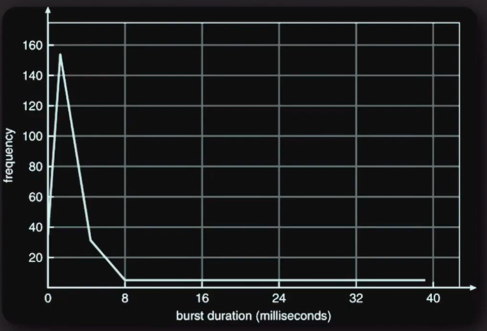
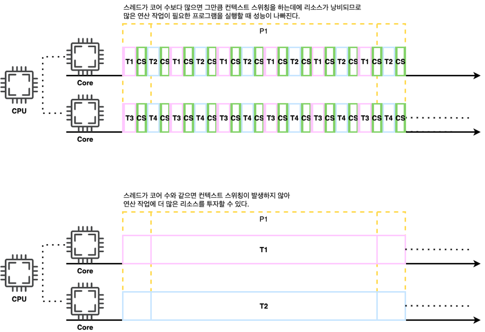

# [03강] CPU bound, I/O bound
(강의 자료 링크: https://www.youtube.com/watch?v=qnVKEwjG_gM)

## 용어 정리

### CPU

프로세스의 명령어를 해석하고 실행하는 장치

 

### I/O

- 파일을 읽고 쓰는 것
- 네트워크의 어딘가와 데이터를 주고 받는 것
- 입출력 장치와 데이터를 주거나 받는 것

 

### 버스트(burst)

어떤 현상이 짧은 시간 안에 집중적으로 일어나는 일

 

### CPU 버스트

프로세스가 CPU에서 한 번에 연속적으로 실행되는 시간

→ 메모리에 올라가있는 프로세스가 자신의 차례가 되어서 CPU에서 실행됐을 때 자신의 명령어들이 CPU에서 연속적으로 실행된 시간

 

### I/O 버스트

프로세스가 I/O 작업을 요청하고 결과를 기다리는 시간

  

## 프로세스와 버스트

프로세스의 인생은 CPU 버스트와 I/O 버스트의 연속이다.

 

### CPU 버스트 길이에 따른 빈도

→ 대부분의 프로세스들의 CPU 버스트가 8ms 내로 끝난다.

  

## CPU bound 프로세스

CPU 버스트가 많은 프로세스

ex) 동영상 편집 프로그램, 머신러닝 프로그램 등 → 연산 작업이 많은 프로그램

 

### CPU bound 프로그램과 스레드 수

듀얼 코어 CPU에서 동작할 CPU bound 프로그램을 구현한다면 몇 개의 스레드를 쓰는게 좋을까?

→ CPU bound 프로그램에서 적절한 스레드 수 = CPU 수 + 1 (recommended by Goetz)

 

why? 컨텍스트 스위칭 때문

→ 컨텍스트 스위칭은 스레드의 실행과 상관없는 추가적인 오버헤드로, 오직 스위칭만을 위해 CPU를 낭비하는 작업이기 때문

  

## I/O bound 프로세스

I/O 버스트가 많은 프로세스

ex) (일반적인) 백엔드 API 서버

- 특히 DB나 캐시 서버에 데이터를 요청하는 작업
- 해당 작업은 네트워크를 타는 작업이므로 CPU에서 몇 십개의 명령어를 처리하는 것보다 오래 걸림

 

### I/O bound 프로그램과 스레드 수

I/O bound 프로그램을 구현한다면 몇 개의 스레드를 쓰는게 좋을까?

→ 여러 상황에 맞춰서 적절한 스레드 수를 찾아야 함

만약 API 서버가 thread per request 방식이라면?

- 몇 개의 스레드들을 미리 만들어 놓을지 여러 상황을 고려해서 결정하는 것이 필요
- ex)
    - API 서버의 하드웨어 스펙
    - 애플리케이션의 I/O 버스트 비중이 대략 어느 정도인지
    - 예상되는 트래픽의 패턴은 어떤지
    - …