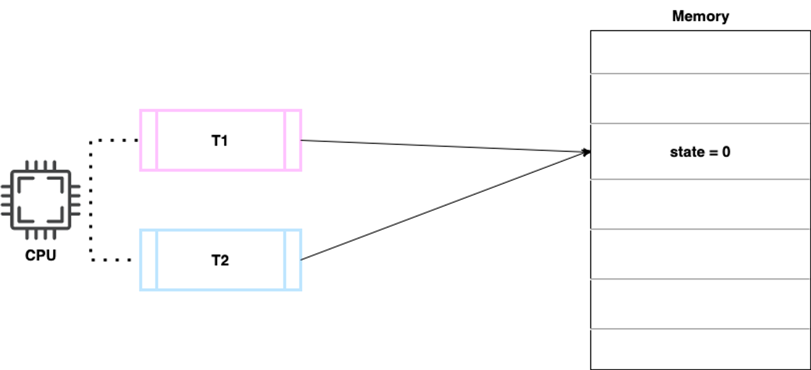
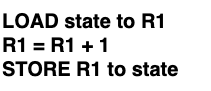

# [04강] 동기화, 경쟁 조건, 임계 영역
(강의 자료 링크: https://www.youtube.com/watch?v=vp0Gckz3z64)

## 하나의 객체를 두 개의 스레드가 접근할 때 생기는 일



```java
for (orange in box) {
	if (stateOfOrange is bad) {
		badCounter.increment();
	}
}

public class Counter {
	private int state = 0;

	public void increment() {
		state++;
	}

	public int get() {
		return state;
	}
}
```



state++ 명령어를 CPU에서 실행할 때

- 프로그래밍 언어에서 state++는 단일 명령문처럼 보이지만 실제로 CPU에서 실행할 때는 여러 명령문이 합쳐진 복합 명령문이다.

<br/>

- 원했던 결과
   - T1과 T2가 차례대로 실행하여 state = 2가 되어야 한다.
- 문제 상황
   - T1이 두 번째 명령어까지 실행한 상황에서 컨텍스트 스위칭이 일어남
      - state = 0, R1 = 1
   - T2가 첫 번째 명령어를 실행
      - state = 0, R1 = 0
   - T2가 마지막 명령어까지 모두 실행
      - state = 1, R1 = 1
   - 컨텍스트 스위칭이 일어나서 T1의 데이터를 로딩
      - state = 1, R1 = 1(이때 R1은 T1의 작업 내용을 로딩한 값)
   - T1가 마지막 명령어를 실행
      - state = 1
- 원인
   - T1과 T2가 메모리를 공유하고 있다.
   - T1의 작업이 메모리에 반영되기 전에 T2의 작업이 시작되었다.

<br/><br/>

## 경쟁 조건(race condition)

- 여러 프로세스/스레드가 동시에 같은 데이터를 조작할 때 타이밍이나 접근 순서에 따라 결과가 달라질 수 있는 상황

경쟁 조건은 서로 다른 프로세스에서도 발생할 수 있다.

서로 다른 프로세스의 경우에는 기본적으로 메모리 영역을 공유하지 않지만, shared memory 영역을 만들고 여러 프로세스를 해당 메모리 영역에 매칭시키면, 스레드들처럼 프로세스들도 같은 메모리 공간에 접근 가능하기 때문이다.

<br/>

지역 변수는 함수나 메소드 내에 국한된 변수이기 때문에 경쟁 조건이 발생하지 않는다.

<br/><br/>

## 동기화(synchronization)

- 여러 프로세스/스레드를 동시에 실행해도 공유 데이터의 일관성을 유지하는 것

<br/>

### 어떻게 동기화 시킬 것인가?

```java
for (orange in box) {
	if (stateOfOrange is bad) {
		badCounter.increment();
	}
}

public class Counter {
	private int state = 0;

	public void increment() {
		state++;
	}

	public int get() {
		return state;
	}
}
```


컨텍스트 스위칭을 막는 것 자체가 무리이기도 하지만, CPU에서 실행되는 명령어 단위로 컨텍스트 스위칭을 막는 것은 싱글 코어에서만 가능한 해결책이다.

따라서, increment 메소드를 실행할 때 한 번에 하나의 스레드만 실행할 수 있도록 만드는 것이 더 효율적이다.


<br/><br/>

## 임계 영역(critical section)

- 공유 데이터의 일관성을 보장하기 위해 하나의 프로세스/스레드만 진입해서 실행 가능한 영역

같은 프로세스에 속하는 스레드들은 메모리 영역을 공유하는데 특히 힙 영역에 있는 데이터를 여러 스레드들이 동시에 접근해서 읽기/쓰기를 하려고 하면 데이터 값이 예상과 다르게 바뀔 수 있다.

이를 막기 위해 임계 영역을 만들고, 그 안에서는 한 번에 하나의 프로세스/스레드만 데이터에 접근 가능하도록 하는 것이다.

결국 임계 영역 안에 작성된 코드는 한 번에 하나의 프로세스/스레드만 진입하여 실행되는 것이며, 해당 스레드는 임계 영역 안의 코드를 실행함으로써 힙 영역에 있는 데이터에 접근을 하게 된다.

<br/>

### critical section 문제를 해결하는 뼈대

```java
do {
	entry section
		critical section
	exit section
		remainder section
} while(true)
```

- `entry section`: critical section에 진입하기 전에 요건이 되는지를 확인하는 section
- `exit section`: critical section에서 한 작업을 이후에도 잘 동작할 수 있도록 필요한 조치를 취하는 section

<br/>

### critical section 문제의 해결책이 되기 위한 조건

1. 상호 배제(mutual exclusion)
    - 한 번에 하나의 프로세스/스레드만 critical section에서 실행할 수 있어야 한다.
2. 진행(progress)
    - 만약에 critical section이 비어있고, 어떤 프로세스/스레드가 critical section에 들어가길 원한다면 그 중에 하나는 critical section에서 실행될 수 있어야 한다.
3. 한정된 대기(bounded waiting)
    - 어떤 프로세스/스레드가 무한정 critical section에 들어가지 못하고 기다리지 않아야 한다.