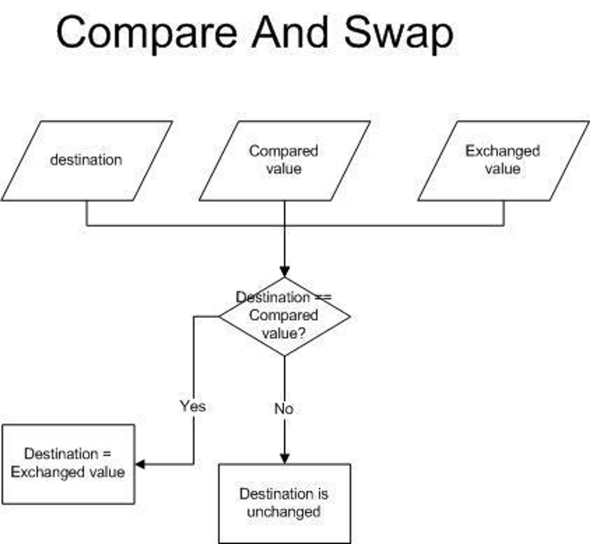

## 1. **Java는 synchronized 키워드를 이용해 이미 동시성 제어가 가능한데 Atomic 클래스를 왜 제공하는걸까?**

(참고: [https://lights93.github.io/java/java-optimization-chap12/#126-최신-자바-동시성](https://lights93.github.io/java/java-optimization-chap12/#126-%EC%B5%9C%EC%8B%A0-%EC%9E%90%EB%B0%94-%EB%8F%99%EC%8B%9C%EC%84%B1))

### synchronized

기존 `synchronized` 키워드는 여러 한계점이 노출되었다.

- 락이 걸린 객체에서 일어나는 동기화 작업은 모두 균등하게 취급됨
  (쓰기 작업에만 `synchronized` 를 적용하면 소실된 업데이트 현상이 나타남)
- 락 획득/해제는 반드시 메서드 수준이나 메서드 내부의 동기화 블록 안에서 이루어져야 함
- 락을 얻지 못한 스레드는 블로킹됨
    - 락을 얻지 못할 경우, 락을 얻어 처리를 계속하려는 시도조차 불가능
    - 멀티 스레드 환경에서 특정 스레드가 해당 블록 전체를 잠그기 때문에 다른 스레드는 아무런 작업을 하지 못하고 기다리게 됨
- 락을 획득하고 해제하는 작업 자체가 비용이 많이 드는 작업

 

### Atomic 클래스

위의 문제점을 해결하고 non-blocking 하면서 동기화 문제를 해결하기 위해 고안된 방법이 Atomic 클래스이다.

Atomic 클래스는 동기화가 되어 있는 변수를 제공하며, 변수를 사용하면 `synchronized` 를 메소드에 지정할 필요가 없다.

특히 Atomic 클래스는 CAS 알고리즘을 이용하기 때문에 `synchronized` 보다 효율적으로 동시성을 보장한다.

- 멀티 스레드 환경에서 쓰기 작업도 가능
- CAS(compare-and-swap) 알고리즘
    - 멀티 스레드 환경에서 직렬화를 이루기 위한 원자적인 연산
    - 예상되는 현재 값과 원하는 새 값, 그리고 메모리 위치(포인터)를 전달받아 다음 두 가지 일을 한다.
        1. 예상되는 현재 값(Compared value)을 메모리 위치에 있는 데이터(Destination)와 비교
        2. 두 값이 일치하면 현재 값을 원하는 새 값(Exchanged value)으로 교체

  

## 2. **세마포어는 여러 스레드/프로세스가 공유자원에 접근할 수 있게 되면 크리티컬 섹션의 정의가 무너지는 것이 아닐까?**

세마포어의 경우를 예외로 보는 것이 좋다.

기본적으로 critical section의 개념은 하나의 프로세스나 스레드만 접근 가능한 영역이다.

그러나 세마포어는 좀 특별해서, 제한된 수의 스레드나 프로세스가 동시에 크리티컬 섹션 영역에서 실행될 수 있도록 허용하기 때문에 세마포어만 구별해서 critical section의 개념을 조금 더 확장해서 이해하는게 좋다.

  

## 3. **세마포어는 여러 스레드/프로세스가 공유자원에 접근할 수 있게 하면서 어떻게 상호 배제를 지키는걸까?**

## 4. 이진 세마포어도 하나의 스레드/프로세스만 접근할 수 있는 것 같은데 뮤텍스와 달리 누가 락을 해제할 수 있는지 알 수 없는걸까?

(참고: [https://www.geeksforgeeks.org/difference-between-binary-semaphore-and-mutex/](https://www.geeksforgeeks.org/difference-between-binary-semaphore-and-mutex/))

이 부분은 이진 세마포어와 뮤텍스의 차이점에 대해 알아보면 알 수 있다.

 

### 이진 세마포어

이진 세마포어는 0과 1만 가질 수 있는 세마포어다.

mutual exclusion을 위한 신호 메커니즘을 사용하여 락을 구현하는 데 사용된다.

세마포어의 값이 0이면 락이 잠겨져 있으므로 사용할 수 없고, 값이 1이면 락이 잠겨져 있지 않으므로 사용할 수 있다.

 

### 뮤텍스

뮤텍스도 잠금 메커니즘으로 mutual exclusion를 제공한다.

어떤 스레드가 뮤텍스 락을 획득하면 locked 값을 가지게 되고, 락을 반환하면 unlocked 값을 가지게 된다.

어떤 시점에서든 한 번에 하나의 스레드만 전체 버퍼를 가지고 작업할 수 있다.

 

### 이진 세마포어 vs 뮤텍스

| 이진 세마포어 | 뮤텍스 |
| --- | --- |
| 신호 메커니즘에 기반한 기능 | 잠금 메커니즘에 기반한 기능 |
| 현재 스레드보다 우선순위가 높은 스레드라면 이진 세마포어를 해제하고 잠금을 사용할 수 있다. | critical section에서 뮤텍스를 획득한 스레드만 뮤텍스를 해제할 수 있다. |
| 세마포어 값은 wait() 및 signal() 작업에 따라 변경된다. | 뮤텍스 값은 locked 또는 unlocked로 변경된다. |
| 여러 개의 스레드가 동시에 이진 세마포어를 동시에 획득할 수 있다. | 한 번에 하나의 스레드만 뮤텍스를 획득할 수 있다. |
| 이진 세마포어에는 소유권이 없다. | 뮤텍스에는 소유권이 있으며 소유자만 잠금을 해제할 수 있다. |
| 다른 스레드/프로세스가 이진 세마포어를 잠금 해제할 수 있기 때문에 더 빠르다. | 뮤텍스는 획득한 스레드만 잠금을 해제할 수 있으므로 이진 세마포어보다 느리다. |
| 리소스 인스턴스가 여러 개 있는 경우 이진 세마포어를 사용하는 것이 좋다. | 리소스 인스턴스가 하나인 경우 뮤텍스를 사용하는 것이 좋다. |

즉, 뮤텍스는 이진 세마포어와 달리 ‘소유’ 라는 개념이 존재하기 때문에 누가 락을 해제할 수 있을지 특정 가능한 것이다.

또한 이진 세마포어는 여러 스레드/프로세스가 동시에 획득할 수 있고, 현재 이진 세마포어를 차지한 스레드보다 우선 순위가 높은 스레드라면 이진 세마포어를 해제할 수 있기 때문에 누가 락을 해제할 수 있을지 예측할 수 없는 것이다.