# [06강] 모니터
(강의 자료 링크: https://www.youtube.com/watch?v=Dms1oBmRAlo)

## 모니터(monitor)

- mutual exclusion을 보장

  → critical section을 보장

- 조건에 따라 스레드가 대기 상태로 전환하는 기능을 제공

  → critical section 내에서 작업을 하다가 어떤 특정 조건이 만족할 때 까지 대기하고 싶을 때 대기할 수 있음

  (뮤텍스나 세마포어에서는 제공하지 않는 기능)

<br/>

### 모니터는 언제 사용되나?

- 한 번에 하나의 스레드만 실행되어야 할 때
- 여러 스레드와 협업이 필요할 때

<br/>

### 구성 요소

- `mutex`

  : critical section에서 mutual exclusion을 보장하는 장치

    - critical section에 진입하려면 mutex lock을 취득해야 함
    - mutex lock을 취득하지 못한 스레드는 큐에 들어간 후 대기 상태로 전환
    - mutex lock을 쥔 스레드가 lock을 반환하면 락을 기다리며 큐에 대기 상태로 있던 스레드 중 하나가 실행됨
- `condition variable(s)`
    - waiting queue 를 가짐
        - waiting queue: 조건이 충족되길 기다리는 스레드들이 대기 상태로 머무는 곳
    - 주요 동작
        1. wait: thread가 자기 자신을 condition variable의 waiting queue에 넣고 대기 상태로 전환
        2. signal: waiting queue에서 대기 중인 스레드 중 하나를 깨움
        3. broadcast: waiting queue에서 대기 중인 스레드 전부를 깨움

<br/>

### 동작 원리

```java
    acquire(m);                       // 모니터의 락 취득

    while(!p) {
	    wait(m, cv);              // 조건 충족 안되면 waiting
    }                                 // -> condition value가 관리하는 waiting queue에 자기 자신을 넣고, 자신의 상태를 대기 상태로 전환함

    ...

    signal(cv2); or broadcast(cv2);   // cv2가 cv와 같을 수도 있음

    release(m);                       // 미터의 락 반환
```

- `wait()` 에 mutex가 들어가는 이유

  → 대기 상태로 전환된 스레드는 락을 쥐고 있으면 안된다.

  왜냐하면 언제 깨어날지도 모를 뿐더러 락을 계속 쥐고 있으면 다른 스레드들이 critical section에 진입할 수 없기 때문이다.

  따라서, `wait()` 를 실행하는 스레드는 락을 반환을 해야하며, 나중에 깨어나게 되면 락을 다시 취득하여 mutual exclusion이 보장된 채로 로직을 실행해야 한다.

- critical section의 로직을 수행하면서 조건을 충족하면 waiting queue에서 `signal()` 혹은 `broadcast()` 로 스레드를 깨운다.
    - 여기서 주의할 점, signal과 broadcast에 의해 상태가 전환된 스레드들은 entry queue에 있는 스레드들 보다 우선적으로 락을 얻는 것이 아니라 다시 entry queue로 돌아가서 똑같이 차례를 기다린다.

<br/>

### 모니터가 가지는 두 개의 큐

1. entry queue: critical section에 진입을 기다리는 큐
2. waiting queue: 조건이 충족되길 기다리는 큐

<br/><br/>

## bounded producer/consumer problem

- 버퍼에 아이템을 넣을 공간이 없을 때, producer 가 계속해서 버퍼의 여유 공간을 확인해야 하는가?
- 버퍼가 비어있을 때, consumer 가 계속해서 버퍼에 아이템이 있는지 없는지 확인해야 하는가?

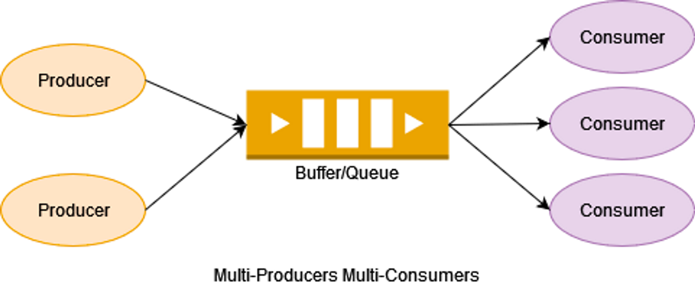

```java
global volatile Buffer q;    // critical section에서 mutual exclusion이 보장될 수 있도록 사용되어야 함.
                             // 그렇지 않으면 race condition이 발생할 수 있음 
global Lock lock;            // 모니터가 가지고 있는 뮤텍스 락
global CV fullCV;
global CV emptyCV;
```

```java
public method producer() {
	while (true) {
		task myTask = ...;

		lock.acquire();

		while(q.isFull()) {
			wait(lock, fullCV);
		}

		q.enqueue(myTask);

		signal(emptyCV); or broadcast(emptyCV);    // consumer 스레드들을 깨움

		lock.release();
	}
}
```

```java
public method consumer() {
	while (true) {
		lock.acquire();

		while(q.isEmpty()) {
			wait(lock, emptyCV);
		}

		myTask = q.dequeue();

		signal(fullCV); or broadcast(fullCV);    // producer 스레드들을 깨움

		lock.release();

		doStuff(myTask);
	}
}
```

<br/>

1. consumer 스레드 C1이 먼저 시작: `lock.acquire()`

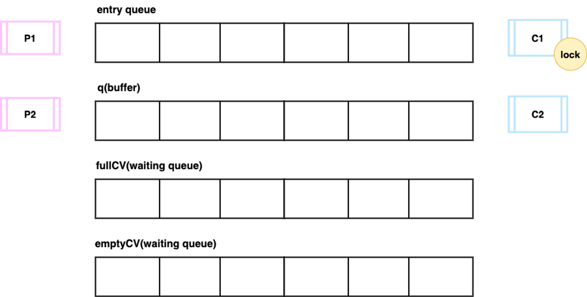

2. producer 스레드 P1도 시작: `lock.acquire()`
    - 이미 C1이 락을 가지고 있으므로 entry queue에서 대기

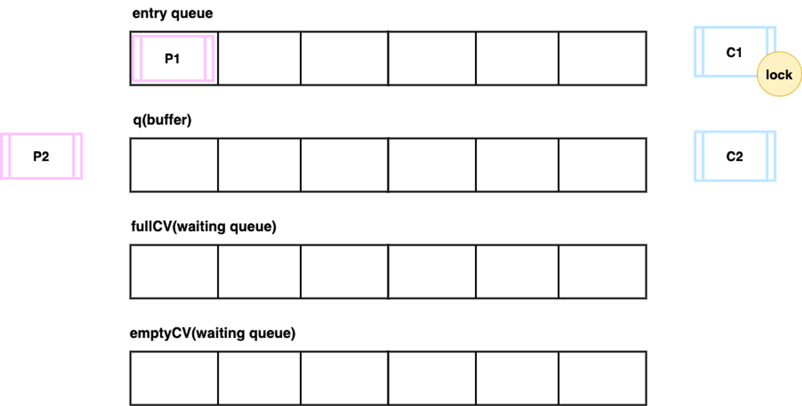

3. C1: `wait(lock, emptyCV)`
    - 현재 버퍼가 비어있으므로 emptyCV가 가지고 있는 waiting queue에서 대기
    - 가지고 있던 락을 반환

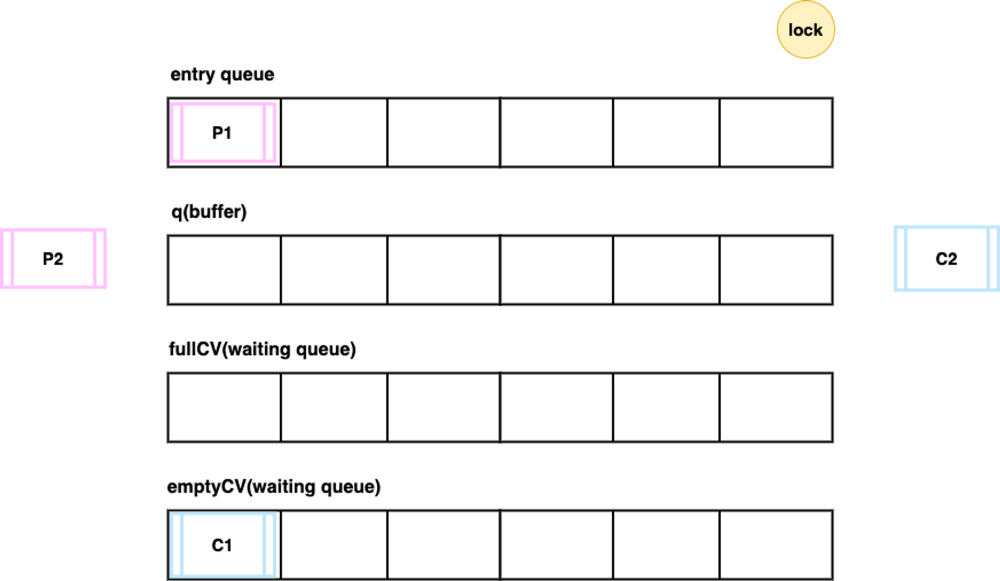

4. P1: `q.enqueue(myTask)`
    - 락을 획득하여 로직 진행
    - 버퍼가 비어있으므로 while 문에 진입하지 않음

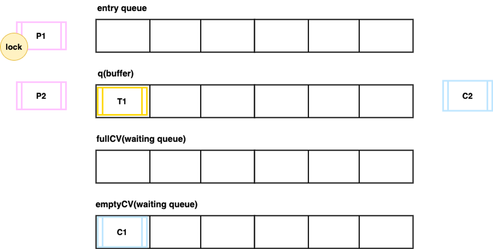

5. P1: `signal(emptyCV)`
    - waiting queue에서 대기하고 있던 C1을 깨움
    - 이때 다음 로직을 실행하는 두 가지 방식
        1. `signal and continue` : `signal()` 을 실행한 스레드(P1)가 그대로 이어서 로직을 진행하는 방식
        2. `signal and wait` : `signal()` 을 실행한 스레드(P1)는 대기하고 방금 깬 스레드(C1)가 로직을 진행하는 방식

      → 여기서는 1번 방식으로 진행


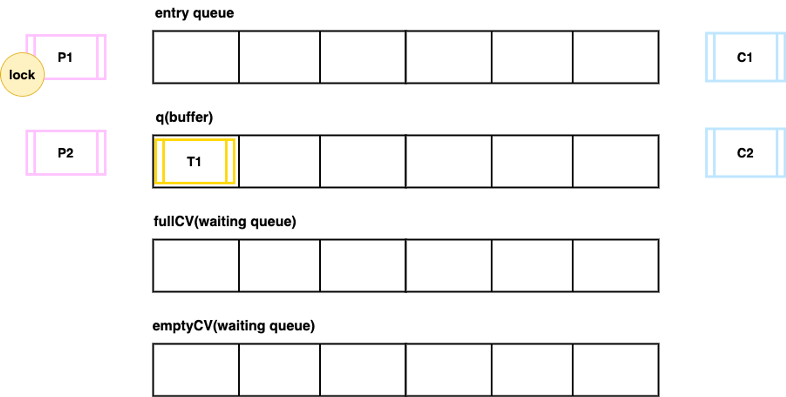

6. C1
    - 깨어났으나 락을 가지고 있지 않기 때문에 다시 entry queue에서 대기

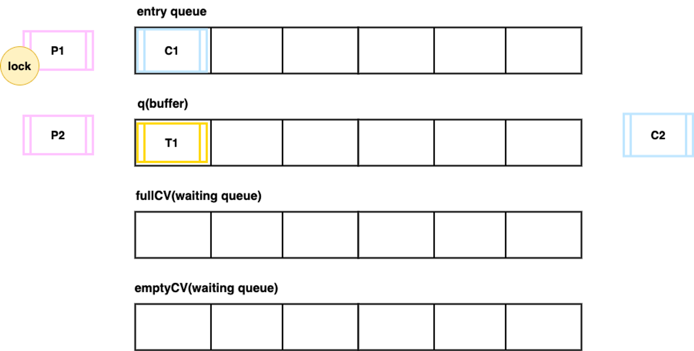

7. producer 스레드 P2와 consumer 스레드 C2도 시작
    - 락을 획득할 수 없으므로 두 스레드 모두 entry queue에서 대기

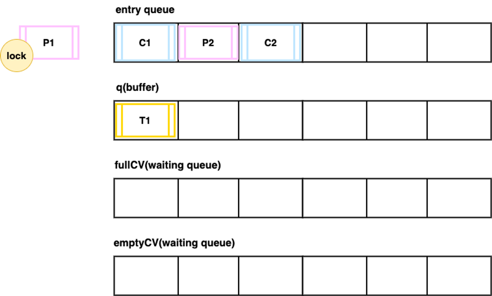

8. P1: `lock.release()`

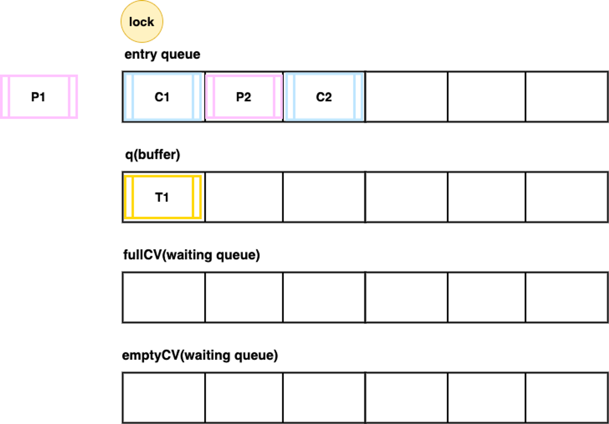

9. C2: 락 획득
    - 어떤 스레드가 먼저 락을 획득할 것인가는 구현에 따라 다름
        - 먼저 기다리고 있던 C1에 우선순위를 높이는 방식
        - 대기 순서 상관없이 entry queue에 들어있는 모든 스레드에 공평하게 기회를 주는 방식 등

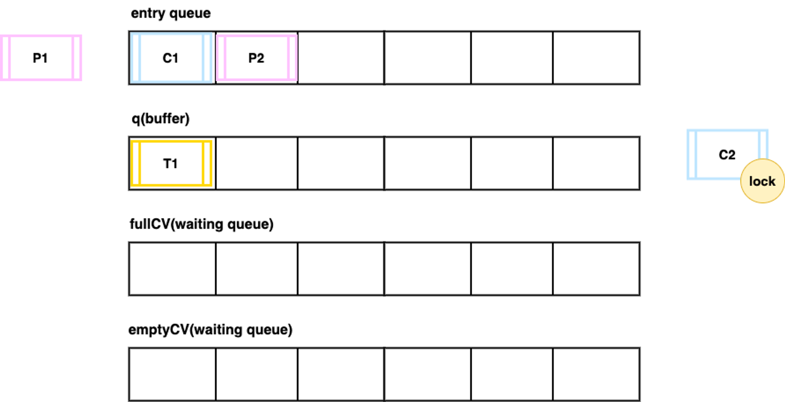

10. C2: `q.dequeue()`
    - 버퍼에 아이템이 들어있으므로 while 문에 진입하지 않음

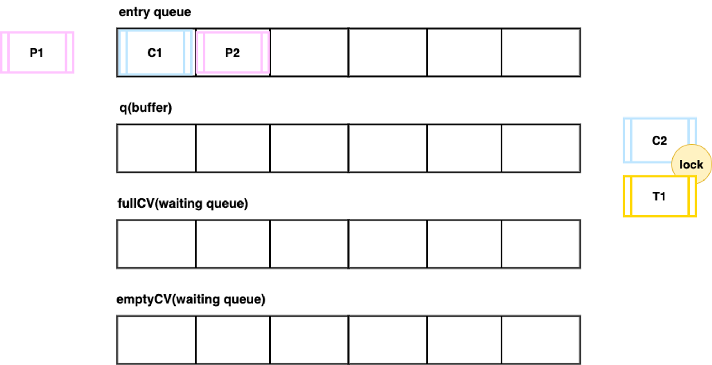

11. C2: `signal(fullCV)`
    - waiting queue에서 대기하고 있는 스레드가 있다면 깨우지만 현재는 없으므로 아무 일도 일어나지 않음

12. C2: `lock.release()` , `doStuff(myTask)`
    - 락을 반환하고 버퍼에서 얻은 아이템으로 나머지 로직 실행

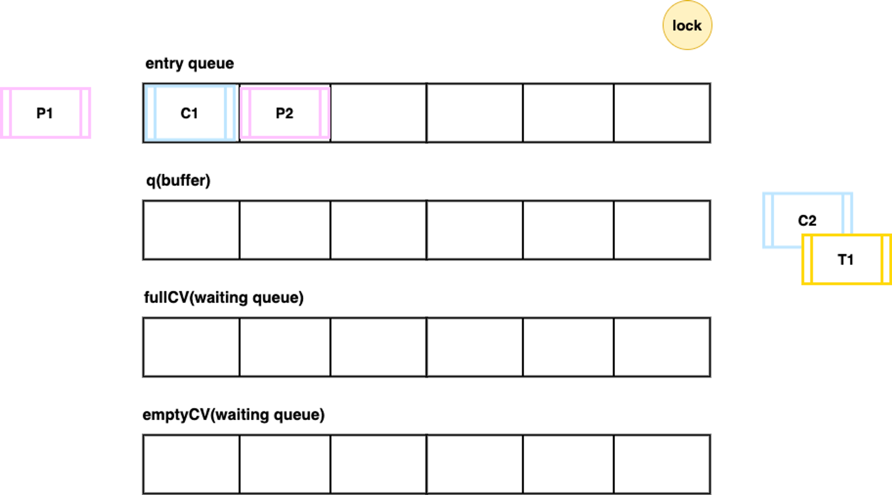

13. C1: 락 획득

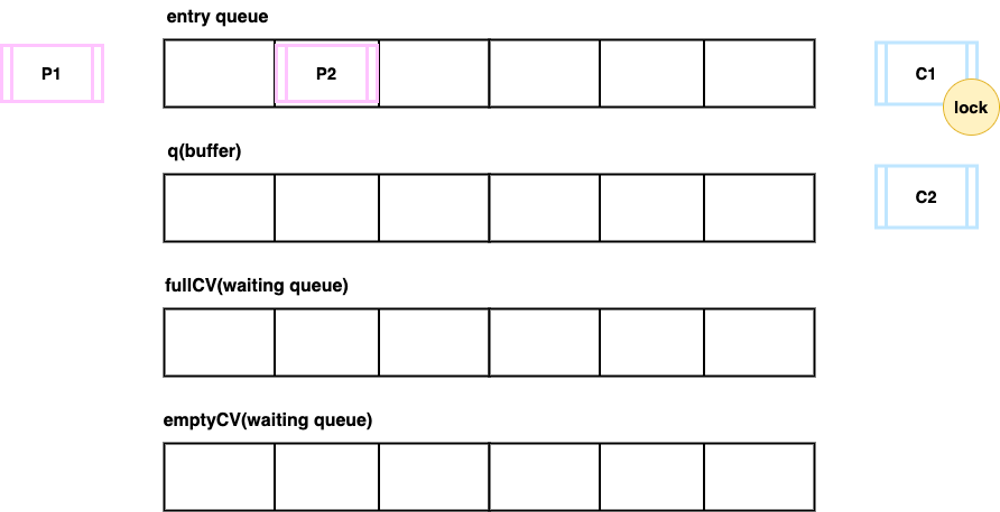

14. C1: `wait(lock, emptyCV)`
    - 대기 전 while 문에서 중단되었으므로 다시 while 문부터 시작
      - 스레드 별로 PC를 가지고 있기 때문에 가능
    - 하지만 아까와 마찬가지로 버퍼가 비어있으므로 다시 waiting queue에서 대기

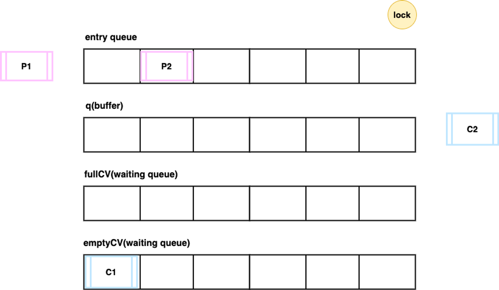

15. P2: 락을 획득한 후 P1처럼 로직 진행
16. C1: 락을 획득하고, P2가 생성한 아이템을 가지고 C2처럼 로직 진행

<br/>

이처럼 락을 획득하고 다음 로직을 실행하기 까지는 많은 일들이 일어난다.

락을 획득할 당시에는 조건이 충족되었지만 막상 로직을 실행할 때는 조건이 만족되지 않은 상황일 수도 있고, OS에 따라서는 대기 상태에 있던 스레드가 갑자기 깨어날 수도 있다.

따라서, 락 획득과 조건 충족이 동시에 만족되어야 하기 때문에 wait 문은 while 루프 안에서 호출되어야 한다.

<br/><br/>

## 자바에서 모니터란

자바에서 모든 객체는 내부적으로 모니터를 가진다.

모니터의 mutual exclusion 기능은 synchronized 키워드로 사용한다.

자바의 모니터는 condition variable을 하나만 가진다.

자바 모니터를 사용할 때 두 가지 이상의 condition variable이 필요하다면 따로 구현해야 한다.

<br/>

### 자바 모니터의 세 가지 동작

- wait
- notify → signal
- notifyAll → broadcast

<br/><br/>

## bounded producer/consumer problem with JAVA

```java
// 각 메소드에 사용된 wait(), notifyAll()은 객체 자신의 condition variable에 대한 동작들이다.
class BoundedBuffer {
	private final int[] buffet = new int[5];
	private int count = 0;

	public synchronized void produce(int item) {
		while (count == 5) {
			wait();
		}

		buffer[count++] = item;
		notifyAll();             // 객체에는 하나의 condition variable만 있어
                             // 위의 예제와 달리 producer와 consumer의 스레드들을 구분해서 깨울 수 없으므로 모든 스레드들을 깨운다.
	}

	public void consume() {
		int item = 0;
		synchronized (this) {    // -> 객체 자신의 뮤텍스 락을 쥐고 진입하라
			while (count == 0) {
				wait();
			}

			item = buffer[--count];
			notifyAll();
		}

		System.out.println("Consume: " + item);
	}
}
```

```java
public class Main {
	public static void main(String[] args) throws {
		BoundedBuffer buffer = new BoundedBuffer();

		Thread consumer = new Thread(() -> {
			buffer.consume();
		});

		Thread producer = new Thread(() -> {
			buffer.produce(100);
		});

		consumer.start();
		producer.start();

		consumer.join();
		producer.join();
		System.out.println("완료");
	}
}
```

<br/><br/><br/>

---

## QnA

### 1. 뮤텍스 락이 해제 될 때 entry queue에 있는 스레드 중에 하나를 깨운다고 했는데 이때 일어난 스레드가 뮤텍스 락을 얻기 전에 새롭게 진입한 다른 스레드가 락을 가로챌 수도 있는가?

-> 그렇다. 새롭게 진입한 다른 스레드가 락을 가로챌 수 있다.

모니터의 뮤텍스 락에서 관리되는 queue(모니터에서는 entry queue 혹은 entry set이라고 부르는 queue)에서 깨어난 스레드 A는 CPU에서 이어서 실행되기 위해 OS에서 관리하는 ready queue에서 대기한다.

하지만 만약 새로운 스레드 B가 모니터의 뮤텍스 락을 취득하기 직전의 상태로 ready queue에서 대기하고 있었다면, 이때 OS 스케줄러가 어떤 선택을 하는지에 따라 스레드 A가 아니라 스레드 B가 먼저 CPU에서 실행될 수 있고, 그럼 B가 모니터의 뮤텍스 락을 취득하고 실행하게 된다.

결국 A가 CPU에서 실행됐을 때는 B가 모니터의 뮤텍스 락을 취득한 상태이기 때문에 다시 모니터의 entry queue에 들어가게 되는 것이다.