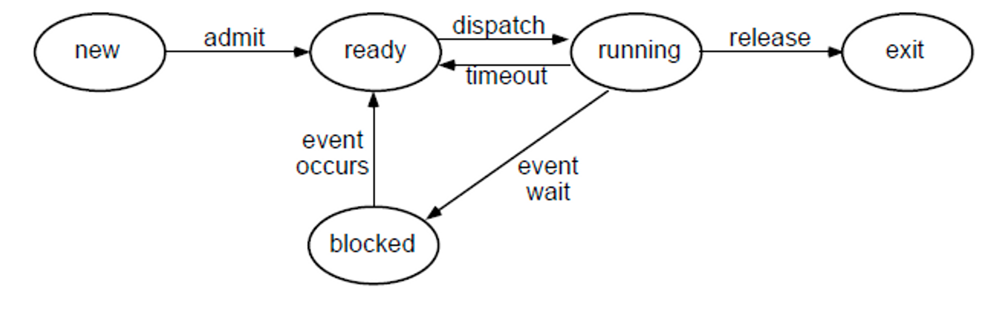

# [08강] OS 프로세스 상태, 자바 스레드 상태
(강의 자료 링크: https://www.youtube.com/watch?v=_dzRW48NB9M)

## OS에서 프로세스 상태



(이미지의 blocked 상태 = waiting 상태, exit = terminated 상태)

<br/>

1. 처음 프로세스가 생성되면 new 상태로 시작
2. new 상태로 기다리고 있다가 long term scheduler가 허락을 해주면 ready 상태가 되어 CPU에서 실행될 준비를 한다.
    - 위의 설명은 real time OS 같은 특수한 상황에서 일어나는 것이고 보통 컴퓨터들은 long term scheduler가 따로 없기 때문에 처음 프로세스가 생성되면 바로 ready 상태가 된다고 보면 됨
3. 스케쥴러에 의해 자신의 차례가 되면 running 상태로 바뀌어 CPU에서 실행된다.
4. 자신에게 할당된 타임 슬라이스를 다 쓰면 다시 ready 상태가 된다.
5. running 상태에서 I/O 작업을 들어가게 되거나, critical section에 진입하려고 하는데 먼저 진입한 다른 프로세스가 있어 기다려야 할 때 waiting 상태로 변경된다.
6. I/O 작업을 완료하거나 critical section에 진입할 수 있게 되면 ready 상태로 변경된다.
    - 아직 CPU에서 다른 프로세스가 실행 중일 것이므로 바로 running 상태가 되지 않는다.
7. 스케쥴러에 의해 다시 running 상태가 되어 실행하다가 작업을 완료하면 terminated 상태로 된다.

스레드는 프로세스의 메모리를 공유하기 때문에 스레드의 상태 또한 프로세스의 상태와 거의 비슷하다.

<br/><br/>

## JAVA thread의 상태 종류

- NEW

  : 자바 스레드가 아직 시작하지 않은 상태

- RUNNABLE

  : 실행 중인 상태

    - 실제로 CPU에서 실행되는 상태 뿐만 아니라 다른 리소스를 기다리거나 I/O 작업의 결과를 기다리는 상태도 포함
- BLOCKED

  : 모니터 락을 얻기 위한 상태

  → critical section으로 들어가려고 모니터 락을 얻기 위해 기다리는 상태

- WAITING

  : 다른 스레드를 기다리는 상태

    - `Object.wait()` , `Thread.join()` 등을 호출할 때 WAITING 상태로 변경됨
- TIMED_WAITING

  : 제한 시간을 두고 다른 스레드를 기다리는 상태

    - `Object.wait() with timeout` , `Thread.join with timeout` , `Thread.sleep` 등을 호출할 때 TIMED_WAITING 상태로 변경됨
- TERMINATED

  : 실행을 마치고 종료된 상태

<br/><br/>

## JAVA thread의 상태 변화는 어떻게 일어나는가?

```java
class BoundedBuffer {
	
	private final int[] buffer = new int[5];
	private int count = 0;

	public synchronized void produce(int item) {
		while (count == 5) {
			wait();
		}
		buffer[count++] = item;
		notifyAll();
	}

	public void consume() {
		int item = 0;
		synchronized (this) {
			while (count == 0) {
				wait();
			}
			item = buffer[--count];
			notifyAll();
		}
		System.out.println("Consume: " + item);
	}
}
```

- consumer 스레드의 상태 변화
    1. `consumer.start()` → RUNNABLE
    2. `wait()` → WAITING
        - 현재 버퍼에는 아무것도 들어있지 않기 때문
        - 쥐고 있던 모니터 락도 반환
    3. produce 스레드가 `notifyAll()` 을 호출 → BLOCKED
        - 일반적으로 자바는 signal and continue 방식으로 동작하기 때문
    4. 모니터 락 획득 → RUNNABLE
        - 작업을 끝낸 produce 스레드가 모니터 락을 반환하고, consumer 스레드가 이를 얻게 됨
    5. `consume()` 작업 종료 → TERMINATED

<br/><br/>

## JAVA thread dump

> 실행 중인 자바 프로세스의 현재 상태를 담은 스냅샷

- 해당 프로세스에 속한 여러 스레드들의 상태 정보를 알 수 있다.