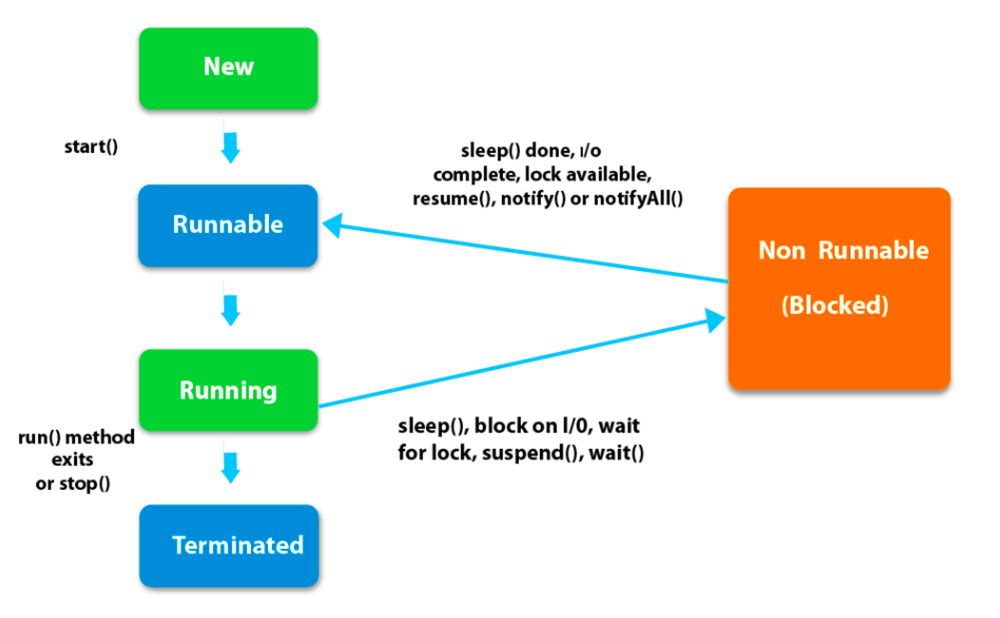

## 1. Java Thread status RUNNABLE vs RUNNING

참고

[https://www.geeksforgeeks.org/difference-between-running-and-runnable-states-of-a-thread-in-java](https://www.geeksforgeeks.org/difference-between-running-and-runnable-states-of-a-thread-in-java)

[https://whitehairhan.tistory.com/249](https://whitehairhan.tistory.com/249)

 

### RUNNABLE

: 실행할 준비가 된 상태

→ 자신의 실행 순서를 기다리는 상태

- 진입 시점
    - NEW → RUNNABLE
        - 스레드가 새로 생성된 후 start() 메서드를 호출했을 때
    - WAITING → RUNNABLE
        - notify() / notifyAll()
    - TIMED_WAITING → RUNNABLE
        - sleep() 메서드로 지정한 대기 시간이 끝났을 때
        - interrupt()
    - BLOCKED → RUNNABLE
        - I/O 작업이 끝났을 때
        - 모니터 락을 사용 가능할 때
        - resume()

 

### RUNNING

: CPU에서 현재 실행 중인 상태

- 탈출 시점
    - RUNNING → RUNNABLE
        - yield() : 다른 스레드에게 실행 순서를 양보
    - RUNNING → WAITING
        - join()
        - wait()
    - RUNNING → TIMED_WAITING
        - join() 에 대기 시간 지정
        - wait() 에 대기 시간 지정
    - RUNNING → BLOCKED
        - sleep()
        - blocking I/O 작업을 요청했을 때
        - 모니터 락을 획득하기 위해 대기할 때
        - suspend()
    - RUNNING → TERMINATED
        - run() 메소드를 실행 완료했을 때
        - stop()

  

## 2. Java Thread.start() vs Thread.run()

### Thread.start()

- `Thread` 클래스에 정의되어 있다.
- 새로운 스레드가 생성되고 run() 메소드 로직이 새로운 스레드에서 실행된다.
- 여러 번 호출할 수 없다.

  → `IllegalThreadStateException` 발생

 

### Thread.run()

- 새로운 스레드가 생성되지 않고 현재 실행 중인 스레드에서 run() 메소드 로직이 실행된다.
- 여러 번 호출이 가능하다.
- `Runnable` 인터페이스에 정의되어 있으며 구현 클래스에서 재정의 해야한다.