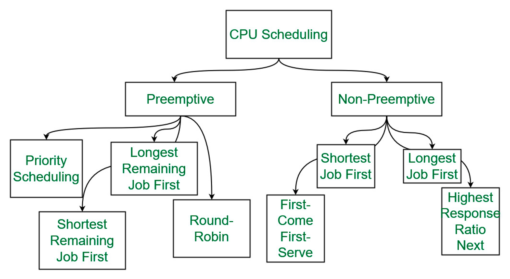

# [09강] CPU 스케줄러
(강의 자료 링크: https://www.youtube.com/watch?v=LgEY4ghpTJI)

## CPU 스케줄러의 역할

- CPU에서 실행될 프로세스를 **선택하는** 역할

  

## 디스패처의 역할

- CPU 스케줄러에 의해 선택된 프로세스를 CPU를 할당하는 역할

  → 이어서 선택된 프로세스가 시작할 수 있도록 실질적으로 돕는 역할

    - 컨텍스트 스위칭 작업을 담당
    - 커널 모드로 실행되는 컨텍스트 스위칭 작업이 끝나면 새로 선택된 프로세스(P1)를 CPU에서 실행시키기 위해 다시 유저 모드로 전환하고 제어권을 P1에게 넘겨주는데, 이때 커널 모드에서 유저 모드로 전환하는 역할도 담당
    - 새롭게 선택된 프로세스가 어디서부터 작업을 시작해야 하는지 파악하여 실행되어야 할 적절한 위치로 이동시키는 역할도 담당

  

## 스케줄링 방식

### 비선점 방식

> 다음 세 가지의 상태 전이가 발생할 때만 OS에서 개입하여 스케줄링을 하는 방식

- RUNNING → TERMINATED : 해야할 작업을 모두 마치고 종료
- RUNNING → WAITING : I/O 작업을 하기 위해 대기
- RUNNING → READY : 자발적으로 다른 프로세스에 양보

세 가지 경우 모두 OS가 강제로 개입하는 일 없이 현재 실행 중인 프로세스가 자발적으로 RUNNING 상태에서 빠져나가기 때문에 비선점 방식이라고 한다.

 

- 특징
    - 신사적 → OS가 각 프로세스들이 CPU를 다 쓸 때까지 충분히 기다려주기 때문
    - 협력적(cooperative) → 다른 프로세스에게 기회를 넘긴다는 것은 프로그램의 협력적 의지가 필요한 것이기 때문
    - 느린 응답성 → OS는 현재 실행 중인 프로세스가 CPU를 다 쓸 때까지 기다리기 때문에 ready queue 에서 기다리는 프로세스들의 대기 시간이 길어질 수 밖에 없기 때문

 

### 선점 방식

> 아직 프로세스가 CPU에서 실행 중인 상태에도 OS가 강제로 개입하여 스케줄링을 하는 방식

(비선점 방식에서 일어나는 경우도 포괄한다.)

- 예시
    - 프로세스에 할당된 타임 슬라이스를 다 쓴 경우, 강제로 프로세스의 상태를 READY 상태로 바꿔 ready queue로 되돌리는 방식
    - I/O 작업이 끝나 READY 상태로 대기하던 프로세스의 우선 순위가 현재 실행 중인 프로세스의 우선 순위보다 높은 경우, 대기하던 프로세스를 실행시키고 실행 중인 프로세스는 READY 상태로 바꾸는 방식
    - …
- 특징
    - 적극적
    - 강제적
    - 빠른 응답성 → OS가 적극적으로 개입하여 여러 프로세스를 더 자주 CPU에서 실행시키기 때문
    - 데이터 일관성 문제 → 실행 중인 프로세스가 갑자기 READY 상태로 바뀌면 데이터 일관성 문제가 발생할 수도 있음(이에 대한 해결책으로 critical section, 뮤텍스 락 등이 존재)

  

## 스케줄링 알고리즘

1. FCFS(first-come, first-served)

   : 먼저 도착한 순서대로 처리

2. SJF(shortest-job-first)

   : 프로세스의 다음 CPU burst가 가장 짧은 프로세스부터 실행

3. SRTF(shortest-remaining-time-first)

   : 남은 CPU burst가 가장 짧은 프로세스부터 실행

    - SJF 방식에서 선점 방식이 적용된 알고리즘

      → 현재 실행 중인 프로세스(P1)의 남은 CPU burst 보다 ready queue에 새로 들어온 프로세스(P2)의 CPU burst 가 더 짧다면 P1은 ready queue에서 대기시키고, P2를 실행시키는 방식

4. Priority

   : 우선 순위가 높은 프로세스부터 실행

5. RR(round-robin)

   : 타임 슬라이스로 나눠진 CPU time을 번갈아가면서 실행

    - 멀티태스킹 방식과 가장 유사한 방식
6. Multilevel queue

   : 프로세스들을 그룹화해서 그룹마다 큐를 두는 방식

    - 스케줄러는 우선 순위에 따라 어떤 그룹의 큐에서 프로세스를 선택할지 결정하고 각 큐에서는 각각의 스케줄링 방식에 따라 큐에 저장된 프로세스의 우선 순위가 결정됨

   

---

## 스케줄링 알고리즘에서 고려되는 기준

- **CPU Utilization**
    - CPU를 최대한 바쁘게 유지할수록 좋은 스케줄링 알고리즘
- **Throughput**

  : CPU에서 수행되고 완료된 프로세스의 수

    - 프로세스의 길이 또는 지속 시간에 따라 다를 수 있다.
- T**urnaround Time
  :** 프로세스 전달 시간부터 완료 시간까지 경과된 시간

  → 메모리 액세스 대기 시간, ready queue 대기 시간, CPU 사용 시간, I/O 대기 시간을 합한 시간

    - 짧을 수록 좋은 스케줄링 알고리즘
- **Waiting Time**

  : 프로세스가 ready queue에서 대기하는 시간

- **Response Time**

  : 프로세스 제출 시간부터 첫 번째 응답이 생성되는 데 걸리는 시간

  → 클릭-답, 타이핑-답. 첫 응답이 나올 때 까지 걸리는 시간

    - Interactive system에서 중요
- **Completion time**

  : 프로세스가 실행을 멈추는 시간

  → 프로세스가 burst 시간을 완료하고 완전히 실행되었다는 것을 의미

- **Priority**
    - OS가 프로세스에 우선 순위를 할당하면 스케줄링 메커니즘은 높은 우선 순위 프로세스를 우선적으로 처리해야 한다.
- **Predictability**
    - 주어진 프로세스는 비슷한 시스템 부하에서 항상 비슷한 시간에 실행되어야 한다.