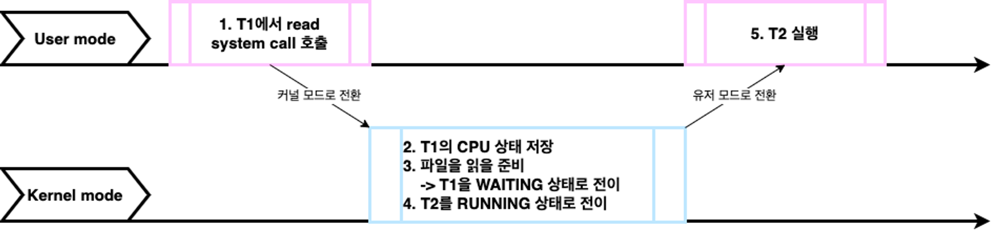
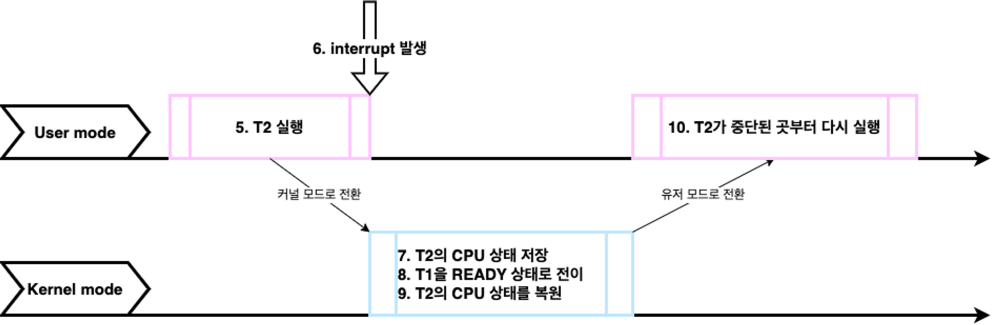
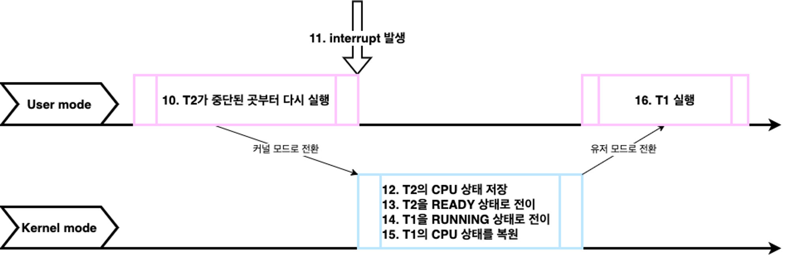

# [10강] 유저 모드, 커널 모드, 인터럽트, 시스템 콜
(강의 자료 링크: https://www.youtube.com/watch?v=v30ilCpITnY)

## User mode & Kernel mode

1. User mode
    - 우리가 개발하는 프로그램은 일반적으로 유저 모드에서 실행
2. User mode → Kernel mode
    - 프로그램 실행 중에 인터럽트가 발생하거나 시스템 콜을 호출하게 되면 커널 모드로 전환
3. Kernel mode
    - 커널 모드에서는 방금 전까지 실행한 프로그램의 현재 CPU 상태를 저장
    - 커널이 인터럽트나 시스템 콜을 직접 처리 → CPU에서 커널 코드가 실행됨
    - 처리가 완료되면 중단됐던 프로그램의 CPU 상태를 복원
4. Kernel mode → User mode
    - 다시 통제권을 프로그램에게 반환
5. User mode
    - 프로그램이 중단됐던 부분부터 이어서 실행됨

  

## 커널(Kernel)

- 운영체제의 핵심
- 시스템의 전반을 관리/감독하는 역할
- 하드웨어와 관련된 작업을 직접 수행

 

### Kernel mode를 만든 이유

→ 시스템을 보호하기 위해

(개발한 프로그램이 마음대로 하드웨어를 점유하게 되면 다른 프로세스는 물론 전체 시스템에도 영향이 갈 수 있기 때문)

  

## 인터럽트(Interrupt)

- 시스템에서 발생한 다양한 종류의 이벤트 혹은 그런 이벤트를 알리는 메커니즘

- ex)
    - 전원에 문제가 생겼을 때
    - I/O 작업이 완료됐을 때
    - 시간이 다 됐을 때(timer 관련)
    - 0으로 나눴을 때
    - 잘못된 메모리 공간에 접근을 시도할 때
    - …

 

인터럽트가 발생하면 CPU에서는 즉각적으로 인터럽트 처리를 위해 커널 코드를 커널 모드에서 실행

→ 커널 모드에서 커널이 인터럽트를 처리하기 위해 주도적으로 CPU에서 실행됨

(여기서 즉각적이라는 것은 인터럽트가 발생한 순간, CPU에서 실행되던 프로세스를 중단시키고 커널이 통제권을 넘겨 받아 필요한 작업을 마무리)

  

## 시스템 콜(System call)

- 프로그램이 OS 커널이 제공하는 서비스를 이용하고 싶을 때 시스템 콜을 통해 실행
- ex)
    - 프로세스/스레드 관련
    - 파일 I/O 관련
    - 소켓 관련
    - 장치(device) 관련
    - 프로세스 통신 관련
    - …

시스템 콜이 발생하면 해당 커널 코드가 커널 모드에서 실행

 

### 프로그래밍 언어와 시스템 콜 간의 관계

하드웨어 혹은 시스템 관련 기능은 어떤 프로그램이라도 반드시 시스템 콜을 통해서만 사용 가능

프로그래밍 언어에서 시스템 콜을 직접 호출하지 않고도 파일 I/O, 네트워크 I/O, 프로세스/스레드 관련 작업 등을 할 수 있었던 이유는 프로그래밍 언어들이 시스템 콜을 포장하여 간접적으로 사용할 수 있도록 제공했기 때문이다.

- JAVA의 경우 JNI(Java Native Interface)를 제공

  
## 시스템 콜 & 인터럽트 예제: 파일 read

- single core CPU
- T1 → RUNNING / T2 → READY

- `3. 파일을 읽을 준비 → T1을 WAITING 상태로 전이`
    - read system call은 block system call이기 때문에 T1이 파일을 읽을 준비가 될 때까지 기다려야 하기 때문에 T1의 상태를 WAITING으로 변경한다.
- `4. T2를 RUNNING 상태로 전이`
    - CPU에서 현재 실행 중인 프로세스/스레드가 없기 때문에 스케줄링을 통해 대기하고 있던 T2의 상태를 RUNNING 상태로 바꾸고 CPU에서 실행될 준비를 한다.

- `6. interrupt 발생`
    - SSD 쪽에서 T1이 요청했던 파일을 읽을 준비가 완료되었다는 interrupt를 발생
- `8. T1을 READY 상태로 전이`
    - 파일이 준비가 되었기 때문에 다음 스케줄링에서 선택을 받아 CPU에서 실행되어야 하기 때문

- `11. interrupt 발생`
    - T2가 주어진 타임 슬라이스를 다 썼다면 timer가 이를 알려주기 위해 interrupt를 발생