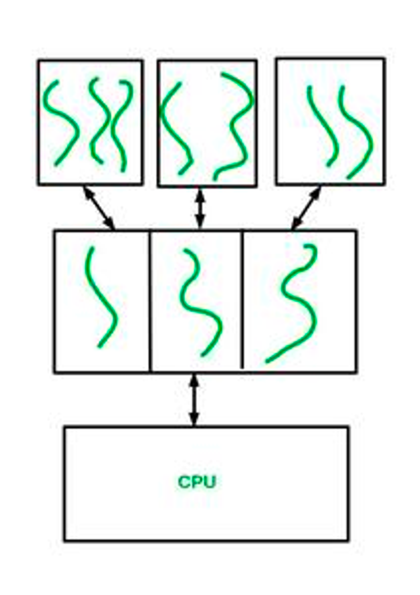
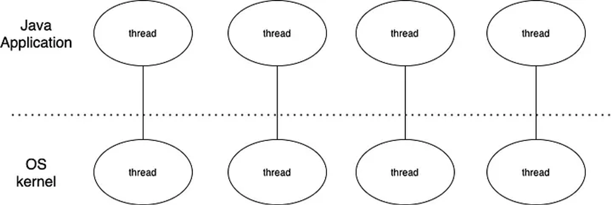
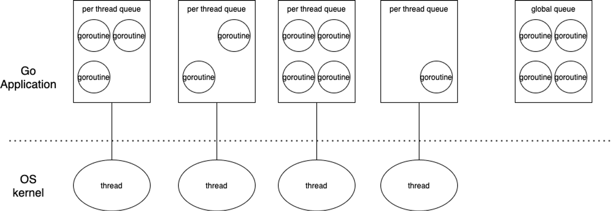
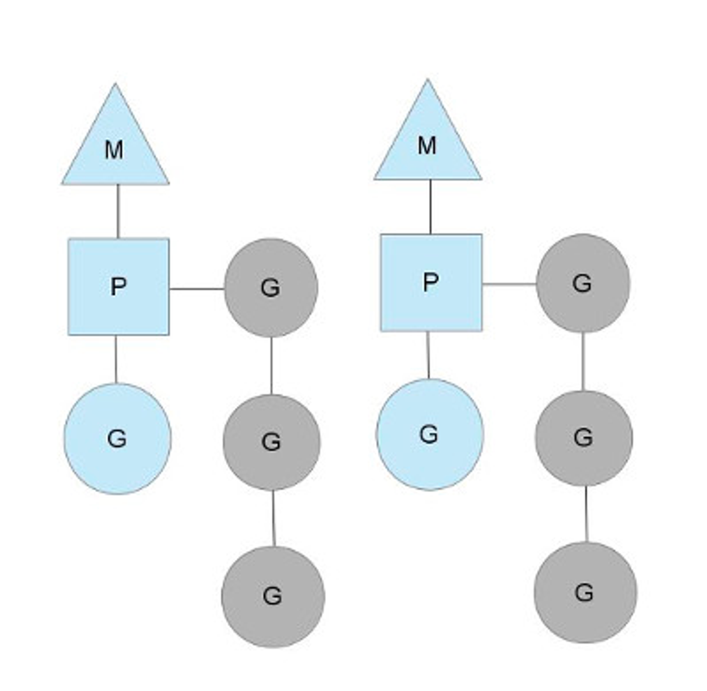
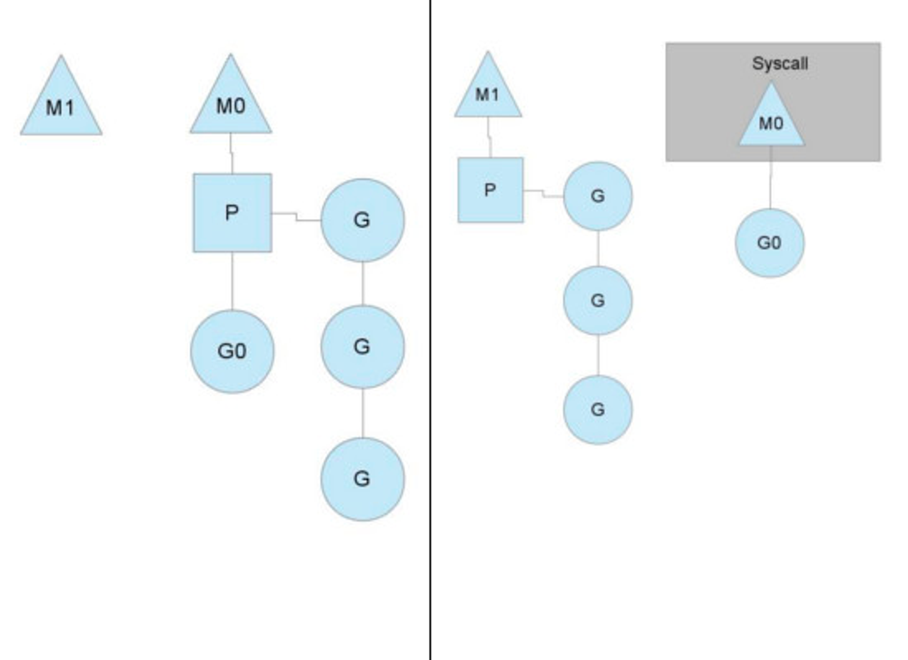
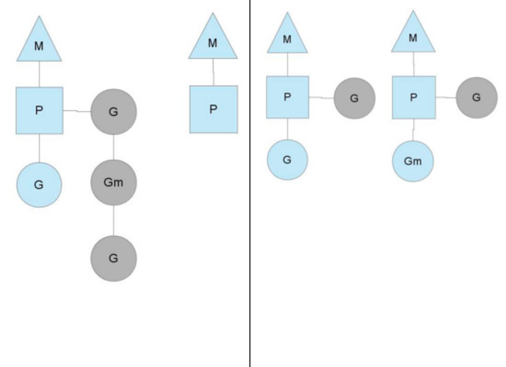

## 1. User Level Thread vs Kernel Level Thread

참고:

[https://www.geeksforgeeks.org/difference-between-user-level-thread-and-kernel-level-thread/?ref=rp](https://www.geeksforgeeks.org/difference-between-user-level-thread-and-kernel-level-thread/?ref=rp)

[https://www.geeksforgeeks.org/relationship-between-user-level-thread-and-kernel-level-thread/?ref=rp](https://www.geeksforgeeks.org/relationship-between-user-level-thread-and-kernel-level-thread/?ref=rp)

[https://www.crocus.co.kr/1404](https://www.crocus.co.kr/1404)

[https://gamedevlog.tistory.com/76](https://gamedevlog.tistory.com/76)

 

### User Level Thread

> 사용자 라이브러리 사용자가 만든 스레드

- 생성 프로세스와 런타임 환경에서만 볼 수 있다.

**장점:**

- 단순하고 생성 비용이 적다.
- 어느 OS에서든 실행이 가능하다.

  → 사용자 영역에서 스레드 연산을 수행하기 때문

- 스레드를 생성할 때 시스템 콜을 호출하지 않으므로 kernel level thread보다 성능상 이점이 있다.
- 사용자 영역에서 행동하기 때문에 스레드 간 컨텍스트 스위칭 과정에서 커널 모드로 전환하지 않아도 된다.

  → 커널이 user level thread의 존재를 모르기 때문

**단점:**

- user level thread 수준의 멀티스레드 어플리케이션은 멀티프로세싱을 활용할 수 없다.

  → CPU가 프로세스 단위로 할당되므로 user level 스레드 단위의 다중처리가 불가능하기 때문

- 스케줄링 우선순위를 지원하지 않는다.

  → 어떤 스레드가 먼저 동작할지 모른다.

- 하나의 user level thread가 blocking 연산을 실행하면 해당 스레드가 속한 전체 프로세스도 blocking 된다.

 

### Kernel Level Thread

**장점:**

- 한 프로세스의 스레드들을 다른 프로세서(CPU)에서 한꺼번에 디스패치할 수 있다.

  → 스레드 단위의 다중처리가 가능해진다.

  → 멀티프로세서 환경에서 매우 빠르게 동작한다.

- 한 스레드가 중지되어도 커널은 동일한 프로세스에 대해 다른 스레드로 다른 작업을 진행할 수 있다.

**단점:**

- 프로세스 내에서 컨텍스트 스위칭이 발생하면 커널 모드로 전환해야 한다.

  → 빈번하게 발생할수록 성능 저하

- user level thread보다 만들고 관리하는데 더 많은 시간이 소요된다.

|  | User Level Thread                                          | Kernel Level Thread |
| --- |------------------------------------------------------------| --- |
| 생성 주체 | 유저                                                         | OS |
| OS 인지 범위 | 인지하지 않음 → 커널은 user level thread들이 속한 프로세스만 인지한다.           | 인지함 |
| 생성 난이도 | 쉬움                                                         | 복잡함 |
| 컨텍스트 스위칭 소요 시간 | 상대적으로 짧음                                                   | 상대적으로 김 |
| 하드웨어 개입 | 필요하지 않음                                                    | 필요함 |
| Blocking 연산 | 하나의 User level thread가 blocking 연산을 수행한다면 전체 프로세스가 block 됨 | 하나의 kernel thread가 blocking 연산을 수행해도 다른 thread들은 계속해서 작업을 수행함 |
| 멀티스레딩 | 멀티스레드 어플리케이션은 멀티프로세싱의 이점을 취하지 못함                           | 커널은 멀티스레딩이 가능함 |
| 생성 및 관리 | 빠르게 생성되고 관리하는데에도 크게 비용이 들지 않음                              | 생성하고 관리하는데 더 많은 시간이 필요함 |
| OS | 모든 OS가 user level thread를 지원함                              | 특정 OS에서만 kernel level thread를 지원함 |
| Thread 관리 | 각 프로그래밍의 thread 관련 라이브러리를 활용하여 관리                          | 커널 모드의 API를 통해 관리 |

 

(다대일 모델이라고 가정)

- 첫번째 줄 → user level의 프로세스 / 스레드
- 두번째 줄 → kernel level의 프로세스 / 스레드

따라서, CPU는 kernel level의 프로세스 / 스레드만 인지 가능하므로 CPU 실행을 위해서는 user level 스레드와 kernel level 스레드의 매핑이 필요하다.

 

### Kernel Level Thread와 Process는 같은 건가?

→ 아니다. 프로세스도 스레드와 마찬가지로 User 프로세스와 System 프로세스로 나뉘는데 커널 스레드는 커널 레벨에서 관리되는 프로세스의 스레드이다.

## 2. Java Thread vs Go Goroutine

참고:

[https://medium.com/@genchilu/javas-thread-model-and-golang-goroutine-f1325ca2df0c](https://medium.com/@genchilu/javas-thread-model-and-golang-goroutine-f1325ca2df0c)

[mimul.com/blog/go-vs-java-thread/](http://mimul.com/blog/go-vs-java-thread/)

[https://tech.ssut.me/goroutine-vs-threads/](https://tech.ssut.me/goroutine-vs-threads/)

### Java Thread

자바 스레드는 OS 커널 스레드와 1:1로 매핑되어 있다.

이는 JVM 자체적으로 스레드 스케줄링을 하지 않고 OS 스케줄러에 전적으로 의존한다는 것을 의미한다.

그러나 유저 레벨 스레드(자바 스레드)와 커널 레벨 스레드를 1:1로 매핑하는 방법은 대규모 병렬성을 지원할 수 없다.

- 스레드가 생성될 때마다 생성된 스레드의 스택으로 고정된 크기가 큰 메모리를 할당하기 때문이다.
  - 64 비트 환경에서의 JVM 기본 스레드 당 스택 길이는 1MB
  - 거기다 스레드와 스레드 사이의 보호 공간(guard page)까지 필요로 한다.
  - 따라서 스레드를 많이 생성할 수록 빠르게 메모리가 고갈된다.
  - 기본 스택 크기를 줄일수 있지만 메모리 용량 측면에서 Stackoverflow 위험과의 트레이드 오프가 존재한다.
- 컨텍스트 스위칭 비용이 크다.

 

### Go Goroutine

그에 비해 고루틴은 기본 스택 크기가 4KB 밖에 되지 않는다.

그렇기 때문에 자바에 비해 더 많은 수의 고루틴을 부담없이 운용할 수 있는 것이다.

더불어 고루틴은 M:N 스레딩 모델을 사용하고 있다.

M:N 스레딩 모델을 사용하면 기존의 스레드/스레드 풀 방식보다 훨씬 가볍고 빠르지만 구현이 어렵다는 단점이 있는데 Go의 경우 언어 차원에서 이러한 단점을 해소시켰다.

 

**Go 스케줄러:**

Go의 스케쥴러는 G, M, P 구성되어 돌아간다.

- G: Goroutine
- M: Machine / OS 스레드
- P: Processor / 스케줄링에 대한 context
  - `GOMAXPROCS` 환경 변수로 설정
  - `runqueues` (회색 부분)를 가지고 있음
    - 실행 예정인 고루틴을 순차적으로 쌓아두는 역할
    - 작업이나 syscall(blocking)을 마친 고루틴은 큐 가장 끝에 추가됨

 

코드를 실행하다가 syscall이 발생하면 blocking이 발생하여 해당 스레드에 성능 저하를 불러올 수 있다.

이때 Go 스케줄러는 계속해서 멈추지 않고 스케쥴링을 할 수 있도록 syscall이 발생한 고루틴을 다른 스레드로 넘겨(hand off) 모든 고루틴이 정상적으로 작동할 수 있도록 보장한다.

이것이 바로 M(thread)에 P(context)가 붙는 이유다.

실행 중인 스레드가 blocking 되었을 때 다른 스레드로 현재 상태를 그대로 넘겨 지속적으로 처리를 할 수 있도록 보장하기 위해 P가 구현되었고 따라서 `GOMAXPROCS` 값이 1이더라도 Go가 멀티스레드로 동작하는 것이다.

이후 syscall 처리가 끝난 고루틴은 P를 다시 찾아와서 붙거나 global runqueues에 들어간다.

 

또한 Go 스케줄러는 스레드 스케줄링을 통해 스레드를 효율적으로 돌아가게 만든다.

예를 들어, `GOMAXPROCS`가 2로 설정된 상황에서 한 쪽은 1개의 고루틴을, 다른 한 쪽은 3개의 고루틴을 runqueues에 지니고 있는 상태라고 하자.

이때 Go 스케쥴러는 가장 우선적으로 global runqueues에 쌓여있는 고루틴을 먼저 가져오려 시도한다.

그 다음에는 왼쪽 스레드에 있는 고루틴의 절반을 오른쪽 스레드에 재배치한다.

이렇게 되면 대기하던 고루틴은 오른쪽 스레드에서 바로 실행할 수 있게 되고, 전체적인 관점에서 Go application은 많은 작업을 더 효율적으로 동시에 처리할 수 있게 된다.