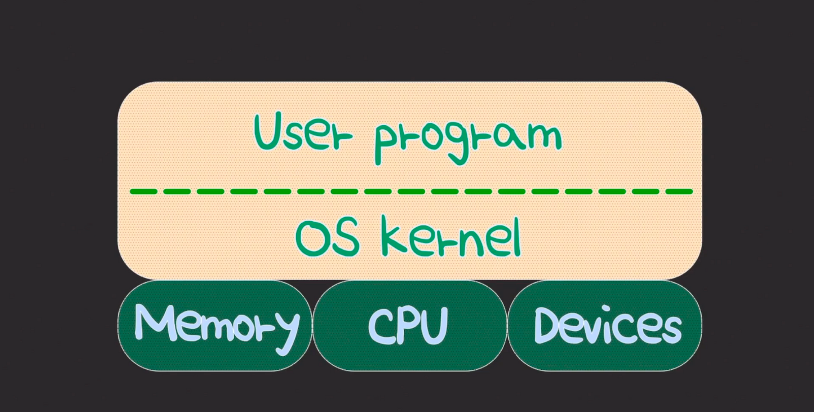

# [11강] 스레드
(강의 자료 링크: https://www.youtube.com/watch?v=vorIqiLM7jc)



- 유저 프로그램은 OS를 통해 하드웨어를 사용할 수 있다.

<br/>

## 하드웨어 스레드

> OS 관점에서는 가상의(logical) 코어

- CPU 레벨의 스레드
- CPU 상에서 사용률을 극대화 시키기 위해 개발된 하드웨어 레벨의 스레드
- 등장 배경
    - 코어에서 프로그램을 실행할 때 여러 연산 작업이 있고, 그 연산 작업을 위해 메모리에서 데이터를 읽어오거나 연산 작업의 결과를 메모리에 쓰는 등의 메모리에 접근하는 작업들이 있다.
    - 여기서 문제는 메모리에서 실제 작업을 실행하는 시간보다 메모리에서 데이터를 기다리는 시간이 더 오래 걸린다는 것이다.
    - 데이터를 기다리는 동안 코어에서 아무 일도 하지 않는 것은 코어를 낭비하는 것이기 때문에 코어 내에서 스레드 개념을 적용한 하드웨어 스레드를 통해 한 스레드가 메모리를 기다리는 동안 다른 스레드를 실행하여 CPU를 더 효율적으로 사용할 수 있게 되었다.
- 만약 싱글 코어 CPU에 하드웨어 스레드가 두 개라면 OS는 이 CPU를 듀얼 코어로 인식하고 듀얼 코어에 맞춰서 OS 레벨의 스레드들을 스케줄링 한다.

<br/>

**인텔의 hyper-threading**

→ 물리적인 코어마다 하드웨어 스레드가 두 개

<br/><br/>

## OS 스레드

> OS 커널 레벨에서 생성되고 관리되는 스레드

- OS 커널 레벨의 스레드
- 일반적으로 알고 있는 개념의 스레드
- CPU에서 실제로 실행되는 단위 → CPU 스케줄링의 단위
- OS 스레드의 컨텍스트 스위칭은 커널이 개입
    - 컨텍스트 스위칭이 일어날 때마다 유저 모드에서 커널 모드로 전환

      → 여러 커널 코드가 CPU에서 실행되기 때문에 CPU 리소스를 사용

      → 컨텍스트 스위칭이 끝나면 다시 커널 모드에서 유저 모드로 전환

      등의 과정이 있기 때문에 비용이 발생한다.

- 사용자 코드와 커널 코드 모두 OS 스레드에서 실행된다.

<br/>

OS 스레드는 아래와 같이 불리기도 한다.
- 네이티브 스레드
- 커널 스레드
    - 맥락에 따라서는 OS 커널의 역할을 수행하는 스레드를 의미하기도 함

      → 커널 코드를 실제로 수행하는 스레드

- 커널-레벨 스레드
- OS-레벨 스레드

<br/><br/>

## 유저 스레드

> 스레드 개념을 프로그래밍 레벨에서 추상화한 것

- 유저 프로그램 레벨의 스레드
- 유저-레벨 스레드라고도 불리기도 함

```java
Thread thread = new Thread();
thread.start();                // OS 스레드와 연결되는 시점
```

유저 스레드가 CPU에서 실행되려면 OS 스레드와 반드시 연결돼야 한다.

→ CPU에는 OS 스레드만 실행 가능하기 때문

<br/>

### 스레딩 모델
→ 유저 스레드 - OS 스레드 간 연결 방법
1. One-to-One model

       : 유저 스레드와 OS 스레드가 1:1로 연결되는 모델

    - 스케줄링을 포함한 스레드 관리를 OS에게 위임
    - OS 스레드와 1:1로 매핑되므로 유저 스레드도 멀티 코어를 잘 활용할 수 있음
    - 한 스레드가 block이 되어도 다른 스레드들은 잘 동작한다.
        - block I/O를 일으킨 유저 스레드와 연결된 OS 스레드가 이를 처리하기 때문
    - race condition 발생 가능성이 있음
2. Many-to-One model

   : 여러 개의 유저 스레드가 하나의 OS 스레드에 연결되는 모델

    - 컨텍스트 스위칭이 빠름
        - 유저 스레드들 간에서만 컨텍스트 스위칭이 일어나 커널이 전혀 개입하지 않기 때문
    - race condition 발생 가능성이 적음
    - 연결된 OS 스레드가 하나이기 때문에 멀티 코어를 활용하지 못함
    - 한 스레드가 blocking 되면 같은 OS 스레드로 연결된 나머지 유저 스레드들도 같이 blocking 됨
        - OS 스레드에서 block I/O를 처리하므로

      → 이를 해결하기 위해 non-block I/O를 사용

3. Many-to-Many model

   : 여러 개의 유저 스레드와 여러 OS 스레드가 연결되는 모델

    - One-to-One model과 Many-to-One model의 장점을 합한 모델
    - 구현하기가 어려움

기술 문서에서는 맥락에 따라 유저 스레드를 OS와 독립적으로 유저 레벨에서 스케줄링되는 스레드라고 설명하기도 한다.

위의 세 가지 모델 중 Many-to-One, Many-to-Many 모델의 유저 스레드들만 한정해서 지칭하는 경우도 있다.

<br/><br/>

## 그린 스레드

> OS와는 독립적으로 유저 레벨에서 스케줄링되는 스레드

→ Many-to-One, Many-to-Many 모델의 유저 스레드

(위에서 언급했던 다른 의미의 유저 스레드와 같은 의미를 가진다.)

이전에는 자바 초창기 버전에서 사용한 Many-to-One 스레딩 모델의 유저 스레드를 한정해서 부르는 말이었다.