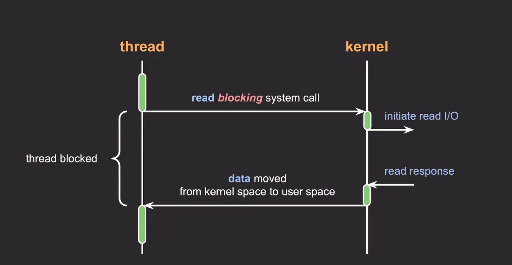
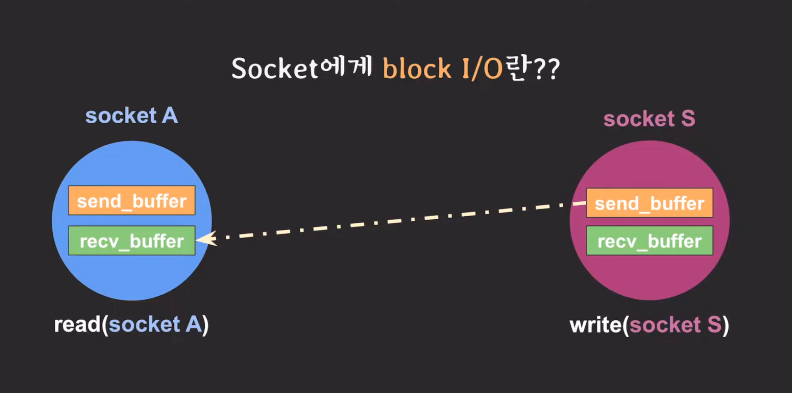
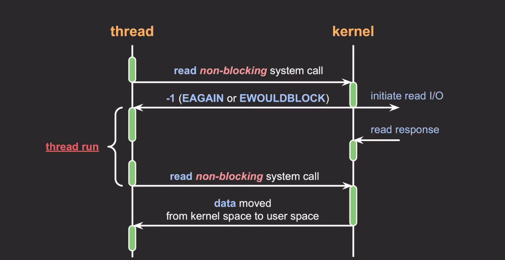
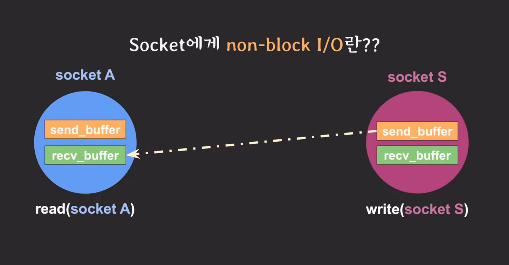
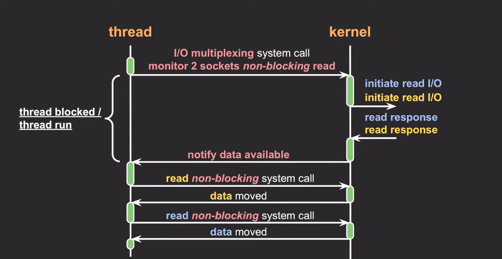
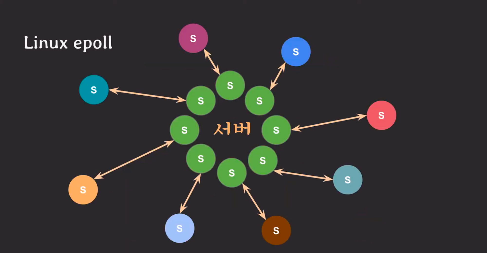
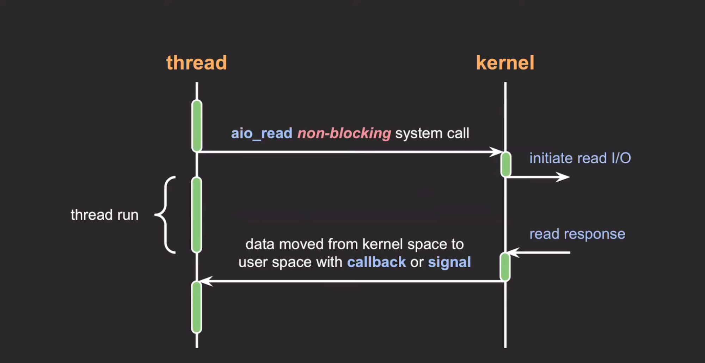

# [13강] block I/O, non-block I/O
(강의 자료 링크: https://www.youtube.com/watch?v=mb-QHxVfmcs)

## I/O

> input/output, 데이터의 입출력

- 종류
    - network(socket)
    - file
    - pipe → 프로세스 간 통신할 때 사용되는 개념
    - device
    - …

 

### Socket

네트워크 통신은 socket을 통해 데이터가 입출력 된다.

**백엔드 서버:**

→ 네트워크 상의 요청자들과 각각 소켓을 열고 통신한다.

  

## block I/O

> I/O 작업을 요청한 프로세스/스레드는 요청이 완료될 때까지 블락됨

따라서, 작업의 순서가 보장되기 때문에 일련의 파이프라인을 준수하는 구조에서 효율적이다.

**예시)**

1. 어떤 스레드가 read 시스템 콜을 blocking 모드로 호출
    - 해당 스레드는 블락되어 아무것도 하지 못하게 됨
2. 커널은 read 시스템 콜을 실행
3. 특정 디바이스로부터 read 시스템 콜에 대한 응답을 받음
4. 응답 데이터를 커널 영역에서 유저 영역으로 전송
5. 데이터를 받은 스레드는 다시 깨어나 코드를 이어서 실행

 

**소캣에서의 block I/O:**

소켓 S가 소켓 A로 데이터를 보내려고 할 때

- 소켓 A에 read 시스템 콜을 호출한 스레드는
    - recv_buffer에 데이터가 들어올 때까지 블락됨
- 소켓 S에 write 시스템 콜을 호출한 스레드는
    - 만약 send_buffer에 데이터가 가득 차게 되면 빈 공간이 생길 때까지 블락됨

      (write를 하게 되면 send_buffer에 전송하려는 데이터를 쓴다.)

  

## non-block I/O

> 프로세스/스레드를 블락시키지 않고 요청에 대한 현재 상태를 즉시 리턴

→ 블락되지 않고 즉시 리턴하기 때문에 스레드가 다른 작업을 수행할 수 있다.

따라서, 작업의 순서가 보장되지 않기 때문에 각 작업이 독립적이거나 수행 시간이 긴 작업일 경우에 효율적이다.

**예시)**

1. 어떤 스레드가 non-blocking 모드로 read 시스템 콜을 호출
2. 커널 모드로 변환되어 read I/O를 실행
    - 실행 후 바로 응답을 내려줌
    - 아직 read I/O가 완료되지 않았기 때문에 리눅스 기준 -1라는 에러 코드를 내려줌
3. 해당 스레드는 블락되지 않았기 때문에 이어서 코드를 실행함
    - 커널도 요청받은 read I/O를 계속 실행하여 응답 데이터를 준비함
4. 스레드가 어떤 시점에 non-blocking 모드로 read 시스템 콜을 다시 호출
5. 커널 모드로 변환되어 스레드가 요청했던 데이터를 유저 영역으로 전송

 

**소켓에서의 non-block I/O:**

소켓 S가 소켓 A로 데이터를 보내려고 할 때

- 소켓 A에 read 시스템 콜을 호출한 스레드는
    - recv_buffer에 데이터가 없어도 현재 버퍼의 상태만 확인 후 read 시스템 콜을 종료
- 소켓 S에 write 시스템 콜을 호출한 스레드는
    - send_buffer에 데이터가 가득 차도 마찬가지로 현재 버퍼의 상태만 확인 후 write 시스템 콜을 종료

  

## non-block I/O로 실행하는 경우 I/O 작업 완료를 어떻게 확인할 것인가?

### 1. 완료됐는지 반복적으로 확인

→ 주기적으로 요청한 응답 데이터가 준비되었는지 시스템 콜을 통해 확인

- 문제점
    - 시스템 콜에 대한 작업이 완료된 시간과 완료를 확인한 시간 사이의 갭으로 인해 처리 속도가 느려질 수 있음
    - 완료됐는지 반복적으로 확인하는 것은 CPU 낭비가 발생

 

### 2. I/O multiplexing(다중 입출력) 사용

- 관심있는 I/O 작업들을 동시에 모니터링하고 그 중에 완료된 I/O 작업들을 한 번에 알려줌

    → 한 번의 시스템 콜로 모니터링 대상의 소켓들로부터 지정한 이벤트가 발생하는 것을 감지

- 네트워크 통신에 많이 사용됨

 

**예시)**

1. 어떤 스레드가 I/O multiplexing 시스템 콜을 호출함

   (위의 예제는 blocking 모드로 multiplexing 시스템 콜을 호출했다고 가정)

    - `monitor 2 sockets non-blocking read` : 2개의 소켓에 대해 non-blocking 모드로 read 요청을 하려고 하니 새로 들어오는 데이터가 있는지 모니터링 해달라
2. 커널 모드로 변환하여 read 요청에 대한 응답 데이터를 받아옴
3. 스레드는 여러 개의 응답 데이터를 순차적으로 커널로부터 받아와 처리함

 

- I/O multiplexing 종류
    - select → 성능이 좋지 않아 잘 쓰이지 않음
      - 모든 모니터링 대상들에 대해 반복문으로 상태를 체크해야 하기 때문
    - poll → 성능이 좋지 않아 잘 쓰이지 않음
    - epoll → 리눅스에서 사용됨
    - kqueue → mac OS에서 사용됨
    - IOCP(I/O completion port) → 윈도우나 솔라리스 계열에서 사용됨

  (epoll, kqueue, IOCP 는 비슷한 역할을 함)

  **epoll:**

  

    1. 어떤 스레드가 epoll 시스템 콜을 통해 연결된 소켓 중 하나라도 read 이벤트가 발생하면 알려달라는 요청을 함
    2. 일부 소켓이 데이터를 받아 옴
    3. 스레드가 깨어나고 동시에 epoll 시스템 콜은 어떤 소켓이 데이터를 받아왔는지 스레드에 알려줌
    4. 스레드는 데이터를 받아온 소켓에 대해서만 처리를 하게 됨

 

### 3. Callback/signal 사용

**예시)**

1. aio_read 시스템 콜을 non-blocking 모드로 호출
2. 커널이 응답 데이터를 받아오면 callback 이나 signal을 통해 데이터를 유저 영역으로 전송함

- Callback/signal 종류
    - POSIX AIO
    - LINUX AIO
    - …

 

### 4. io_uring