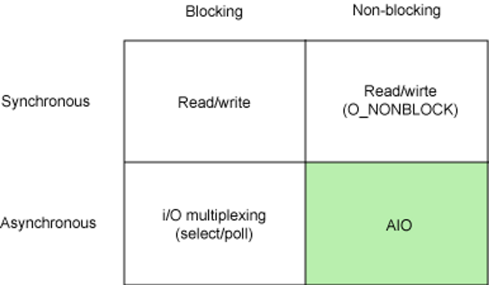

## 1. blocking/non-blocking, synchronous/asynchronous

(참고: [https://haneepark.github.io/2021/07/18/blocking-nonblocking-sync-async/](https://haneepark.github.io/2021/07/18/blocking-nonblocking-sync-async/))

### **blocking/non-blocking**

→ 호출된 쪽(A)의 처리가 끝나기 전에 호출한 쪽(B)에게 응답을 리턴해주는가 아닌가

- blocking
    - B가 A를 호출하면 A는 자신의 작업이 끝날 때까지 응답을 리턴하지 않기 때문에 B는 A의 작업이 끝날 때까지 기다려야 한다.
- non-blocking
    - B가 A를 호출하면 A는 자신의 작업이 끝나지 않았더라도 바로 응답을 리턴하기 때문에 B는 A의 작업이 끝날 때까지 기다리지 않아도 된다.

      → B는 자신이 하던 작업을 이어서 할 수 있다.

    - 그 후 A의 결과를 어떻게 인지하고 받을 지는 다른 문제

 

### **synchronous/asynchronous**

→ 호출한 쪽(B)이 호출된 쪽(A)의 결과와 (여러 번 호출했다면) 순서를 신경 쓰느냐 쓰지 않느냐

- synchronous
    - B가 A를 호출하면 B가 A의 결과를 확인한다.
    - 그렇기 때문에 여러 번 호출하면 호출한 순서대로 결과를 확인하게 된다.
- asynchronous
    - B가 A를 호출하면 A가 자신의 결과를 알려준다.
    - 그렇기 때문에 여러 번 호출해도 A가 어떤 호출에 대한 결과를 먼저 알려줄지 알 수 없다.

 

### blocking + synchronous

- B가 A를 호출하면 B는 A의 작업이 끝날 때까지 자신의 작업은 중단하고 기다려야 한다.
- 심지어 B가 A의 결과를 직접 확인해야 한다.

 

### non-blocking + synchronous

- B가 A를 호출하면 B는 A의 작업이 끝날 때까지 기다리지 않아도 된다.
    - A는 A대로, B는 B대로 각자의 작업을 진행한다.
- 그러나 A의 결과는 B가 직접 확인해야 한다.

 

### blocking + asynchronous

- B가 A를 호출하면 B는 A의 작업이 끝날 때까지 자신의 작업은 중단하고 기다려야 한다.
- 그러나 A의 결과는 A가 알아서 B에게 알려준다.

 

### non-blocking + asynchronous

- B가 A를 호출하면 B는 A의 작업이 끝날 때까지 기다리지 않아도 된다.
    - A는 A대로, B는 B대로 각자의 작업을 진행한다.
- 거기다 A의 결과는 A가 알아서 B에게 알려준다.