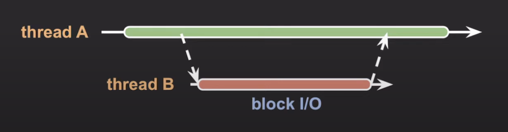
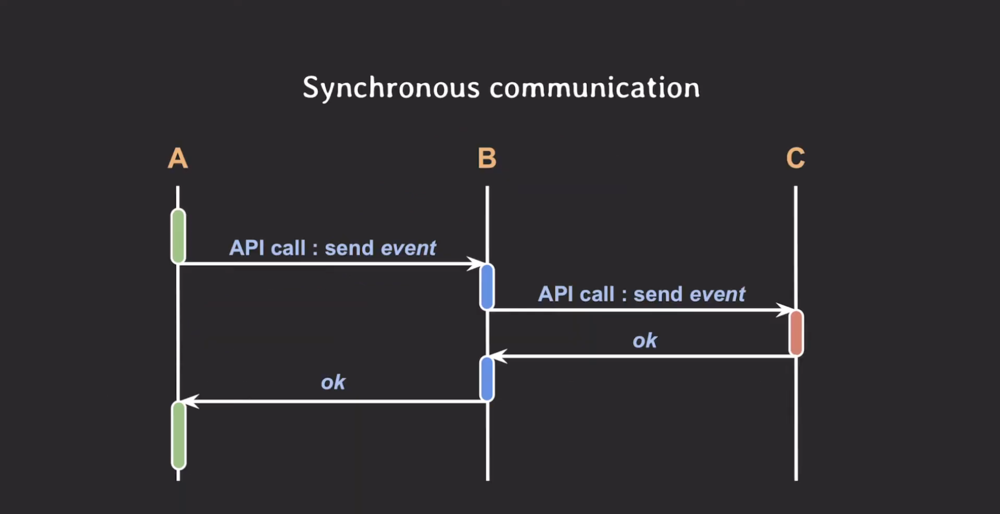
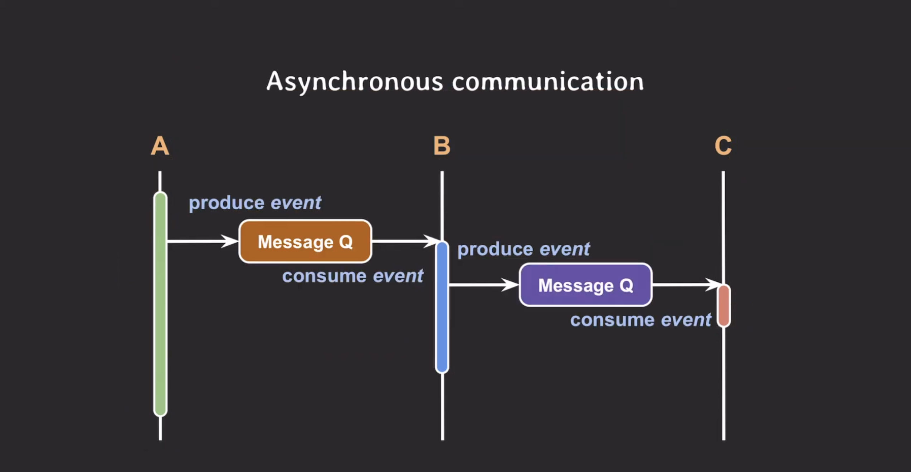

# [14강] 비동기(Asynchronous)
(강의 자료 링크: https://www.youtube.com/watch?v=EJNBLD3X2yg)

## 동기(Synchronous)

> 여러 작업들을 순차적으로 실행하는 것

- synchronous programming

  → 여러 작업들을 순차적으로 실행하도록 개발

  

## 비동기(Asynchronous)

> 여러 작업들을 동시에 병렬적으로 실행하는 것

- asynchronous programming

  → 여러 작업들을 독립적으로 실행하도록 개발

 

### 비동기 프로그래밍 vs 멀티스레딩

- 비동기 프로그래밍: 여러 작업을 동시에 실행하는 프로그래밍 방법론
- 멀티스레딩: 비동기 프로그래밍의 한 종류

 

### 비동기 프로그래밍을 가능하게 하는 것

1. 멀티스레드

   

    - 장점: 멀티 코어를 활용할 수 있다.
    - 단점
        - 스레드를 많이 만들수록 컨텍스트 스위칭 비용이 증가한다.
        - race condition이 발생할 수 있으므로 이에 유의하여 개발해야 한다.
2. non-block I/O

   

    - 핵심은 I/O 작업과 CPU 작업을 동시에 할 수 있다는 것
    - 장점
        - 싱글 스레드여도 여러 가지 작업을 동시에 할 수 있다.

          → 적은 스레드를 가지고도 좋은 성능을 낼 수 있는 프로그래밍이 가능한다.

현재 백엔드 프로그래밍의 추세는 스레드를 적게 쓰면서도 non-block I/O를 통해 전체 처리량을 늘리는 방향으로 발전 중이다.

  

## I/O 관점에서의 비동기

### 맥락에 따른 의미

**case1:**

synchronous I/O = block I/O

asynchronous I/O = non-block I/O

 

**case2:**

synchronous I/O: I/O 작업의 요청자가 작업의 완료나 결과까지 챙겨야 할 때

asynchronous I/O: I/O 작업의 요청자가 작업의 완료나 결과를 직접 챙기지 않아도 완료를 noti 받거나 callback으로 처리

 

**case3:**

asynchronous I/O: block I/O를 다른 스레드에서 실행

1. 스레드 A가 코드를 실행하다가 block I/O 작업을 해야될 때
2. 스레드 B를 새로 생성하여 해당 스레드에 block I/O 작업을 요청하고 스레드 A는 하던 작업을 이어서 한다.
3. 스레드 B에서 실행한 block I/O 작업이 끝나면 스레드 A에서 결과를 받아 처리한다.

  

## 백엔드 아키텍처 관점에서의 비동기

하나의 서비스는 기능과 역할에 따라 여러 개의 마이크로 서비스로 구성되고 이들 사이에는 빈번하게 커뮤니케이션이 발생한다.

이때 커뮤니케이션을 어떻게 하느냐에 따라 Synchronous communication과 Asynchronous communication으로 나뉜다.

 

### Synchronous communication

- 각각의 서비스는 요청한 API에 대한 응답이 올 때까지 blocking 되어 있다.
- 특정 서버로부터 데이터를 받아와 빠르게 처리해야 할 상황일 때 사용하는 것이 좋다.
- 그러나 만약 서버 C가 응답 불능 상태에 빠져버리면 서버 C의 응답을 기다리는 서버 B도, 서버 B의 응답을 기다리는 서버 A도 응답 불능 상태에 빠져버릴 수 있다.

  → 하나의 서버에서 장애가 발생하면 서비스 전체에 장애가 전파될 수 있다.

 

### Asynchronous communication

- 각각의 서비스는 특정 서버가 해야 할 작업을 해당 서버에 직접 요청하지 않고 메시지 큐에 적재한 후 하던 작업을 이어서 실행한다.
- 해당 서버는 적재된 작업을 메시지 큐로부터 consuming 하여 처리한다.